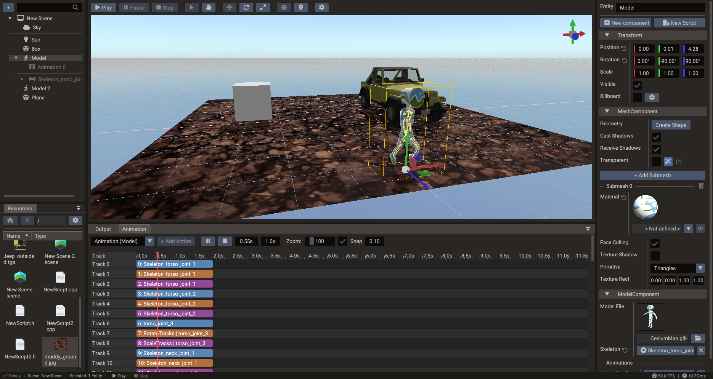

# Animation Timeline

The **Animation Timeline** edits time-based changes and previews them in the scene. It
works with entity transforms, sprite frame sequences, skeletal animation clips, morph
targets, and runtime action components — all driven by the `ActionSystem` at runtime.



## Timeline concepts

| Concept | Meaning |
| --- | --- |
| **Playhead** | Current time or frame being previewed |
| **Track** | A single animated property channel (e.g. position X, sprite frame, alpha) |
| **Keyframe** | A value recorded at a specific time on a track |
| **Clip** | A named time range containing one or more tracks |
| **Interpolation** | How values are calculated between keyframes (linear, step, ease, etc.) |
| **Snap** | Grid interval used when placing or moving keyframes |
| **Loop** | Whether the clip repeats when it reaches the end |

## Supported track types

| Track type | What it controls |
| --- | --- |
| **Transform** | Position, rotation, scale (translate, rotate, scale tracks) |
| **Color / Alpha** | Color tint and opacity |
| **Sprite frame** | Active frame index for a `Sprite` atlas |
| **Skeletal clip** | Bone transforms from an imported GLTF animation |
| **Morph weights** | Blend shape weights for facial or deformation animation |
| **Particle playback** | Play/stop state of a `Particles` action |

## Action frames

An animation is a list of **action frames**. Each frame schedules an action entity to
run at a **start time** on a **track** (a timeline lane, used only for visual
organization — overlapping frames are re-laned automatically).

Add frames with the **+ Add Action** button (which creates a new action entity of the
chosen type), or **drag an action entity from the Structure panel onto the tracks
area** — a ghost block previews the target track, the grid-snapped start time, and the
frame length before you drop. Invalid drops are rejected with an explanatory tooltip:
entities without an `ActionComponent`, entities from another scene, and anything that
would make an animation contain itself, directly or through nested animations.

| Operation | How |
| --- | --- |
| Select a frame | Click the block (details appear in the toolbar) |
| Move a frame | Drag the block; dragging vertically changes track |
| Resize a frame | Drag the block's left or right edge |
| Scroll tracks vertically | When the track stack exceeds the viewport, use its vertical scrollbar or the mouse wheel |
| Zoom the timeline | Use the mouse wheel over the visible time ruler |
| Scroll a long timeline | When blocks, the authored duration, or the playhead exceed the viewport, use the horizontal scrollbar; its range includes trailing space |
| Open the action | Double-click the block to select the action entity |
| Remove a frame | **Properties → AnimationComponent → Actions** → trash button |

Frame moving and resizing remain available while a timeline preview is paused. After
the edit, the preview is evaluated again at the current playhead time. Timeline
editing remains locked during active animation playback and scene play mode. If
playback or preview shutdown interrupts an active timeline drag, the pending edit is
finalized as its normal undo step before the timeline locks.

### Automatic duration

A frame whose duration is `0` is **auto**: it follows the action's own length — a
`SpriteAnimation` lasts as long as its frame sequence, a `TimedAction` uses its
duration, a nested `Animation` its own total length. Frames created in the editor
default to auto, so configuring the action later updates the timeline block
automatically.

Resizing a block in the timeline converts it to an **explicit** duration. To switch
back and forth, use the checkbox next to **Duration** in the Properties window
(**AnimationComponent → Actions**): checking it stores `0` (auto) and displays the
resolved duration read-only; unchecking freezes the current resolved value as an
editable number.

## Creating a clip

1. In the **Structure panel**, create an **Animation** entity (**Create entity →
   Animation → Animation**). Creating it as a child of the entity to animate sets
   that entity as the animation's target; otherwise set **Target** in the
   Properties window (**ActionComponent → Target**).
2. Open the **Animation Timeline** and pick the animation in the clip selector.
3. Right-click empty track space at the first key time and choose **Key Position**,
   **Key Rotation**, **Key Scale**, or **Key Transform**. Missing transform tracks
   are created automatically as auto-duration action frames.
4. Scrub to another time, pose the target in the scene view or Properties, and
   click the camera **Snapshot** button. Repeat for each pose.
5. Press **Play** in the timeline to preview the clip.

You can also create action frames manually with **+ Add Action** or by dragging action
entities from the Structure panel.

## Keying transforms

Transform keying has two complementary controls: **Snapshot** for the complete pose at
the playhead, and right-click keying for one block or selected channels.

### Snapshot

The camera **Snapshot** button next to **Stop** stores the current position, rotation,
and scale values of every transform keyframe track reached by the playhead. All writes
are grouped into **one undo step**.

A track is included when its action frame starts at or before the playhead:

- An **auto-duration** frame (`duration <= 0`) remains keyable after its current last
  key. Adding the key extends the action and grows its block.
- An **explicit-duration** frame is included only while the playhead is inside its
  fixed span, including the end. Snapshot does not extend it.
- Keys use time local to their own frame (`playhead time - frame start`), so moving a
  block along the timeline does not change where its keys belong.

Snapshot only keys tracks already present in the animation. If no eligible transform
track is under the playhead, the button is disabled and its tooltip says **No keyframe
tracks under the playhead to snapshot**. Use empty-area right-click keying when you
want to create missing tracks.

Scrubbing starts a paused preview, and Snapshot remains available in that state. It is
disabled during active animation playback and scene play mode. The button tooltip
shows the exact snapshot time or explains why the action is disabled. Snapshot does
not reset the displayed pose, and its keys remain after you stop previewing.

### Right-click keying

Right-click while the scene is stopped and animation playback is paused:

| Where | Result |
| --- | --- |
| A transform-track block | Inserts that block's position, rotation, or scale value at the clicked block-local time |
| Empty track space | Keys the animation target's position, rotation, scale, or complete transform |

Block keying always targets the **clicked action**, even when same-channel blocks
overlap. Its clicked time must be inside an explicit-duration block's real span; the
menu disables insertion when the block's minimum visual width extends beyond that
span.

Empty-area keying reuses the latest matching block active at the clicked time. It can
extend auto-duration blocks, but it will not write past an explicit block's end. When
the requested channel does not exist yet, it creates the track and an auto-duration
action frame. **Key Transform**, including any track creation, is one undo step;
single-channel keying is one undo step as well.

### Authoring past the current end

The playhead and time field can move beyond the current clip duration (up to one hour),
so auto-duration tracks can grow. Preview evaluation still stops at the clip's current
end, however: until you extend it, the object holds its **end pose** at the later
authoring time. The Snapshot tooltip and right-click menu warn when this happens.

This held pose is useful for pose-to-pose authoring, but it is not a newly evaluated
future pose. After scrubbing past the end, adjust the target before keying if you want
different values there.

Keyframes appear as small **diamonds** along the bottom of track blocks.

## Editing keyframes

Keyframes of track actions show as diamonds on their timeline blocks. Click a diamond
to select it; the selected key is highlighted. Drag it horizontally to change its
track-local time using the current timeline snap interval. A key cannot cross its
neighbors or move outside an explicit-duration block, and the completed drag is one
undo step. Auto-duration blocks grow when their last key moves later.

Values, interpolation, and deletion are edited in the **Properties** window with the
track entity selected (double-click its block to select it):

| Operation | How |
| --- | --- |
| Move a keyframe in time | Drag its timeline diamond horizontally, or edit its **KeyframeTracks** time entry |
| Change a keyed value | Edit the entry in the track component's values list |
| Change interpolation | Under **KeyframeTracks → Easing**, click **Add Ease**, expand the list, and pick a curve (`Ease 0 - 1`, …) |
| Remove explicit easing | Expand **Easing** and use the trash button beside the entry; later entries shift to the preceding segments |
| Delete a keyframe | Trash button next to the time entry (easings and cubic tangents stay aligned) |
| Move position keys visually | Drag the path handles in the [scene view](scene-view.md#editing-movement-paths-translatetracks) |

## Sprite animation

For 2D frame animation, add a **Sprite Frame** track and set keyframes to specific
frame names or indices from the sliced sprite sheet. Keep frame intervals consistent
for smooth playback.

The runtime equivalent is `SpriteAnimation`. See the
[Sprite Slicer](sprite-slicer.md) page for how to prepare a sprite sheet.

## Skeletal animation

GLTF models can include one or more named skeletal animation clips. The timeline editor
lets you preview and blend these clips on the **Model** entity. Use the **Bone** view
to inspect and edit individual joint transforms.

The animation selector uses each animation entity's name. Imported clips start with the
name authored in the GLTF; you can rename the entity in the Structure panel. Runtime
`Model:findAnimation` and `Model:playAnimation` string lookups use that same entity name.


At runtime, look up a clip by name on the `Model` object:

=== "Lua"

    ```lua
    model = Model(scene)
    model:loadGLTF("characters/hero.gltf")
    local walk = model:findAnimation("Walk")
    walk:start()
    ```

=== "C++"

    ```cpp
    Model hero(&scene);
    hero.loadGLTF("characters/hero.gltf");
    Animation walk = hero.findAnimation("Walk");
    walk.start();
    ```

### Previewing crossfades between clips

At runtime you usually switch clips with a **crossfade** so the character eases from one
motion into the next instead of snapping (see
[Smooth transitions](../manual/animation.md#smooth-transitions-crossfading)). You can
preview that blend directly in the timeline:

1. Select an animation clip and press **Play** to preview it.
2. In the toolbar, pick a clip in the **Blend to** dropdown.
3. Click the **⇄** button. The playing clip fades out while the chosen clip fades in,
   using the target clip's **Fade time**, and the viewport shows the blended result.

Each clip carries a **Fade time** (`defaultFadeTime`) — the default crossfade duration
used when [`Model:playAnimation`](../reference/classes/model.md#playanimation-stopanimations)
is called without an explicit time. Edit it in the **Properties** window under
**AnimationComponent → Fade time** (~0.2–0.3s reads well for locomotion, ~0.1s for a
quick hit or death). Scrubbing the playhead exits the transition and returns to the
single selected clip.

!!! tip "Use looping clips to see the blend"
    The blend reads best when you crossfade *from* a looping clip (idle, run). Blending
    from a one-shot clip that has already finished will snap, because a finished clip no
    longer contributes to the pose.

## Runtime action system

For scripted one-shot and looping motion that does not need a full authored timeline,
the runtime action system provides lightweight action types:

| Action | Purpose |
| --- | --- |
| `PositionAction` | Animate entity position |
| `RotationAction` | Animate entity rotation |
| `ScaleAction` | Animate entity scale |
| `ColorAction` | Animate material or UI color |
| `AlphaAction` | Animate opacity |
| `TimedAction` | Trigger a callback after a delay or on each loop iteration |
| `SpriteAnimation` | Cycle through sprite frames |
| `Animation` | Play a skeletal or keyframe clip |
| `Particles` | Drive particle playback |
| `TranslateTracks` / `RotateTracks` / `ScaleTracks` / `MorphTracks` | Multi-keyframe tracks with per-segment easing |

All actions support easing curves. See [TimedAction](../reference/classes/timedaction.md)
for the full list of `EaseType` values.

## Easing curves

Timed actions (`PositionAction`, `RotationAction`, …) have a single **Ease** property in
the **Properties** window (`setFunctionType()` in code). Keyframe tracks ease **per
segment** through a collapsible, sparse **Easing** list. **Add Ease** appends the next
explicit segment entry, up to one entry per pair of consecutive keys; expand the list
to edit or remove its `Ease 0 - 1`, `Ease 1 - 2`, … rows. Missing trailing entries are
linear. Removing an entry shifts later entries to the preceding segments. GLTF-imported
clips match their authored sampler mode: `LINEAR` clips leave easing unset, `STEP`
clips import with every segment set to `Step`, and `CUBICSPLINE` clips interpolate from
imported tangents instead — see
[Per-segment easing](../manual/animation.md#per-segment-easing) and
[Interpolation modes](../manual/animation.md#interpolation-modes). Common choices:

| Curve | Best for |
| --- | --- |
| `LINEAR` | Constant-speed motion, debug |
| `STEP` | Held poses — stop-motion and stepped, pose-to-pose motion |
| `QUAD_IN_OUT` | UI transitions and camera moves |
| `BOUNCE_OUT` | Playful jumps and pop-in effects |
| `BACK_IN` | Anticipation before a jump |
| `ELASTIC_OUT` | Springing UI elements |

## Best practices

- Name clips clearly and consistently (`idle`, `walk`, `run`, `jump`, `attack`).
- Keep looping and one-shot animations in separate clips.
- Use consistent frame intervals for sprite animations.
- Prefer skeletal animation for character movement; use keyframe tracks for camera
  and scene-wide effects.
- Use morph targets sparingly on performance-sensitive targets.
- Test in play mode after changing script-driven animation timing.
