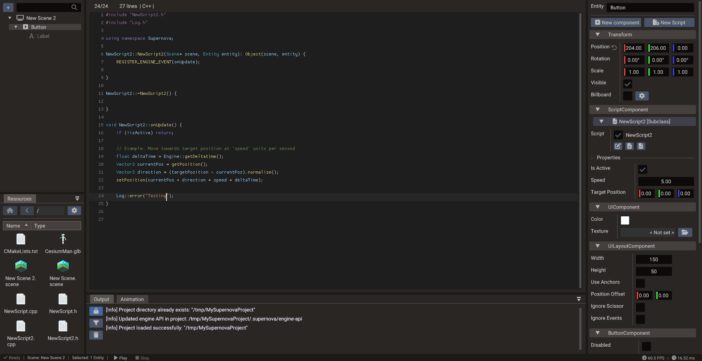
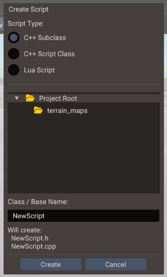
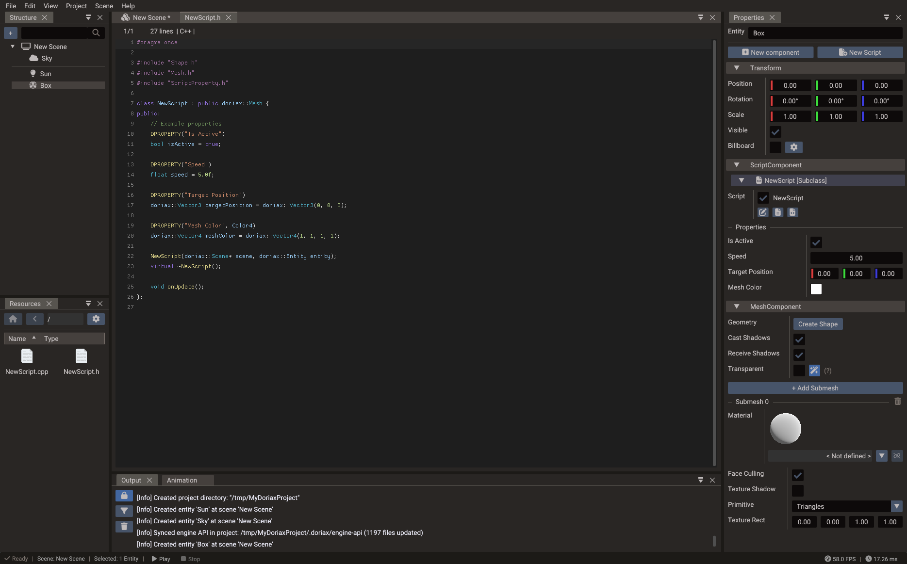

# Code Editor

The integrated code editor lets you write and edit Lua and C++ scripts without leaving
the Doriax editor. It provides syntax highlighting, API completion, script creation
dialogs, and a live output panel for compile and export messages.



## Supported workflows

| Workflow | Notes |
| --- | --- |
| **Lua scripts** | Fast iteration — script-only changes take effect immediately in play mode without rebuilding |
| **C++ scripts** | Compiled at export/build time for native performance; require a rebuild to take effect |
| **Script templates** | Create new Lua or C++ script files from boilerplate using the **New Script** dialog |
| **API completion** | Engine API suggestions generated from Lua bindings; covers classes, methods, and constants |
| **Build output** | Compiler errors, warnings, and export messages stream into the Output panel |

## Creating a new script

1. Open the **New Script** dialog from the toolbar or the Code Editor menu.
2. Choose **Lua** or **C++**.
3. Enter the class name — the editor generates a file with the correct `ScriptBase`
   subclass structure.
4. Save to the `scripts/` folder.
5. Return to the scene, select an entity, and add a `ScriptComponent` in the Properties
   window.
6. Assign the new script file and enable the entry.



## Script entry point

Every script receives engine lifecycle callbacks. Implement only the callbacks you need:

=== "Lua"

    ```lua
    local Player = {}
    Player.__index = Player

    function Player:init()
        RegisterEngineEvent(self, "onUpdate")
        RegisterEngineEvent(self, "onDestroy")
    end

    function Player:onUpdate()
        -- called every frame
    end

    function Player:onDestroy()
        -- called when the entity is destroyed
    end

    return Player
    ```

=== "C++"

    ```cpp
    #include "script/ScriptBase.h"
    using namespace doriax;

    class Player : public ScriptBase {
    public:
        void init() override;
        void update(double dt) override;
        void destroy() override;
    };
    ```

See [Creating Scripts](../manual/creating-scripts.md) for the full lifecycle and event
system documentation.

## DPROPERTY and script properties

Properties declared with `DPROPERTY` (C++) or in the `properties` table (Lua) appear
as editable fields in the **Properties window** automatically.



```cpp
DPROPERTY("Speed")
float speed = 5.0f;

DPROPERTY("Jump Force")
float jumpForce = 12.0f;
```

The editor parser reads `DPROPERTY` from C++ headers and populates the Properties
window without requiring a build. See
[Script Properties](../manual/script-properties.md) for syntax and type mapping details.

## Project entry points

A project can have both Lua and C++ startup paths. Set which one is active in project
settings, or keep both and use `NO_CPP_INIT` / `NO_LUA_INIT` to disable one at
compile time.

=== "C++ startup"

    ```cpp
    #include "Doriax.h"
    using namespace doriax;

    Scene scene;

    DORIAX_INIT void init() {
        Engine::setScene(&scene);
    }
    ```

=== "Lua startup"

    ```lua
    scene = Scene()
    Engine.setScene(scene)
    ```

## Practical tips

- Keep startup code small — move gameplay behavior into scripts or systems.
- Use `DPROPERTY` for values that designers should tune; avoid hard-coding magic
  numbers inside script logic.
- Watch the Output panel after every C++ edit or export; it shows the first compiler
  error clearly.
- Lua scripts iterate faster during development — prototype in Lua, port to C++ for
  performance-critical paths.
- Use the built-in [Log](../reference/classes/log.md) API for runtime diagnostics
  rather than relying on `print`.
