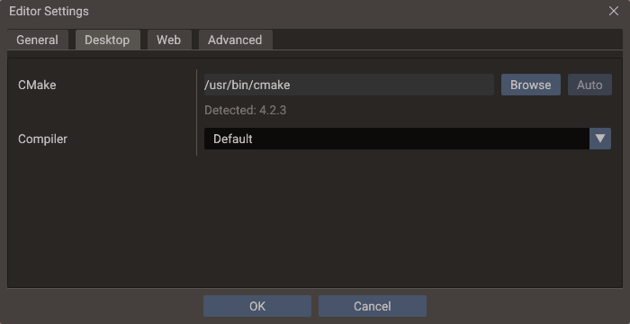
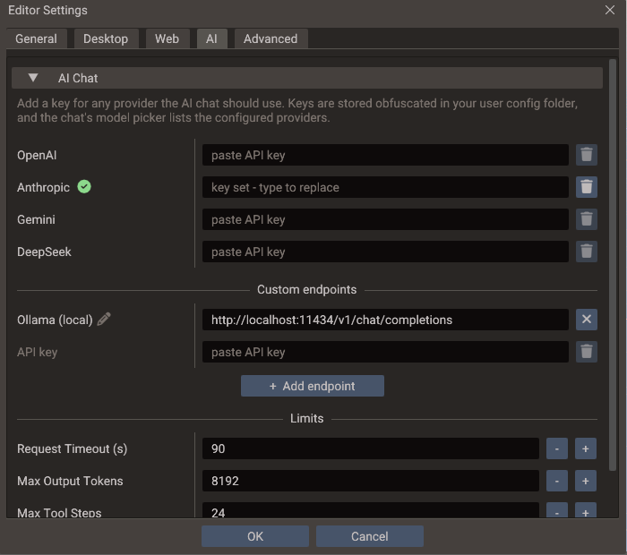

# Editor Settings

**Edit → Editor Settings** holds the settings that belong to *this machine* rather than
to the project: where your compiler and SDKs are, where exports go by default, how the
editor itself renders, and how it talks to AI models and agents. They are saved with the
editor's own settings, never to `project.yaml`, so they are not shared through version
control and a teammate opening the same project keeps their own toolchain and keys.

Anything the game itself carries — application identity, canvas, window, directories,
per-platform settings — is in [Project Settings](project-settings.md) instead.

The dialog is a modal with five tabs and an **OK** / **Cancel** footer.

## General

| Setting | Default | Effect |
| --- | --- | --- |
| **Default Export Directory** | Not set | Pre-fills the output folder in the Export Window for projects that have no remembered export directory yet |
| **Editor VSync** | Enabled | VSync for the editor's own frames |
| **UI Scale** | `100%` | Size of the editor text and panels, on top of the display scale the system reports |

The default export directory is only a starting point: once you export a project, the
folder you actually used is remembered per project *and per export mode*, and that
remembered value wins the next time you open the Export Window.

**Editor VSync** covers editing frames only. While a scene is running, frames follow the
project's own [VSync](project-settings.md#window) setting instead, so the two never apply
at once. Toggling takes effect on the next frame with no restart, and an idle editor
waits on the window system either way, so disabling it does not make the editor spin.

**UI Scale** goes from 50% to 300% and multiplies the display scale your system reports.
On a screen the system scales to 150%, the default 100% keeps the editor at 150%, and 120%
makes it 180%. The new size applies when you press **OK**, with no restart. Docked panels
resize with the text, but a panel beside the scene view grows to at most 30% of the
window's width, or 40% of its height for panels along the bottom, so the scene keeps its
room.

On Linux the editor reads the display scale from `Xft.dpi`, which desktops such as GNOME,
KDE, and Xfce set, or from the `GDK_SCALE` and `QT_SCALE_FACTOR` environment variables.
When none of them is set it uses 100%, as GTK and Qt apps do. To make every app larger,
raise the scale in your desktop's settings. To change only the editor, use **UI Scale**.

## Desktop

The C++ toolchain used both when **playing** a scene with C++ scripts and when running a
**Desktop** export.

| Setting | Default | Effect |
| --- | --- | --- |
| **CMake** | Auto-detect | Path to the `cmake` executable. **Browse** validates the pick by running it, and reports a folder with no working CMake instead of storing it. **Auto** returns to looking it up on `PATH` |
| **Compiler** | Default | The compiler kit used to build C++ scripts |

The **Compiler** dropdown lists the kits the editor detected (GCC, Clang, MSVC/Visual
Studio), each paired with a compatible CMake generator, and shows the resolved C and C++
compiler paths under the selection. Kits that cannot work are listed greyed out — hover
one to read why. **Default** leaves the toolchain to CMake on Linux and macOS; on Windows
it resolves to the best ABI-compatible detected kit, because a bare `cmake` there can
pick a toolchain that cannot link the editor's engine.

If the kit stored for a project is no longer detected — a compiler that was uninstalled,
or a project that came from another machine — the dropdown falls back to **Default** and
warns that builds still use the stored kit until you press OK.

!!! note "The compiler is stored per project, and remembered for new ones"
    Each project keeps its own kit, so a project that needs MSVC and one that needs
    MinGW can coexist. The kit is saved beside the project in `.doriax/user/build.yaml`,
    which is not committed, so a teammate opening the same project keeps their own
    toolchain. The kit you last chose also becomes the default for projects opened
    afterwards that have none, so in practice you set it once.

See [C++ Build Setup](../manual/cpp-build-setup.md) for what each toolchain requires, the
Windows ABI rules, and how to read a failing build.

## Web

| Setting | Default | Effect |
| --- | --- | --- |
| **Emscripten SDK** | Auto-detect | Root of your `emsdk` installation, used by **Web** exports. **Auto** returns to detecting it from the `EMSDK` environment variable or `emcmake` on `PATH` |
| **Status** | — | Whether the SDK was found, and where |

The status line updates as soon as you pick a folder, so you can confirm the SDK before
leaving the dialog. See [Building for HTML5](../building/html5.md) for installing the SDK.

## AI

Two collapsible sections: **AI Chat**, open by default, and **MCP Server** below it. The
chat's gear button, and its prompts to add a key, open the dialog on this tab.

### AI Chat

The keys and limits of the built-in AI Chat. The model and the approval mode stay in the
chat, beside its message box.

| Setting | Default | Effect |
| --- | --- | --- |
| **OpenAI**, **Anthropic**, **Gemini**, **DeepSeek** | Empty | One API key per provider. A green check marks a stored key, typing replaces it, and the trash button deletes it at once |
| **Custom endpoints** | None | OpenAI-compatible Chat Completions URLs, each with its own key and model list. **Add endpoint** offers presets for OpenCode Zen, OpenRouter and a local Ollama, or a blank one. The pencil renames an endpoint; the cross removes it, and its key on **OK** |
| **Request Timeout (s)** | `90` | How long to wait for each model response. Raise it for slow local models |
| **Max Output Tokens** | `8192` | The longest reply a model may write in one turn, including a whole script written in one tool call |
| **Max Tool Steps** | `24` | How many tool-using model turns one message may take. Raise it if long tasks stop at the tool-step limit |

A custom endpoint works without a key, since a local server usually needs none. The chat's
model picker lists every provider and endpoint that is ready to use.

### MCP Server

Runs the editor's [MCP server](mcp-server.md), which lets AI agents outside the editor —
Claude Code, Codex, Gemini CLI — use the AI Chat's tools on the open project. That page
covers connecting a client and the security model. The section starts collapsed.

| Setting | Default | Effect |
| --- | --- | --- |
| **Enable Server** | Off | Starts the server on `127.0.0.1`, now and whenever the editor starts |
| **Status** | — | **Running**, **Stopped**, or why the server could not start |
| **Port** | `3674` | The local port the server listens on |
| **Allow Changes** | On | Off leaves agents only the read-only tools |
| **Token** | Generated | The secret clients send with every request. Replacing it takes effect at once |
| **URL** | — | The endpoint, with a copy button |
| **Clients** | — | Ready commands that add the editor to Claude Code, Codex or Gemini CLI, each with a copy button |

## Advanced

**Clear Shader Cache** deletes the compiled-shader cache shared by every project on this
editor version. Shaders are rebuilt on demand afterwards, so the only cost is the next
build being slower. The button is disabled while a scene is playing.

## Where the values are stored

Everything but the secrets goes to the editor's `settings.yaml`, beside `editor.log` —
the [FAQ](../about/faq.md#where-can-i-find-the-editor-crash-log) lists the per-platform
path.

| Key | Holds |
| --- | --- |
| `cmake.path` | The CMake executable override |
| `emsdk.path` | The Emscripten SDK override |
| `export.default_dir` | The default export directory |
| `editor.ui_scale` | The UI scale as a multiplier, `1.25` for 125% |
| `project_builds` | Per project: compiler kit and parallel build jobs, keyed by the absolute path of its `project.yaml` |
| `project_exports` | Per project and export mode: the last output directory used |
| `ai_assistant` | The AI Chat's provider, model, approval mode, custom endpoints and limits |
| `mcp_server` | The MCP server's `enabled`, `port` and `allow_changes` |

API keys and the MCP token never go to `settings.yaml`. They are kept in `ai_keys.dat` in
the same folder, obfuscated with a key derived from that folder's path, so the file does
not work when copied to another machine.

The per-project entries are keyed by path, so moving a project through **Save Project
As** re-keys them and your toolchain choice follows the project on this machine.

!!! note "Build jobs are edited in the Export Window"
    The parallel job count lives in the same `project_builds` entry as the compiler, but
    it is edited in the Export Window's **Desktop** mode as **Build Jobs**. The value
    applies to Play builds too. See
    [Parallel builds](../manual/cpp-build-setup.md#parallel-builds).

## Migrating from older projects

Editors before this dialog kept the compiler kit and job count in `project.yaml` as
`cmakeCCompiler`, `cmakeCxxCompiler`, `cmakeGenerator` and `cmakeBuildJobs`. Opening such
a project copies those values into `project_builds` once, and never over an entry this
machine already has. The keys stay in the old file until the project is saved again, so
an older editor can still read it.

## See also

- [Project Settings](project-settings.md) — the per-project counterpart
- [C++ Build Setup](../manual/cpp-build-setup.md) — toolchain requirements and troubleshooting
- [Export Window](export.md) — where the SDK and toolchain settings are used
- [MCP Server](mcp-server.md) — connecting outside AI agents to the editor
