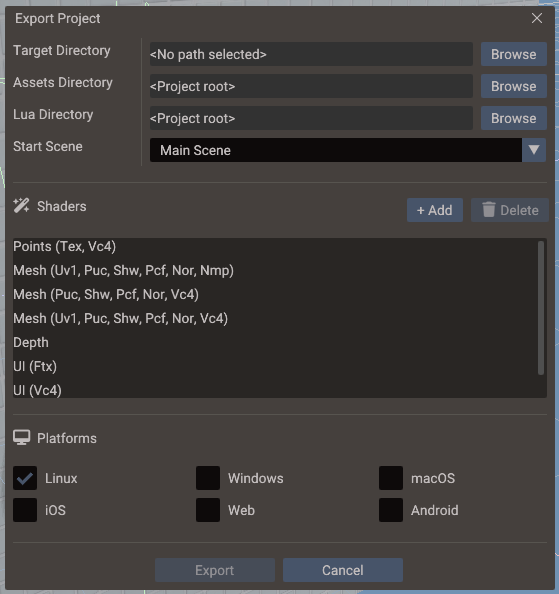

# Export Window

The **Export Window** prepares a Doriax project for a target platform. It collects
scene data, resources, scripts, generated C++ glue, engine runtime files, and compiled
shaders into a self-contained buildable project directory.



## Opening the Export Window

Choose **File → Export** from the menu bar, or press the **Export** button in the
toolbar.

## Export inputs

| Input | Source |
| --- | --- |
| **Scenes** | Saved project scene YAML files |
| **Bundles** | Reusable entity hierarchy files |
| **Resources** | Asset folders (textures, models, audio, fonts) |
| **Lua scripts** | Project Lua script files |
| **C++ scripts** | Project source files and editor-generated glue code |
| **Shaders** | Shader builder output and platform backend settings |
| **Platform settings** | Target platform, output directory, build options |

## Export steps

1. Open the Export Window and select a **target platform**.
2. Review the included asset folders and script paths.
3. Choose a **build output directory** (outside the source project).
4. Click **Export**.

The exporter runs through the following phases:

| Phase | Output |
| --- | --- |
| Scene serialization | Converts scene YAML to runtime-loadable data |
| Bundle factory generation | Generates C++ factory functions for each bundle |
| Shader compilation | Translates shaders for the selected graphics backend |
| Asset packaging | Copies and organizes resource files |
| Startup code generation | Generates `main.cpp` / entry point with scene registration |
| Engine template copy | Copies the runtime engine library and CMake/build files |

## Generated output structure

```
output/
├── assets/          ← copied and processed resources
├── shaders/         ← compiled shader data for the target backend
├── src/
│   ├── main.cpp     ← generated startup entry point
│   ├── scenes/      ← generated scene factory C++ files
│   └── bundles/     ← generated bundle factory C++ files
├── CMakeLists.txt   ← build system entry point
└── ...              ← platform-specific files
```

## Generated scene data

Meshes backed by a model file keep their geometry in the exported asset and load it at
runtime. Terrain meshes with a configured heightmap also rebuild their runtime buffers
from `TerrainComponent` settings and the exported heightmap. Other meshes without a
runtime geometry source, including geometry created directly in the editor, embed their
vertex and index buffers in the generated scene or bundle C++ as read-only static data.
The scene factory copies those bytes into the runtime buffers without placing the full
geometry blob on the thread stack.

Generated factories also construct large fixed-capacity components, such as mesh,
tilemap, and 3D physics body data, in temporary heap storage before inserting them into
the ECS. This prevents those payloads from inflating the scene factory's stack frame.

Large inline meshes still increase the generated source size, executable size, and C++
compile time. Prefer a GLTF or OBJ asset for multi-megabyte geometry that does not need
to be stored directly in the scene.

## Shader compilation

The shader builder translates shader source for the selected graphics backend. Supported
backends:

| Backend | Platforms |
| --- | --- |
| OpenGL / GLSL | Windows, Linux, macOS |
| OpenGL ES 3 / ESSL | Android, web |
| Metal / MSL | iOS, macOS |
| Direct3D 11 / HLSL | Windows |
| WebGL / GLSL ES | HTML5 / Emscripten |
| Vulkan / SPIR-V | Windows, Linux |

If shader compilation fails, the Output panel reports the shader name, stage, backend,
and the compiler error. Fix the shader source and re-export.

Custom (forked) shaders are compiled and shipped through this same pipeline — the Header
output embeds them into the build, while the `.sdat`/JSON output writes them to the
project's **Shaders Directory**. See [Custom Shaders — Export and runtime](custom-shaders.md#export-and-runtime).

## Platform toolchains

After export, build the generated project with the appropriate native toolchain:

| Target platform | Toolchain | Notes |
| --- | --- | --- |
| **Windows** | CMake + MSVC or MinGW | Requires CMake 3.16+, Windows SDK |
| **Linux** | CMake + GCC or Clang | Requires X11 or Wayland dev libraries |
| **macOS** | CMake + Xcode or CLang | Requires Xcode command-line tools |
| **Android** | Gradle + Android NDK | Requires Android Studio or SDK command-line tools |
| **iOS** | Xcode workspace | Requires a Mac with Xcode |
| **HTML5 / Web** | Emscripten | Requires `emcmake cmake` |

## VSync in desktop exports

The project-level **VSync** option is written into exported desktop CMake projects.
With VSync disabled, Linux GLFW, Windows/Linux Sokol OpenGL, and Windows Direct3D 11
builds use swap interval `0`. Vulkan builds prefer Immediate presentation, use Mailbox
when Immediate is unavailable, and fall back to the always-supported FIFO mode when
required by the driver or surface.

macOS Metal currently has no uncapped application-loop path in Doriax. Metal exports
therefore remain synchronized and emit a CMake warning when project VSync is disabled.
See [Project Workflow — VSync](project-workflow.md#vsync) for the full behavior table.

## Window settings in desktop exports

The project-level **Window** settings (mode, size, resizable, title) are written into
exported desktop CMake projects the same way. Linux GLFW builds honor all of them.
Windows and macOS Sokol builds honor the size, title, and fullscreen mode, but have no
maximized or non-resizable window support. Web, Android, and iOS exports ignore window
settings entirely — the game always fills the browser canvas or the device screen. See
[Project Workflow — Window](project-workflow.md#window) for the full behavior table.

## Exporting from the command line

The same export pipeline is available headlessly through the `doriax-editor` CLI, which
is ideal for build servers and CI/CD:

```bash
doriax-editor export --project ./MyGame --out ./build/MyGame --platform "linux,web"
```

See [Command-Line Tools](command-line.md) for the full `export` and `shaders` reference.

## Build options

See [Build Options](../reference/build-options.md) for a full list of CMake flags and
compile-time defines you can set to control engine features in the export.

## Tips

- Keep the export output directory separate from your source project so version control
  does not track generated files.
- Export a clean build before submitting to an app store or sharing a release build.
- Use the **Development** export mode while iterating; switch to **Release** for final
  builds (enables optimizations, strips debug symbols).
- Test exported builds on actual devices — some graphics, input, and memory behaviors
  differ between the editor's desktop preview and the target platform.
