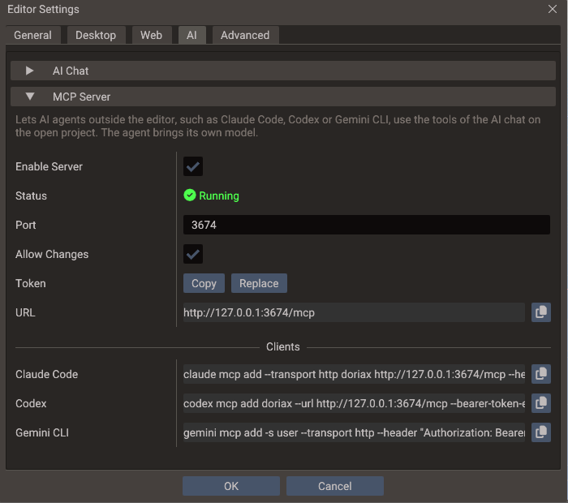

# MCP Server

The editor can run a [Model Context Protocol](https://modelcontextprotocol.io) (MCP)
server, so AI agents outside it — Claude Code, Codex, Gemini CLI and other MCP clients —
can work on the open project with the same tools as the built-in AI Chat: inspect scenes
and entities, add components, write scripts, fork shaders, run a scene and read the
output log.

The agent brings its own model and account. The editor only runs the tools, so no API key
is needed here and the AI Chat can stay closed. The server works on whichever project the
editor has open, so opening another project changes what agents see, and an agent can
[open or create one](#opening-and-creating-projects) itself.

## Turning it on

1. Open **Edit → [Editor Settings](editor-settings.md#mcp-server) → AI** and expand **MCP Server**.
2. Tick **Enable Server** and press **OK**.

The Output panel reports `MCP server listening on http://127.0.0.1:3674/mcp`, and the
server starts with the editor from then on.



| Setting | Default | Effect |
| --- | --- | --- |
| **Enable Server** | Off | Listens for MCP clients on `127.0.0.1` only, so nothing outside this computer can reach it |
| **Status** | — | **Running**, **Stopped**, or why the server could not start, such as a port another program holds |
| **Port** | `3674` | The local TCP port. Change it when another program uses it, or to run two editors with the server on |
| **Allow Changes** | On | Off leaves agents only the read-only tools, which inspect and search the project |
| **Token** | Generated | The secret every request must carry. **Copy** puts it on the clipboard and **Replace** makes a new one |
| **URL** | — | The endpoint, `http://127.0.0.1:<port>/mcp` |
| **Clients** | — | Ready commands that add the editor to Claude Code, Codex and Gemini CLI, each with a copy button |

The token is created and kept the first time the section opens, and replacing it takes effect
at once, so a command copied from here keeps working whether the dialog closes with **OK**
or **Cancel**. The other fields apply on **OK**.

## Connecting Claude Code

Copy the **Claude Code** row and run it in a terminal:

```bash
claude mcp add --transport http doriax http://127.0.0.1:3674/mcp \
  --header "Authorization: Bearer <token>"
```

The command adds the server for the folder you run it in, so run it in the project folder,
where Claude Code can also read the project's files. Add `--scope user` after
`--transport http` to have it in every folder. In a Claude Code session, `/mcp` then lists
`doriax` as connected, with its tools.

## Connecting Codex

Copy the **Codex** row and run it in a terminal:

```bash
codex mcp add doriax --url http://127.0.0.1:3674/mcp --bearer-token-env-var DORIAX_MCP_TOKEN
```

Codex keeps the token out of its configuration: it reads it from the `DORIAX_MCP_TOKEN`
environment variable each time it connects. Set that variable to the token (**Copy** on the
**Token** row) where Codex runs, for example in your shell profile:

```bash
export DORIAX_MCP_TOKEN=<token>
```

On Windows, `setx DORIAX_MCP_TOKEN <token>` sets it for terminals opened afterwards.

## Connecting Gemini CLI

Copy the **Gemini CLI** row and run it in a terminal:

```bash
gemini mcp add -s user --transport http --header "Authorization: Bearer <token>" \
  doriax http://127.0.0.1:3674/mcp
```

`-s user` saves the server in your user settings. Without it, Gemini CLI writes it to
`.gemini/settings.json` in the current folder, token included, where it could end up in
version control.

## Other clients

Any other client that speaks MCP over Streamable HTTP and can send a custom header works:
give it the **URL** and the header `Authorization: Bearer <token>`. A client that can only start
local (stdio) servers needs a stdio-to-HTTP bridge in between.

!!! warning "Keep the token out of version control"
    The token belongs to one machine and lets its holder change your project. When a
    client's configuration is committed, such as Claude Code's project-scoped `.mcp.json`,
    read the token from an environment variable instead of writing it there:

    ```json
    {
      "mcpServers": {
        "doriax": {
          "type": "http",
          "url": "http://127.0.0.1:3674/mcp",
          "headers": { "Authorization": "Bearer ${DORIAX_MCP_TOKEN}" }
        }
      }
    }
    ```

## What agents can do

The server offers every tool the AI Chat uses, with the same checks and the same results,
plus `open_project` and `create_project`, which only MCP clients get: the chat runs inside
the editor, and switching projects would end its own turn. Each tool is marked read-only
or not (`readOnlyHint`), which clients can use when they ask you to confirm a call.

When a client connects, the server also sends the engine rules the AI Chat's model gets:
how Lua and C++ scripts are written, to confirm an API in the engine source before using
it, how physics bodies get their shapes, how to verify a script by running the scene and
reading the log. An agent that reads them follows the same conventions as the AI Chat.

## How calls run

- Each call runs on the editor's main thread between frames, one at a time, exactly as if
  the AI Chat made it. A long action such as an export holds the editor until it ends.
- Scene edits go through the editor's undo history, so **Edit → Undo** reverts what an
  agent did.
- Each change an agent makes is logged in the Output panel as `MCP: <what it did>`, and a
  failed call as a warning or an error.
- While a project is loading, calls wait. A call still waiting after two minutes fails,
  and the agent is told to try again.
- A call the client gives up on before it starts, for example when you cancel it, is
  dropped. One already running is asked to stop early where the action supports it, as an
  export or an asset download does.

!!! note "Scenes are edited through the tools, not on disk"
    The editor holds open scenes and `project.yaml` in memory and writes them back when it
    saves, so an agent that edits those files directly loses its change at the next save
    or overwrites yours. The server tells agents this; remind yours if it keeps editing the
    files. Scripts are ordinary files, but writing one with the `update_script_file` tool
    also refreshes the properties of every entity that uses it.

## Saving an agent's work

Agents save with `save_scene`, `save_all_scenes` and `save_project`, like the AI Chat.
Two saves would need a dialog that only you can answer, so the tools take a path instead:

- **A scene that was never saved.** `save_scene` with a project-relative `path`, such as
  `scenes/Level1.scene`, saves it there. Without one, and with `save_all_scenes`, which
  takes no paths, the editor opens the **Save Scene** dialog for you.
- **A [temporary project](project-workflow.md#creating-a-project).** `save_project` with
  an absolute `path` moves the project out of the system temp folder, as **Save Project**
  does, into a directory that is empty or does not exist yet. An optional `name` renames
  it too. A project that is not temporary is saved where it is, without `path`.

Tools that would stop to ask you about unsaved work refuse instead, and tell the agent
what to save first. `create_scene`, for example, closes the selected scene, so it refuses
while that scene or one of its child scenes has unsaved changes.

## Opening and creating projects

Two tools replace the project the editor has open, and only MCP clients have them:

- `open_project` opens an existing project directory, the one holding `project.yaml`, as
  **File → Open Project** does.
- `create_project` creates a project in an empty or new directory and opens it. It is
  named after the directory unless the agent passes `name`, and starts with an unsaved 3D
  scene, *New Scene*, which `save_scene` with a `path` keeps.

Both take an absolute path. The switch happens after the call returns, and the agent's
next calls wait until the new project has loaded.

The editor does not drop work to switch, so both refuse where its menus would ask you
first:

| Refused while | Resolved by |
| --- | --- |
| A scene is playing, saving or loading | Stopping play mode (`control_play_mode`), or retrying once the save or load ends |
| A scene has unsaved changes | Saving it with `save_scene`, with a `path` if it has no file yet |
| A script in the Code Editor has unsaved edits | You saving or discarding them; the agent cannot |
| The project is temporary and holds work: a saved or changed scene | Moving it out of the temp folder with `save_project` and a `path` |

The temporary project the editor opens at startup holds no work until you or an agent
change it, so an agent can switch away from it at once.

## Security

The server is meant for agents running on your own computer:

- It listens on `127.0.0.1` only.
- Every request must carry the token as `Authorization: Bearer <token>`. A missing or wrong
  token is answered with HTTP `401`.
- Requests from web pages are refused with HTTP `403`: the server checks the `Origin`
  header, so a site cannot reach it through your browser, not even by pointing its own
  domain at `127.0.0.1`.
- The token is stored obfuscated in `ai_keys.dat`, beside the editor's `settings.yaml`,
  and never in the project.

Treat the token like access to the editor itself. With **Allow Changes** on, an agent can
write scripts and build settings, and those run on the next Play or export. A replaced
token applies from the next request, so every connected client needs the new command.

## Troubleshooting

| Symptom | Cause and fix |
| --- | --- |
| **Status** says it could not listen on the port | Another program, or another editor with the server on, holds the port. Pick another **Port**, press **OK**, and add the server to the client again with the new URL |
| The client reports `401` or *Missing or wrong token* | The token was replaced, or the command came from another machine. Run the client's command from **Clients** again, after `claude mcp remove doriax` for Claude Code; for Codex, update `DORIAX_MCP_TOKEN` instead |
| The client cannot connect | The server only runs while the editor does, and only with **Enable Server** on. Start the editor, then reconnect from the client; in Claude Code, `/mcp` shows the server's status |
| Calls fail with *Changes are turned off* | **Allow Changes** is off. Turn it on, or ask the agent only for inspections |
| Calls fail with *The editor was busy* | A project load took longer than two minutes. Try again once it finishes |
| `open_project` or `create_project` fails over unsaved work | The editor does not drop work to switch projects. Let the agent save it, or save or discard it yourself; see [Opening and creating projects](#opening-and-creating-projects) |
| A **Save Scene** dialog opens while an agent works | The agent saved a scene that has no file yet without a `path`. Answer the dialog, or ask the agent to pass `path` to `save_scene` |
| The agent still lists tools that **Allow Changes** removed, or misses ones it added | Clients keep the tool list they read when they connected. Reconnect the client |

## Protocol details

For client authors:

- **Transport:** Streamable HTTP on one endpoint, `POST /mcp`. Every response is a single
  JSON object, never an SSE stream. `GET` and `DELETE` return `405`.
- **Versions:** `2026-07-28` (stateless: `server/discover`, `_meta` on every request, and
  the mirrored `MCP-Protocol-Version`, `Mcp-Method` and `Mcp-Name` headers checked), plus
  the `initialize`-based `2025-11-25`, `2025-06-18` and `2025-03-26`. No sessions are
  created.
- **Capabilities:** tools only, with no resources, prompts or change notifications. The
  tool list only changes with **Allow Changes**, but that can happen at any time, so under
  `2026-07-28` the `server/discover` and `tools/list` results are marked never to be
  cached (`ttlMs: 0`, `cacheScope: "private"`).
- **Results:** text content holding the action's message followed by its data as JSON. A
  failed action is a result with `isError: true`, so the model can correct itself; an
  unknown tool or a malformed request is a JSON-RPC error.

## Where the values are stored

| File | Key | Holds |
| --- | --- | --- |
| `settings.yaml` | `mcp_server` | `enabled`, `port` and `allow_changes` |
| `ai_keys.dat` | `mcp_server` | The token, obfuscated and bound to this machine |

Both files are in the editor's settings folder, which the
[FAQ](../about/faq.md#where-can-i-find-the-editor-crash-log) lists per platform.

## See also

- [Editor Settings](editor-settings.md#mcp-server) — the MCP Server section, beside the AI
  Chat's keys
- [Command-Line Tools](command-line.md) — exports, shader builds and benchmarks without
  the editor window
- [Model Context Protocol](https://modelcontextprotocol.io) — the specification
