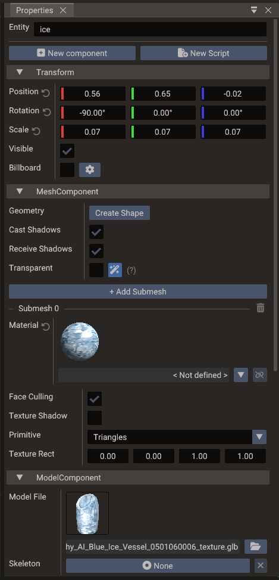
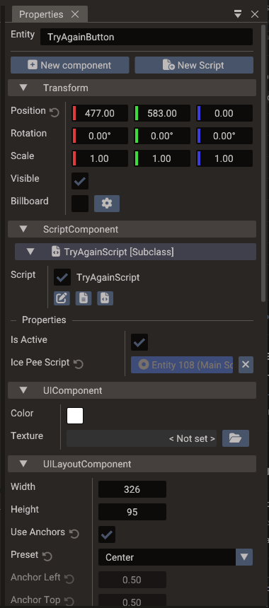
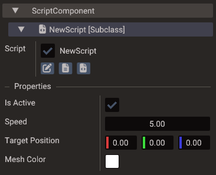

# Properties & Components

The **Properties window** displays every component attached to the selected entity and
lets you read and change their values. It is the primary place to configure transforms,
materials, physics, scripts, UI layout, audio, animations, and any other component
data.

## Selecting an entity

Click an entity in the **Structure panel** or directly in the **Scene view** to select
it. The Properties window updates immediately to show its components.

## Adding components

Use the **Add Component** button at the bottom of the Properties window. A searchable
dialog lists all available component types grouped by category. Components are added to
the entity immediately and their defaults appear in the panel for editing.

## Component groups

| Group | Typical components |
| --- | --- |
| **Spatial** | Transform, Camera, Light, Fog, Skybox, Mirror, Reflection Probe |
| **2D** | Sprite, Sprite Animation, Tilemap, Polygon, 2D Light, 2D Occluder |
| **3D** | Mesh, Model, Instanced Mesh, Terrain, Bone |
| **Physics** | Body2D, Body3D, Joint2D, Joint3D |
| **UI** | UILayout, Button, Text, Image, Panel, Scrollbar, Progressbar, TextEdit |
| **Animation** | TimedAction, ActionComponent, Animation |
| **Audio** | SoundComponent |
| **Scripting** | ScriptComponent and script property fields |

## Editing component fields

Most fields are edited with the mouse or keyboard directly in the panel:

| Field type | Editing method |
| --- | --- |
| Numbers (float, int) | Click and drag, or double-click to type a value |
| Vectors (Vector2, Vector3) | Per-component drag or type fields |
| Colors | Color picker with RGBA sliders |
| Booleans | Toggle checkbox |
| Strings | Inline text input |
| Textures / assets | Drag from the Resources Browser, type the asset path, or pick a **camera** as the source (camera button / drag a camera entity) for render-to-texture. For image sources, a sliders button opens the **Texture Settings** popup (filter, wrap, and SVG scale) |
| Entity references | Drag an entity from the Structure panel |
| Enumerations | Drop-down selection |

When a field differs from the component's default value, a small reset arrow appears next
to its label; clicking it restores the default. Edits apply to every selected entity and
every change is undoable.

A texture field set to a camera shows that camera's live output (render-to-texture). The
camera is switched to render-to-texture automatically and can no longer be the scene's
main camera. This is the manual building block behind effects like minimaps and monitors;
for reflections, prefer the [Mirror component](#mirror-component), which manages its own
camera.

Once a camera is in render-to-texture mode, its own properties gain a **Render Target**
section for setting the framebuffer **Width**, **Height**, and sampling **Filter**
(Nearest or Linear). These control the resolution and look of the output texture, are
saved with the scene, and are applied in exported projects.

When the field holds an image texture (not a camera link or an empty slot), a sliders
button next to the camera button opens the **Texture Settings** popup:

* **Min Filter** / **Mag Filter** — sampling filters for minification and magnification.
  Picking a mipmap variant for Min Filter enables mipmap generation for the texture.
* **Wrap U** / **Wrap V** — wrapping mode per texture axis.
* **SVG Scale** (only for `.svg` sources) — a multiplier on the vector's intrinsic size
  (a drag field plus 0.5×–4× presets), so the image rasterizes crisp when drawn larger or
  on high-DPI displays. The scale is stored on the texture reference, so different slots
  can use the same SVG at different resolutions.

Like any other field, each row shows the reset arrow when it differs from the component's
default, and the settings are saved with the scene and applied in exported projects. See
[Vector images (SVG)](../manual/resources-and-assets.md#vector-images-svg) for the
underlying behavior.

## Model component

The **Model** component loads a GLTF/GLB/OBJ file onto the entity. Multi-node GLTF
files usually create child mesh entities under the model root.

| Control | Purpose |
| --- | --- |
| **Model File** | Path to the model asset (browse or drag from Resources) |
| **Skeleton** | Optional skeleton entity reference |
| **Animations** | Clips imported with the model |

For static multi-node models that need same-entity features such as
[Instanced Mesh](#instanced-mesh), use **Merge static model** on the entity in
[Structure](structure.md#merge-static-model) (or **Restore model mesh children** to undo).
That sets the serialized `mergeStaticMeshes` flag and reloads the model in one undoable
step. See [3D Graphics — Merging static model meshes](../manual/3d-graphics.md#merging-static-model-meshes).

## Instanced Mesh

**Instanced Mesh** draws many copies of the *same entity's* mesh geometry with per-instance
transforms. Add it from **Add Component**, then populate the instance list in Properties
or from script via `Mesh::createInstancedMesh` / `addInstance`.

Instancing only uses geometry on the entity that owns the component. If a Model still
stores its meshes as child entities (the default multi-node GLTF layout), the editor
shows a warning and writes to the Output panel: instances will not render until you
[merge the static model](structure.md#merge-static-model).

A clone mark next to the entity in Structure indicates the instance count. See
[Rendering Pipeline — GPU instancing](../manual/rendering-pipeline.md#gpu-instancing).

## Mesh materials and IBL

The **Mesh** component exposes rendering flags beyond per-submesh material slots:

| Property | Purpose |
| --- | --- |
| **Receive IBL** | When enabled, the mesh is lit with the scene's Sky environment (diffuse irradiance + specular reflections) in addition to punctual lights. Requires a Sky entity with a cubemap texture. |
| **Receive Lights** | Master switch for dynamic lighting (must be on for IBL to apply). |
| **Cast / Receive Shadows** | Shadow map participation. |

Each **Submesh** section contains a **Material** row with a shaded preview sphere. The
preview reflects the current **Receive IBL** setting so you can see environment
reflections before entering play mode.

On a mesh that came from a model file, every field you change in the Submesh section is
kept as an override on the model and re-applied whenever the file reloads, while the
fields you leave alone keep following the file. See
[3D Graphics — Editing an imported model's submeshes](../manual/3d-graphics.md#editing-an-imported-models-submeshes).

Expand the Material row to edit **Alpha Mode** and **Alpha Cutoff** alongside the base
colour, textures, metallic, and roughness controls:

| Alpha mode | Use |
| --- | --- |
| **Auto** | Compatibility mode for editor-created and older materials. Texture/factor alpha can select transparent rendering automatically. |
| **Opaque** | Render the material fully opaque, regardless of base-colour alpha. |
| **Mask** | Cut out pixels below **Alpha Cutoff**; useful for leaves, hair cards, fences, and similarly sharp-edged transparency. |
| **Blend** | Render smooth or partial transparency through the transparent pass. |

**Alpha Cutoff** ranges from `0` to `1`, defaults to `0.5`, and only affects **Mask**.
Masked cutouts use the same threshold in the visible surface, shadows, depth, and SSR
G-buffer.

For explicit **Opaque**, **Mask**, and **Blend** modes, the engine derives **Texture
Shadow** from the alpha mode: it is enabled for Mask and disabled for the other two.
The separate **Texture Shadow** checkbox remains meaningful in **Auto** mode for legacy
materials and sprites.

### Linking material files

The Material row supports three workflows:

1. **Edit inline** — expand the material section and change factors and textures directly
   in the scene (values stored on the mesh component).
2. **Link to a file** — drag a `.material` file from the Resources Browser onto the
   Material row or preview; the mesh submesh links to that file and reloads when it
   changes on disk.
3. **Create a shared file** — drag the material preview **from Properties into the
   Resources Browser**; the editor writes a new `.material` file and links the submesh
   to it automatically.

When linked, the material name shows the file name and an **unlink** button (broken
chain icon) appears. Unlinking keeps the current values on the mesh but stops syncing
with the file.

You can also drop a single **image** onto the Material row to assign only the base colour
texture without replacing the rest of the material.

## Custom shaders

Mesh, UI, Points, Lines, and Sky components expose a **Shader** row. By default it shows
**Built-in**; **Fork** opens a dialog to choose where the fork is created and what it is
called, then writes it and opens the GLSL in the Code Editor. The remaining buttons pick
the `.vert`/`.frag` files, reopen the assigned shader, and reset to the engine default.
You can also drag an existing `.vert`/`.frag` from the Resources Browser onto the row.

A scene can also define a **default custom shader per type** (in the scene settings'
**Default Shaders** section); components whose Shader row shows **Built-in** inherit it.
A shader assigned on the component always takes priority over the scene default.

See [Custom Shaders](custom-shaders.md) for the full workflow, scene defaults, includes,
and project settings.

## Sky component

The **Sky** component controls the scene cubemap background and the IBL environment:

| Property | Purpose |
| --- | --- |
| **Visible** | Draw the sky in the viewport. When off, the sky is hidden but still feeds IBL to meshes with **Receive IBL** enabled. |
| **Texture** | Cubemap source (six faces or bundled layout). Changing it rebuilds IBL maps. |
| **Color** | Tint multiplied with the sky texture. |
| **Rotation** | Rotate the sky around the Y axis. |

Use **Default sky** to restore the built-in editor cubemap.

## Mirror component

The **Mirror** component turns its mesh into a planar reflection surface. Add it to a flat
mesh (a [Wall](structure.md#basic-shapes) works out of the box), or use the **Mirror**
entry in the Structure create menu, which sets up the wall and component together.

| Property | Purpose |
| --- | --- |
| **Normal** | The reflecting surface direction in the mesh's local space (default `+Z`, matching a Wall). It is rotated with the entity to form the world mirror plane. |

The reflection camera is created and managed by the engine — there is nothing else to
wire. If the reflection is clipped on the wrong side, flip the sign of **Normal**. See
[Rendering Pipeline — Mirrors and planar reflections](../manual/rendering-pipeline.md#mirrors-and-planar-reflections)
for how it works and its cost.

## Reflection Probe component

The **Reflection Probe** component gives meshes inside its box-shaped influence volume a
local reflection environment instead of the global sky — see
[Rendering Pipeline — Reflection probes](../manual/rendering-pipeline.md#reflection-probes)
for how probes are selected, blended, and captured.

| Property | Purpose |
| --- | --- |
| **Mode** | **Static** (authored cubemap, or captured once at load) or **Dynamic** (re-captured at runtime). |
| **Update** | *(dynamic)* Capture policy: On Load, On Move, Interval, or Manual. |
| **Update Interval** | *(dynamic, Interval)* Seconds between captures. |
| **Cubemap** | *(static)* Authored six-face cubemap; leave empty to capture at load. |
| **Intensity** | Reflection strength multiplier. |
| **Priority** | Higher-priority probes win where influence boxes overlap. |
| **Box Offset / Box Size** | The influence volume, in the entity's local space. The cubemap is always captured at the entity origin. |
| **Blend Distance** | Fade band at the box edges where the probe blends into the sky IBL. |
| **Resolution** | Capture face size (16–1024). |
| **Near / Far** | Capture camera clip planes. |
| **Include Sky** | Whether the sky appears in captures. |

Selecting the probe draws its influence box in the viewport — cyan for static, purple for
dynamic — with a gold marker at the capture origin when **Box Offset** moves the box away
from it. The **Refresh Probe** button forces a re-capture (or re-bake of the authored
cubemap) regardless of mode.

## Scripts

Two buttons at the bottom of the Properties window create scripts:

- **New Script** — opens a dialog that generates the script files (Lua module, or C++
  header + source), adds a `ScriptComponent` if the entity lacks one, and links an
  enabled entry to the new files — all in one undoable step.
- **New component → ScriptComponent**, then **Add Script** inside the component — adds
  an *empty* script entry without creating files. Use the entry's pencil button to set
  the class name and link existing header/source (or `.lua`) files.

Each script entry shows an enable checkbox, buttons to open its files in the Code
Editor, and a right-click menu to reorder or remove it.

### Script properties

When a script is linked, the Properties window shows every property declared with the
`DPROPERTY` macro (C++) or in the `properties` table (Lua). These fields are serialized
with the scene and injected into the script instance at play and export time.

See [Creating Scripts](../manual/creating-scripts.md) for the full workflow and
[Script Properties](../manual/script-properties.md) for declaring and typing custom
script properties.

## Entity references

Some component fields accept another entity as their value — for example, a physics
joint links two Body entities, a Camera can follow a target entity, and script
properties of pointer types display an entity picker. Drag the target entity from the
Structure panel into the field, or use the picker icon.

Keep referenced entities inside the same scene or a consistently-loaded child scene so
exports can resolve the relationship correctly.

## Transform gizmo

Selecting a transform field highlights the corresponding gizmo in the Scene view.
You can edit numeric values in the Properties window and see the result in the viewport
at the same time, or manipulate the gizmo and watch the numbers update live.

## Undo / redo

Every property edit is recorded in the command history. Use **Ctrl+Z** / **Ctrl+Y** to
step back and forward through changes made in the Properties window or in the viewport.

## Best practices

- Prefer editor-exposed `DPROPERTY` fields for any value a designer should tune,
  rather than hard-coding it in script logic.
- Keep generated or runtime-only data out of serialized component fields.
- After changing physics, script, or animation fields, test in play mode immediately
  because those affect runtime behavior, not just visual appearance.
- Use [bundles](bundles.md) for repeated configured entity hierarchies so the same
  property values do not have to be re-entered manually in many scenes. For entities
  inside a bundle instance, the component header's right-click menu offers
  **Make Unique** (override this instance) and **Revert to Bundle** (re-link to the
  shared values).
