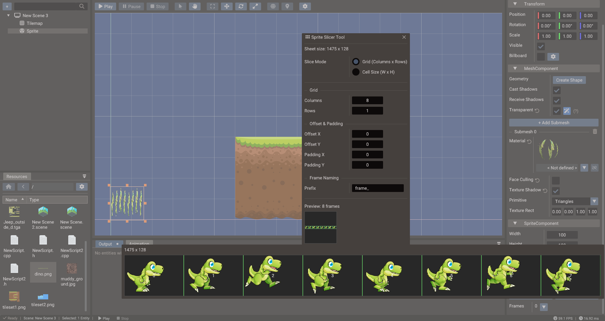

# Resources Browser

The **Resources Browser** is the file manager for your project's assets. It lets you
import new files, preview existing resources, drag assets into scenes, assign them to
components, and open specialized tool windows such as the Sprite Slicer and Tileset
Slicer.

## Supported resource types

| Type | Extensions | Typical use |
| --- | --- | --- |
| Textures | PNG, JPG, BMP, TGA, PSD, HDR | Sprites, UI images, albedo/normal/roughness/metallic maps, skyboxes |
| Models | GLTF, GLB, OBJ | 3D meshes, skeletons, animations, morph targets |
| Materials | `.material` (YAML) | Reusable PBR material definitions shared across meshes |
| Audio | OGG, WAV, MP3, FLAC | Sound effects, music, 3D spatial audio |
| Fonts | TTF, OTF | Text and UI rendering |
| Scenes | YAML scene files | Saved scenes and child scene references |
| Bundles | YAML `.bundle` files | Reusable entity hierarchies — see [Bundles](bundles.md) |
| Shaders | Shader data files | Built, serialized, and loaded shader programs |
| Scripts | LUA, CPP, H | Gameplay logic files |

## Previews

The browser includes inline preview renderers. Select a resource to see:

- **Texture preview** — full image with mip-level and channel controls.
- **Model preview** — interactive 3D view with orbit navigation, lighting, and material
  display.
- **Material preview** — shaded sphere with the PBR material applied.
- **Font preview** — sample text at the font's supported sizes.
- **Audio preview** — waveform display and play button.

Use previews to catch missing textures, wrong scale, or broken imports before dropping
assets into a scene.

## Importing assets

Copy files into your project folder or drag them from your OS file manager into the
Resources Browser. The editor scans the asset directories on startup and whenever the
project folder changes.

!!! tip "File naming"
    Use lowercase, hyphen-or-underscore-separated file names without spaces. Consistent
    naming avoids case-sensitivity issues on Linux and Android and makes asset paths
    predictable in scripts.

## Dragging assets out of the browser

Files dragged from the Resources Browser are accepted by several editor windows:

| Asset type | Drop target | Result |
| --- | --- | --- |
| Model (GLTF/GLB/OBJ) | Scene view (3D scene) | Creates a Model entity at the drop position |
| Image | Scene view, empty space (2D / UI scene) | Creates a Sprite (2D) or Image widget (UI) sized to the texture |
| Image | Scene view, onto a mesh or UI entity | Assigns the texture (base color / UI texture) with live preview |
| Material | Scene view, onto a mesh entity | Applies the material to all submeshes with live preview |
| Material (`.material`) | Properties → Material preview | Creates a new `.material` file in the open folder and links the source submesh |
| Font | Scene view, onto a Text entity | Assigns the font with live preview |
| Texture / audio / asset | A component field in Properties | Assigns the file to that field |
| `.scene` file | Structure panel, scene root | Adds the scene as a child scene |
| `.bundle` file | Structure panel | Creates a bundle instance (as child of the target entity, or at the root) |

See [Scene View](scene-view.md#drag-and-drop-from-the-resources-browser) for the
viewport behaviors in detail.

## Material files

A **`.material`** file stores a PBR material as YAML: base colour factor, metallic and
roughness factors, and texture paths for albedo, normal, metallic-roughness, occlusion,
and emissive slots. Material files live anywhere under the project and appear in the
Resources Browser with a shaded-sphere thumbnail preview.

### Creating a material file

Drag the **material preview** from the Properties window (Mesh → Submesh → Material row)
into the Resources Browser. Drop it on the folder where you want the file. The editor:

1. Creates `Material.material` (or `Material_1.material`, … if the name already exists).
2. Writes the current PBR settings into that file.
3. **Links** the submesh you dragged from, so future edits to the file propagate back to
   that mesh automatically.

This is the fastest way to turn a tuned material into a reusable project asset.

### Applying and sharing materials

| Action | How |
| --- | --- |
| Apply to a mesh | Drag the `.material` file from the browser onto a mesh in the Scene view, or onto the Material row in Properties |
| Share across many meshes | Link each mesh submesh to the same `.material` file — all linked meshes stay identical |
| Edit once, update all | Change the `.material` file on disk (or via linked Properties fields); the editor reloads linked meshes when the file timestamp changes |
| Stop sharing | Click the **unlink** button next to the material name in Properties |

Linked materials are tracked per submesh. The scene stores the link; the `.material` file
is the single source of truth for colour factors and texture paths.

!!! tip "Organize shared materials"
    Keep reusable `.material` files under something like `assets/materials/` and link
    props, terrain chunks, and instanced meshes to the same file instead of duplicating
    values in every scene.

## Dragging entities in: creating bundles

The Resources Browser is also a drop *target*: drag an entity (or a multi-selection)
from the **Structure panel** into the browser to save it as a `.bundle` file in the
currently open folder. The dragged hierarchy is replaced in the scene by an instance of
the new bundle. Since the file is created wherever you drop it, bundles can be
organized in any directory of the project.

See [Bundles](bundles.md) for the full bundle workflow.

## Context menu

Right-click any resource to access:

- **Open** — opens the file with the appropriate editor tool.
- **Open in Sprite Slicer** — opens the texture in the [Sprite Slicer](sprite-slicer.md) tool.
- **Open in Tileset Slicer** — opens the texture in the [Tileset Slicer](tileset-slicer.md) tool.
- **Rename** — renames the file on disk and updates scene references.
- **Delete** — removes the file from the project.
- **Show in OS** — reveals the file in the system file manager.

## Sprite and tileset slicing

Two dedicated slicer tools process sprite sheets and tilesets:

### Sprite Slicer

The **Sprite Slicer** divides a texture into named frames for sprite animation or
individual sprite display. Supports grid-based slicing (uniform cell size) and
free-form rectangle drawing for irregular layouts.

See [Sprite Slicer](sprite-slicer.md) for the complete workflow.

### Tileset Slicer

The **Tileset Slicer** splits a tileset texture into uniformly-sized tiles and assigns
each tile a numeric ID. Those IDs are used when painting tiles in the Tilemap editor
and when defining tile data in scripts.

See [Tileset Slicer](tileset-slicer.md) for the complete workflow.

## Organization guidelines

- Keep source art, imported assets, and generated data in separate folders.
- Separate audio by category: `sounds/effects/`, `sounds/music/`, etc.
- Prefer GLTF for animated or material-rich 3D assets; OBJ for simple static geometry.
- Store collision meshes separately from visual meshes.
- Remove unused large assets before exporting mobile or web builds to keep bundle
  sizes small.

## See also

- [Bundles](bundles.md)
- [Sprite Slicer](sprite-slicer.md)
- [Tileset Slicer](tileset-slicer.md)
- [Resources & Assets](../manual/resources-and-assets.md)
- [2D Graphics](../manual/2d-graphics.md)
