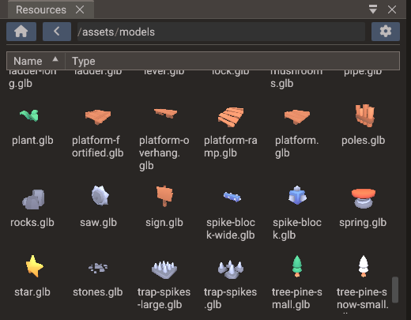

# Resources Browser

The **Resources Browser** is the file manager for your project's assets. It lets you
import new files, preview existing resources, drag assets into scenes, and assign them
to components.

## Supported resource types

| Type | Extensions | Typical use |
| --- | --- | --- |
| Textures | PNG, JPG, BMP, TGA, PSD, HDR, SVG | Sprites, UI images, albedo/normal/roughness/metallic maps, skyboxes |
| Models | GLTF, GLB, OBJ, FBX | 3D meshes, skins, node hierarchy, animations, morph targets |
| Materials | `.material` (YAML) | Reusable PBR material definitions shared across meshes |
| Audio | OGG, WAV, MP3, FLAC | Sound effects, music, 3D spatial audio |
| Fonts | TTF, OTF, TTC | Text and UI rendering |
| Scenes | YAML scene files | Saved scenes and child scene references |
| Bundles | YAML `.bundle` files | Reusable entity hierarchies — see [Bundles](bundles.md) |
| Shaders | Shader data files | Built, serialized, and loaded shader programs |
| Scripts | LUA, CPP, H | Gameplay logic files |

Scenes and bundles the project does not use are drawn **dimmed**: a `.scene` file that is
not one of the project's scenes, and a `.bundle` no scene instantiates that is not listed
in **Project → Bundles**. Hover one to see why — a dimmed bundle is not built into the
game, so `BundleManager` cannot spawn it. See [Bundles in the build](bundles.md#bundles-in-the-build).

## Previews

The browser includes inline preview renderers. Select a resource to see:

- **Texture preview** — full image with mip-level and channel controls.
- **Model preview** — interactive 3D view with orbit navigation, lighting, and material
  display.
- **Material preview** — shaded sphere with the PBR material applied.
- **Font preview** — sample text at the font's supported sizes.
- **Audio preview** — waveform display and play button.

Use previews to catch missing textures, wrong scale, or broken imports before dropping
assets into a scene.

## Importing assets

Copy files into your project folder or drag them from your OS file manager into the
Resources Browser. The editor scans the asset directories on startup and whenever the
project folder changes.

!!! tip "File naming"
    Use lowercase, hyphen-or-underscore-separated file names without spaces. Consistent
    naming avoids case-sensitivity issues on Linux and Android and makes asset paths
    predictable in scripts.

## FBX models

FBX files are used like any other model: drop one into a scene, pick it for a component,
or load it by its `.fbx` path from a script. The editor converts each one to a binary glTF
the first time it is needed (the browser's preview counts), keeps the conversion in
`.doriax/imported/`, and converts it again when the FBX or one of its textures changes.
Models in open scenes then reload with the new conversion. Warnings, such as a texture
that could not be found, appear in the Output panel.

**Reimport** in the [context menu](#context-menu) converts a file again on demand. See
[3D Graphics — FBX models](../manual/3d-graphics.md#fbx-models) for what is converted and
how textures are found.

## Dragging assets out of the browser

Files dragged from the Resources Browser are accepted by several editor windows:

| Asset type | Drop target | Result |
| --- | --- | --- |
| Model (GLTF/GLB/OBJ/FBX) | Scene view (3D scene) | Creates a Model entity at the drop position |
| Image | Scene view, empty space (2D / UI scene) | Creates a Sprite (2D) or Image widget (UI) sized to the texture |
| Image | Scene view, onto a mesh or UI entity | Assigns the texture (base color / UI texture) with live preview |
| Material | Scene view, onto a mesh entity | Applies the material to all submeshes with live preview |
| Material (`.material`) | Properties → Material preview | Creates a new `.material` file in the open folder and links the source submesh |
| Font | Scene view, onto a Text entity | Assigns the main font with live preview and preserves its fallback slots |
| Texture / audio / asset | A component field in Properties | Assigns the file to that field |
| `.scene` file | Structure panel, scene root | Adds the scene as a child scene |
| `.bundle` file | Structure panel | Creates a bundle instance (as child of the target entity, or at the root) |

Only files inside the
[assets directory](project-workflow.md#assets-and-lua-directories) can be assigned. One
from elsewhere in the project still previews while you drag, but the drop is refused with
a warning, since its path could not be stored or exported. Material files are project
files and are not affected.

See [Scene View](scene-view.md#drag-and-drop-from-the-resources-browser) for the
viewport behaviors in detail.

## Material files

A **`.material`** file stores a PBR material as YAML: base colour factor, metallic and
roughness factors, alpha mode and cutoff, per-texture UV sets, and texture paths for
albedo, normal, metallic-roughness, occlusion, and emissive slots. Material files live
anywhere under the project and appear in the Resources Browser with a shaded-sphere
thumbnail preview.

### Creating a material file

Drag the **material preview** from the Properties window (Mesh → Submesh → Material row)
into the Resources Browser. Drop it on the folder where you want the file. The editor:

1. Creates `Material.material` (or `Material_1.material`, … if the name already exists).
2. Writes the current PBR settings into that file.
3. **Links** the submesh you dragged from, so future edits to the file propagate back to
   that mesh automatically.

This is the fastest way to turn a tuned material into a reusable project asset.

### Applying and sharing materials

| Action | How |
| --- | --- |
| Apply to a mesh | Drag the `.material` file from the browser onto a mesh in the Scene view, or onto the Material row in Properties |
| Share across many meshes | Link each mesh submesh to the same `.material` file — all linked meshes stay identical |
| Edit once, update all | Change the `.material` file on disk (or via linked Properties fields); the editor reloads linked meshes when the file timestamp changes |
| Stop sharing | Click the **unlink** button next to the material name in Properties |

Linked materials are tracked per submesh. The scene stores the link; the `.material` file
is the single source of truth for colour factors, alpha settings, UV selections, and
texture paths. Linking a submesh of an imported model keeps the link across reloads of
that model — see
[3D Graphics — Editing an imported model's submeshes](../manual/3d-graphics.md#editing-an-imported-models-submeshes).

!!! tip "Organize shared materials"
    Keep reusable `.material` files under something like `assets/materials/` and link
    props, terrain chunks, and instanced meshes to the same file instead of duplicating
    values in every scene.

## Dragging entities in: creating bundles

The Resources Browser is also a drop *target*: drag an entity (or a multi-selection)
from the **Structure panel** into the browser to save it as a `.bundle` file in the
currently open folder. The dragged hierarchy is replaced in the scene by an instance of
the new bundle. Since the file is created wherever you drop it, bundles can be
organized in any directory of the project.

See [Bundles](bundles.md) for the full bundle workflow.

## Context menu

Double-click a file to open it in its editor tool (image viewer, scene, or code editor).
Right-click a file or folder to access:

- **Open (Add)** — `.scene` files only: opens the scene alongside the one already open
  instead of replacing it.
- **Reimport** — `.fbx` files only: converts the file to glTF again, even when nothing
  changed (see [FBX models](#fbx-models)).
- **New** — folders only: creates a folder or file inside the folder (see
  [Creating files and folders](#creating-files-and-folders)).
- **Copy** / **Cut** / **Paste** — copies or moves the selected files. Paste puts the
  clipboard contents into the right-clicked folder.
- **Delete** — removes the file from the project and clears every reference to it in
  scenes, bundles and `.material` files, including C++ and Lua script entries. Undo
  restores the file, not the references.
- **Rename** (`F2`) — renames the file on disk and updates scene references. `F2` acts
  on the selected file, or on the one under the mouse when nothing is selected.
- **Open in File Manager** — shows the selection in the OS file manager (Explorer,
  Finder, or the Linux default). A folder opens itself; a file opens the folder that
  contains it.

Right-click empty space in the listing for **Import Files**, **Import Folders**,
**New**, **Paste** into the current folder, and **Open in File Manager** for the
current folder.

### Creating files and folders

**New** opens a submenu of the items it can create. Each asks for a name; typing the
extension is optional.

| Item | Creates |
| --- | --- |
| **Folder** | An empty folder |
| **Lua Script** | A `.lua` module that returns an empty table named after the file |
| **C++ Source** | An empty `.cpp` file |
| **C++ Header** | A `.h` file starting with `#pragma once` |

New files are not attached to any entity. Load a Lua module from other scripts with
[`require()`](../manual/scripting.md#require-and-module-paths), include a header from
your scripts, or attach a script later with **Add Script** in Properties.

- **Lua Script** is enabled only inside the project's
  [Lua directory](project-workflow.md#assets-and-lua-directories), which `require()` and
  script entries resolve against.
- A **C++ Source** compiles on its own only under one of the
  [script directories](../manual/cpp-build-setup.md#script-directories); elsewhere it
  compiles only as an attached script, and the dialog says so.

Undo moves a new file to `.trash`, and redo brings it back with any edits.

## Sprite and tileset slicing

Sprite sheets and tilesets are cut by two slicer tools. Both open from the
**Slicer Tool** button of a component in the [Properties window](properties.md), not
from the Resources Browser.

### Sprite Slicer

The **Sprite Slicer** divides a Sprite's texture into named frames on a regular grid,
for sprite animation or individual sprite display.

See [Sprite Slicer](sprite-slicer.md) for the complete workflow.

### Tileset Slicer

The **Tileset Slicer** divides a Tilemap's texture into tile rects on a regular grid.
Each rect has an index and a name; you place tiles by dragging a rect into the viewport,
and scripts refer to rects by index.

See [Tileset Slicer](tileset-slicer.md) for the complete workflow.

## Organization guidelines

- Keep source art, imported assets, and generated data in separate folders.
- Separate audio by category: `sounds/effects/`, `sounds/music/`, etc.
- Prefer GLTF for animated or material-rich 3D assets; OBJ for simple static geometry.
  FBX files work as they come from your content tool, through their glTF conversion.
- Store collision meshes separately from visual meshes.
- Remove unused large assets before exporting mobile or web builds to keep bundle
  sizes small.
- Do not name a top-level file or folder in the assets directory `resources.pak` or
  `resources.pak.tmp`. Those names are reserved for the optional native resource pack.

## See also

- [Bundles](bundles.md)
- [Sprite Slicer](sprite-slicer.md)
- [Tileset Slicer](tileset-slicer.md)
- [Resources & Assets](../manual/resources-and-assets.md)
- [2D Graphics](../manual/2d-graphics.md)
