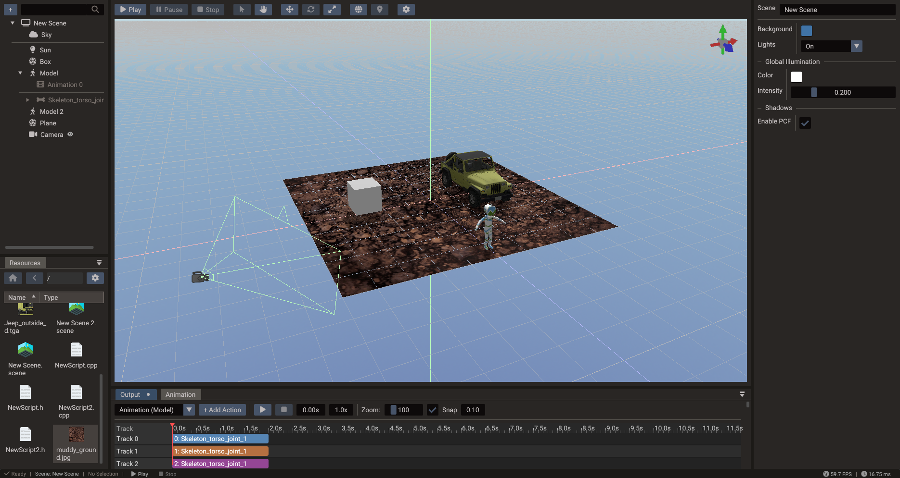
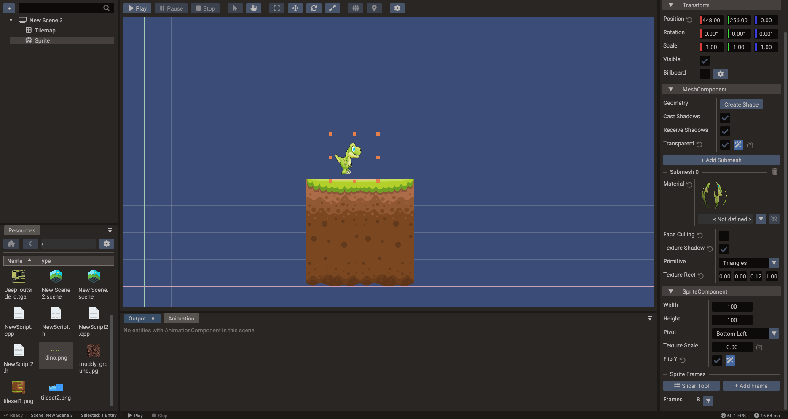
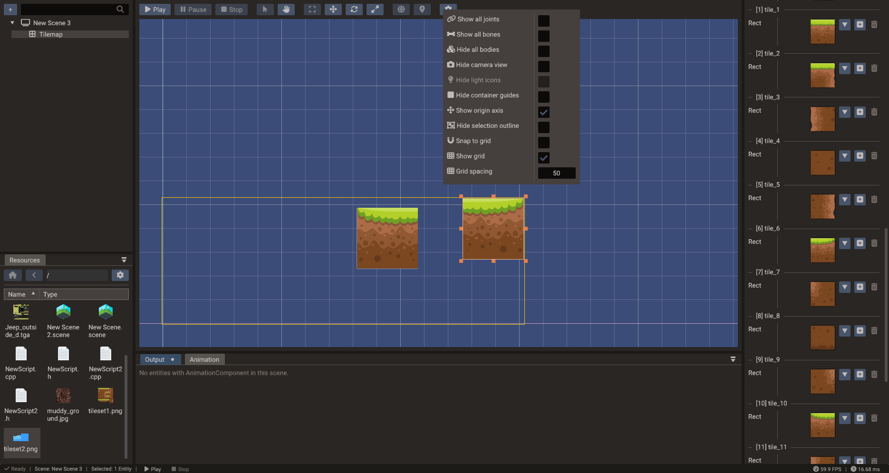
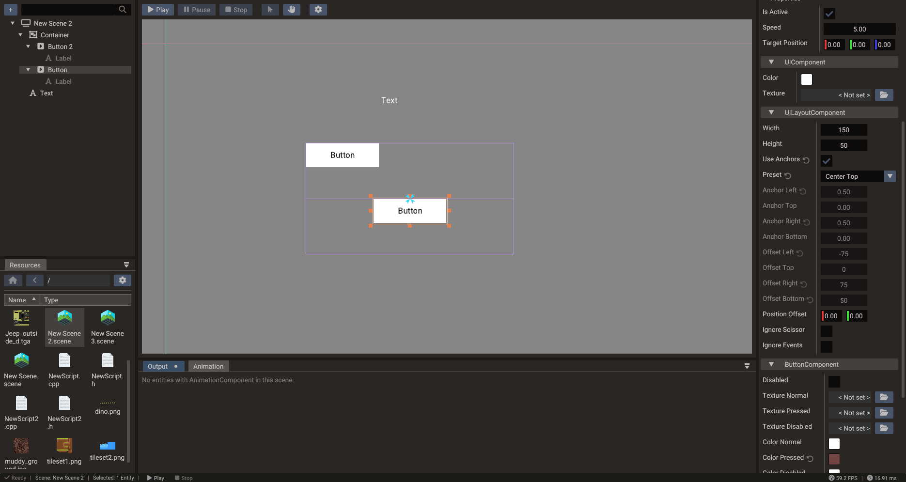

# Scene View

The **Scene view** is the main canvas for authoring scenes. It renders the current
scene using editor cameras and overlays gizmos, selection highlights, and tool guides
on top. You place, rotate, scale, and test entities here, and you see the result of
component changes made in the Properties window immediately.

## Navigation

| Action | Input |
| --- | --- |
| **Orbit** | Right-click drag (3D) |
| **Pan** | Middle-click drag, or Shift + right-click drag |
| **Zoom** | Mouse wheel |
| **Focus on selection** | **F** key |
| **Reset camera** | Home key or double-click empty space |

In 2D mode the camera is orthographic; orbit is replaced with a simple pan.

## Gizmo tools

Select a gizmo mode from the toolbar or with the keyboard:

| Gizmo | Key | Purpose |
| --- | --- | --- |
| **Translate** | W | Move selected entities along axes or planes |
| **Rotate** | E | Rotate selected 3D entities |
| **Scale** | R | Resize entities uniformly or per axis |
| **Object2D** | — | Manipulate 2D objects in canvas space (position and size) |
| **Anchor** | — | Edit UI anchor points and layout bounds |

Hold **Ctrl** while transforming to snap to the configured grid interval. Hold **Alt**
to move in world space instead of local space.

## Viewport settings

Open the **gear** button on the scene view toolbar to toggle display and snap options
for the current scene. Settings are saved with the project.

| Setting | Applies to | Purpose |
| --- | --- | --- |
| **Snap to grid** | All scene types | Snap transforms to the configured grid spacing |
| **Snap tile** | 2D / UI | Snap Tilemap tiles to their own width and height so they pack edge-to-edge |
| **Snap rotation** | All scene types | Snap rotations to the configured step (degrees) |
| **Show grid** | All scene types | Draw the editor grid overlay |
| **Grid spacing** | All scene types | Interval used by the grid and by **Snap to grid** |

**Snap tile** takes priority over **Snap to grid** while you move or resize an
individual tile inside a Tilemap. Turn it on when laying out floors, walls, or other
tiled content that should sit flush without relying on the global grid.

## Selection

Click an entity in the viewport to select it; the Properties window updates
immediately. Hold **Ctrl** and click to add to or remove from a multi-selection.

Selection respects the [Structure panel](structure.md#tree-marks-and-collapse) expand
state: if the hit entity is under a **collapsed** parent, the editor selects that
visible ancestor instead of a hidden child. Expand the parent in Structure when you
need to pick a specific child mesh or node (common with multi-node and animated models).

For fine-grained selection in dense scenes, use the **Structure panel** — clicking a
row there selects the entity without needing to click through overlapping objects.

## Drag and drop from the Resources Browser

Files dragged from the [Resources Browser](resources.md) can be dropped directly into
the viewport. The editor shows a live preview while you hover, and the change is only
committed (undoably) when you release the mouse:

### Creating entities

| File | Scene type | Result |
| --- | --- | --- |
| Model (GLTF/GLB/OBJ) | 3D | Creates a Model entity at the drop position, named after the file |
| Image | 2D, on empty space | Creates a **Sprite** entity at the drop point, sized to the image |
| Image | UI, on empty space | Creates an **Image** widget at the drop point, sized to the image |

While dragging an image over empty space, a half-transparent ghost of the texture
follows the cursor so you can place it precisely before dropping.

### Modifying the entity under the cursor

Dropping a file *onto* an existing entity assigns it instead of creating something new.
The hovered entity previews the change live; moving away before releasing restores the
original value:

| File | Target entity | Result |
| --- | --- | --- |
| Image | Mesh-based entity (sprite, mesh, model) | Sets the base color texture of the material |
| Image | UI widget | Sets the widget texture |
| Material (`.material`) | Mesh-based entity | Links all submeshes to the material file (live preview while hovering) |
| Font (TTF/OTF) | Text entity | Sets the text font |

This makes texturing a scene fast: drop a texture onto each model to assign it, or
drop a saved material onto several meshes to keep them consistent.

### Shared materials across meshes

When you drop the same `.material` file onto different mesh entities, each submesh
**links** to that file. Editing the material in Properties (while linked) or saving the
`.material` file on disk updates every linked mesh.

To create a new shared material from an existing look:

1. Tune the material on one mesh in Properties.
2. Drag its **material preview** into the Resources Browser to create `Material.material`.
3. Drag that file onto other meshes in the Scene view.

Use the unlink control in Properties when a mesh needs a one-off variation copied from a
shared file.

!!! note "Bundles and scenes drop on the Structure panel"
    `.bundle` and `.scene` files are instanced by dropping them on the
    [Structure panel](structure.md), not the viewport — the tree controls where the
    instance is parented. See [Bundles](bundles.md).

## Viewport camera vs game camera

The **editor camera** is only for authoring navigation. The **game camera** is a
`Camera` entity you place in your scene; it defines what the player sees at runtime.
Always verify gameplay framing with the game camera preview before testing.

## 2D and tilemap editing

In a 2D scene the editor uses orthographic projection and a canvas overlay. Sprites,
tilemaps, UI widgets, and polygons should be positioned in a consistent logical
coordinate system so that canvas scaling stays predictable across different screen sizes.

Tilemap cells can be painted directly in the scene view when a Tilemap entity is
selected and the tile-paint mode is active.

### Placing and grouping tiles

Drag a tile rect from the Tilemap palette onto the viewport to place it. With
**Snap tile** enabled in the viewport settings:

- Dropped tiles snap to multiples of their own size in the tilemap's local space.
- Dragging or resizing a selected tile with the Object2D gizmo snaps the same way, so
  neighboring tiles line up edge-to-edge.

Use **Snap to grid** instead when tiles should align to the scene grid rather than to
each other. See also [Tileset Slicer](tileset-slicer.md).

### 2D lights and occluders

2D lights show a **bulb icon** in the viewport — click the icon to select the light and
drag it to move it. While selected, the light's range is drawn as a circle.

Selecting an entity with an **Occluder2D component** shows its outline. For polygon
occluders, each point gets a small handle:

- **Click a handle** to select that point (it also highlights in the Properties point
  list), then **drag the move cross** to reposition it. The drag is a single undo step
  and respects snap-to-grid.
- **Click the occluder body** to go back to entity-level selection, or click another
  handle to switch points.

Standalone occluder entities (no sprite) are selected by clicking anywhere inside the
polygon's bounds. See [2D Graphics — 2D shadows](../manual/2d-graphics.md#2d-shadows).

## 3D scene editing

3D scenes use perspective projection and full 3D gizmos. Switch between the editor
camera and the game camera preview to check framing. Use the **F** key to center the
view on a selected entity.

## Editing movement paths (TranslateTracks)

Selecting a **TranslateTracks** entity draws its movement path in the viewport: a
polyline through the keyframe positions with a handle at each point, shown in the
space the values play back in (the action target's parent space). The path renders
on top of scene geometry, so waypoints lying on floors or inside meshes stay visible.

- **Click a handle** to select that point — it highlights and the translate gizmo
  (move cross in 2D scenes) jumps to it.
- **Drag the gizmo** to move the point. The drag is a single undo step, respects
  snap-to-grid, and updates the track's `values` list live in the Properties window.
- **Click empty space** or another entity to return to normal selection.

Keyframe *times* and per-segment easing are edited in the **Properties** window; see
[Keyframe tracks](../manual/animation.md#keyframe-tracks-timeline-authored).

## UI scene editing

UI scenes display the canvas in screen-space overlay mode. Anchor gizmos show the
layout boundaries of UI elements. Drag anchors directly to reposition or stretch
widgets relative to their parent.

## Physics visualization

When a `Body2D` or `Body3D` is attached, the editor draws the collision shape outline
in the viewport. This lets you verify that the physics shape matches the visual mesh
without running the game.

## Play mode in the viewport

Press **Play** to run the scene inside the viewport. All input and logic operate
normally. When you press **Stop**, the scene is restored to the pre-play snapshot.
Use play mode for fast local iteration; export to a real build for platform-specific
testing.

Play mode follows **Project → Project Settings → VSync**. With VSync disabled, the
editor render loop is uncapped while a scene is running; after you stop, frames follow
**View → Editor VSync** instead. See [Project Workflow — VSync](project-workflow.md#vsync)
and [Editor VSync](project-workflow.md#editor-vsync).
