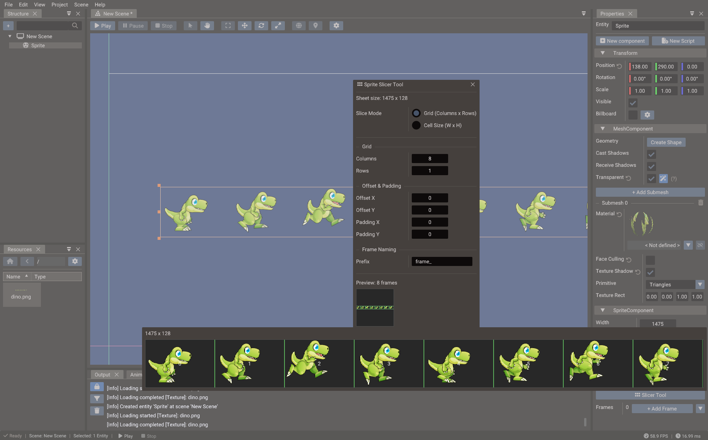
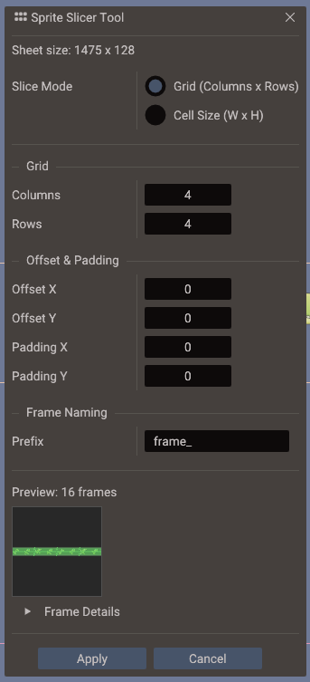

# Sprite Slicer

The **Sprite Slicer** tool cuts a single texture into a series of named frames that the
engine can use for sprite animation, atlas-based rendering, or individual sprites. Once
sliced, frames are referenced by name or index and do not require the original atlas
to be split into separate files.



## Opening the Sprite Slicer

Select a texture in the **Resources Browser** and choose **Open in Sprite Slicer** from
the context menu, or double-click the texture preview if the texture has already been
tagged as a sprite sheet.

## Slice modes

| Mode | When to use |
| --- | --- |
| **Grid** | All frames are the same size and aligned on a regular grid |
| **Free** | Frames have arbitrary positions and sizes — draw each frame manually |

The **Grid** mode is the fastest workflow for regular sprite sheets such as animated
characters, explosion effects, or item icons.


## Grid slicing



1. Set **Cell Width** and **Cell Height** to the pixel size of one frame.
2. Optionally set **Offset X / Y** (first-cell inset) and **Spacing X / Y** (gap
   between cells) if your sheet has padding.
3. Click **Slice** — the tool fills the frame list with all cells that fit.
4. Rename frames as needed. Frame names are used by `Sprite::setFrame(name)` and
   `Sprite::startAnimation(name, …)`. `SpriteAnimation::setAnimation` uses frame
   indices; identify the action entity by its entity name if you need a searchable label.
5. Click **Save** to commit the slice data to the texture resource.

## Free slicing

1. Draw a rectangle over each frame region in the canvas.
2. Give each frame a unique name.
3. Reorder or delete frames in the list on the right.
4. Click **Save**.

## Working with frames at runtime

After slicing, use frame names or indices in scripts and components:

=== "Lua"

    ```lua
    sprite = Sprite(scene)
    sprite:setTexture("characters/hero.png")

    -- Show a specific frame by name or index
    sprite:setFrame("walk_01")

    -- Animate through a frame index range (interval in milliseconds)
    anim = SpriteAnimation(scene)
    anim:setTarget(sprite)
    anim:setAnimation(1, 8, 100, true)   -- startFrame, endFrame, interval (ms), loop
    anim:start()
    ```

=== "C++"

    ```cpp
    Sprite hero(&scene);
    hero.setTexture("characters/hero.png");

    // Show a specific frame by name or index
    hero.setFrame("walk_01");

    // Animate through a frame index range (interval in milliseconds)
    SpriteAnimation anim(&scene);
    anim.setTarget(&hero);
    anim.setAnimation(1, 8, 100, true);
    anim.start();
    ```

## Tips

- Keep sprite sheets power-of-two in size for best GPU compatibility.
- Use consistent frame naming conventions (`walk_00` … `walk_07`) so animation ranges
  are easy to specify.
- A single texture can contain multiple animation sequences — just name them clearly.
- For tilemaps and tilesets, use the [Tileset Slicer](tileset-slicer.md) instead, which
  is designed for tile index workflows.

## See also

- [Tileset Slicer](tileset-slicer.md)
- [Sprite](../reference/classes/sprite.md)
- [SpriteAnimation](../reference/classes/spriteanimation.md)
- [2D Graphics](../manual/2d-graphics.md)
