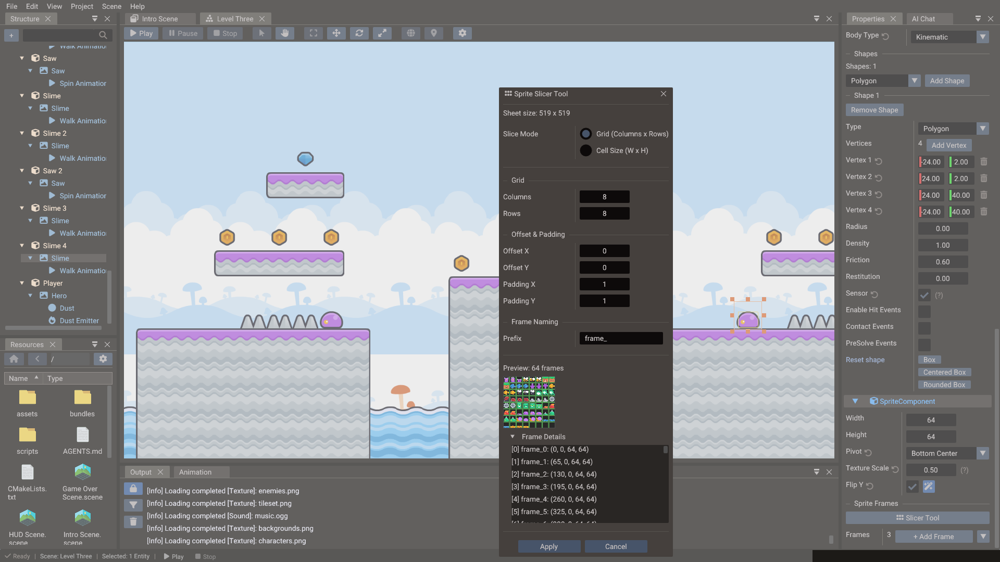
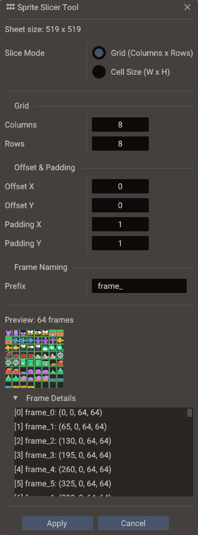

# Sprite Slicer

The **Sprite Slicer** tool cuts a single texture into a series of named frames that the
engine can use for sprite animation, atlas-based rendering, or individual sprites. Once
sliced, frames are referenced by name or index and do not require the original atlas
to be split into separate files.



## Opening the Sprite Slicer

Select an entity with a **Sprite** component. In the [Properties window](properties.md),
click **Slicer Tool** in the component's **Sprite Frames** section. The slicer works on
the texture the sprite already uses, so assign the sprite sheet first.

## Slice modes

| Mode | When to use |
| --- | --- |
| **Grid (Columns x Rows)** | You know how many frames the sheet has across and down; the cell size is derived from the sheet size |
| **Cell Size (W x H)** | You know the pixel size of one frame; the number of columns and rows is derived |

Both modes cut a regular grid, the fastest workflow for sprite sheets such as animated
characters, explosion effects, or item icons. For frames of different sizes, slice the
regular part and adjust the rects in the component's **Sprite Frames** list afterwards.



## Grid slicing

1. Pick a slice mode, then enter **Columns** and **Rows**, or **Cell Width** and
   **Cell Height**.
2. Set **Offset X / Y** (inset of the first cell) and **Padding X / Y** (gap between
   cells) if the sheet has margins or gutters.
3. Change the **Prefix** under **Frame Naming** if you want names other than `frame_0`,
   `frame_1`, …. Frames are numbered left to right, top to bottom.
4. Check the **Preview**: it shows how many frames the grid produces over a thumbnail of
   the sheet. Expand **Frame Details** to see each frame's name and rect in pixels.
   Cells that run past the edge of the sheet are clipped to it.
5. Click **Apply**. The sprite's frame list is replaced with the new frames, as one
   undoable step.

Frame names are used by `Sprite::setFrame(name)` and `Sprite::startAnimation(name, …)`.
`SpriteAnimation::setAnimation` uses frame indices; identify the action entity by its
entity name if you need a searchable label.

## Working with frames at runtime

After slicing, use frame names or indices in scripts and components:

=== "Lua"

    ```lua
    sprite = Sprite(scene)
    sprite:setTexture("characters/hero.png")

    -- Show a specific frame by name or index
    sprite:setFrame("walk_01")

    -- Animate through a frame index range (interval in milliseconds)
    anim = SpriteAnimation(scene)
    anim:setTarget(sprite)
    anim:setAnimation(1, 8, 100, true)   -- startFrame, endFrame, interval (ms), loop
    anim:start()
    ```

=== "C++"

    ```cpp
    Sprite hero(&scene);
    hero.setTexture("characters/hero.png");

    // Show a specific frame by name or index
    hero.setFrame("walk_01");

    // Animate through a frame index range (interval in milliseconds)
    SpriteAnimation anim(&scene);
    anim.setTarget(&hero);
    anim.setAnimation(1, 8, 100, true);
    anim.start();
    ```

## Tips

- Keep sprite sheets power-of-two in size for best GPU compatibility.
- Use consistent frame naming conventions (`walk_00` … `walk_07`) so animation ranges
  are easy to specify.
- A single texture can contain multiple animation sequences — just name them clearly.
- For tilemaps and tilesets, use the [Tileset Slicer](tileset-slicer.md) instead, which
  is designed for tile index workflows.

## See also

- [Tileset Slicer](tileset-slicer.md)
- [Sprite](../reference/classes/sprite.md)
- [SpriteAnimation](../reference/classes/spriteanimation.md)
- [2D Graphics](../manual/2d-graphics.md)
