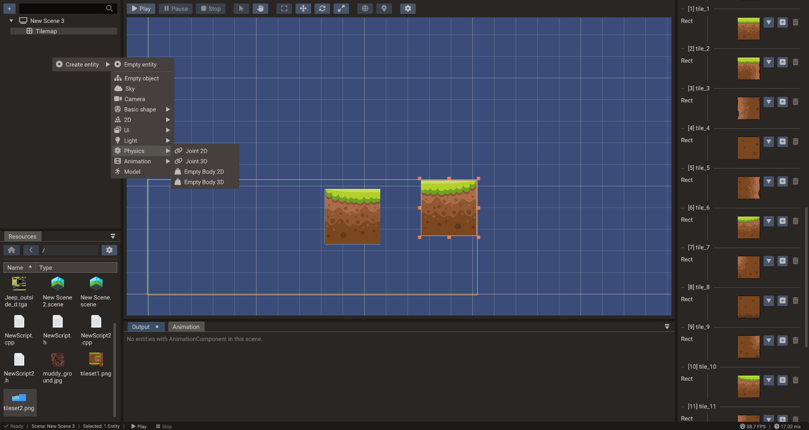

# Structure Panel

The Structure panel is the editor's tree view for scenes and entities. It is also the
clearest way to understand Doriax's ECS model: everything shown under a scene is an
entity, but only entities with a `Transform` participate in the spatial hierarchy.

## Scene root

The top node is the selected scene. Child scenes are shown before entities. If a child
scene is expanded inline, its entities are shown under that child scene node.

## Child scenes

A scene can reference other scenes as **child scenes** so they load and run together as
one [scene stack](../manual/scenes-and-entities.md#scene-stacks). Child scene nodes appear
above the parent's entities, tinted to set them apart.

**Add a child scene** in one of two ways:

- Right-click the scene root and choose **Add child scene → _SceneName_** (the submenu
  lists every other scene that is not already attached).
- Drag a `.scene` file from the [Resources Browser](resources.md) onto the scene root.

**Right-click a child scene node** for its menu:

| Action | Effect |
| --- | --- |
| **Start active** | Toggles whether the child scene is added to the engine automatically when the parent loads. On (the default) means it runs immediately; off means it is built but hidden until you call `SceneManager.addChildScene` at runtime. |
| **Remove child scene** | Detaches the reference (it does not delete the scene file). |

Click the **eye icon** on a child scene node to load it *inline* — its entities appear
nested under the node so you can view and edit them in the parent's context. This is an
editing convenience and does not affect runtime behavior.

**Order matters:** scenes render as layers, with the main scene at the bottom and each
child scene drawn on top of the ones listed above it — so the last child scene is the
topmost layer. The order follows the order you added the child scenes; to change it,
remove them and add them back in the sequence you want (top-most last). See
[Child scenes](../manual/scenes-and-entities.md#child-scenes) in the manual for the full
runtime model.

## Empty entity vs empty object

The create menu has two intentionally different entries:

| Entry | Components added | Meaning |
| --- | --- | --- |
| Empty entity | None | A pure entity ID. Use it for logic, global scripts, non-spatial data, or components that do not need a transform. |
| Empty object | `Transform` | A spatial entity. It can be positioned, parented, rendered, and shown in the hierarchy. |

This distinction matters because the entity itself owns nothing. Components decide what
the ID can do.

The rest of the create menu adds ready-configured entities (camera, light, sky, fog,
sound, **mirror**), basic shapes, 2D and UI objects, physics bodies, and more — each one
is just an entity with the right components already attached.

The **2D** submenu includes **2D Light** and **2D Occluder** for the 2D lighting
system — see [2D Graphics — 2D lighting](../manual/2d-graphics.md#2d-lighting).

### Basic shapes

**Basic shape** creates a mesh entity with procedural geometry: Box, Plane, **Wall**,
Sphere, Cylinder, Capsule, and Torus. A **Plane** lies flat (normal points up, `+Y`); a
**Wall** stands upright facing the camera (normal points `+Z`) — handy for walls,
backdrops, and mirror surfaces. You can change a mesh's geometry later from the
**Create Shape** dropdown in [Properties](properties.md).

### Mirror

**Mirror** is a one-click convenience entry: it creates a Wall with a
[Mirror component](properties.md#mirror-component) already attached, giving an upright
planar-reflection surface with no camera or texture setup. See
[Rendering Pipeline — Mirrors](../manual/rendering-pipeline.md#mirrors-and-planar-reflections).

## Hierarchical area

Entities with `Transform` appear in the hierarchy area. Their parent-child relation is
stored in `Transform::parent`, and their order is managed by the scene registry. Moving
a parent updates child world transforms through that parent chain.

Common entities in this area include objects, sprites, models, cameras, lights, 3D
sounds, physics bodies, UI widgets, points, lines, terrain, and mesh polygons.

## Non-hierarchical area

Entities without `Transform` appear separately before the transform hierarchy. They are
valid scene entities, but they do not have a spatial parent or local/world transform.

Typical non-transform entities include:

| Entity type | Why it may not need `Transform` |
| --- | --- |
| Empty entity | Logic-only entity or script host |
| Sound source | Non-spatial audio |
| Sky/Fog | Scene environment data |
| Joints | Constraint data linking physics bodies |
| Actions/animations | Time-based behavior targeting another entity |
| Particles action | Playback behavior targeting another entity |

An entity can be selected and inspected even if it is not in the transform hierarchy.
Add a `Transform` if it should become spatial or parentable.

## Drag and drop rules

Reparenting is a transform operation. Dragging an entity under another entity only
makes sense when the moved entity has `Transform`. Non-transform entities can still be
reordered in their separate area or associated virtually with a target, such as an
action targeting a transformed entity.

Drag and drop also crosses window boundaries:

| Drag | Drop | Result |
| --- | --- | --- |
| Entity (or selection) from Structure | Resources Browser | Saves the hierarchy as a `.bundle` file and replaces it with a bundle instance |
| Entity from Structure | Entity-reference field in Properties | Assigns the entity to that field |
| Entity from Structure | Script file in the Code Editor | Inserts an entity reference property ([details](code-editor.md#drag-entities-into-your-code)) |
| `.bundle` file from Resources | Scene root or an entity with `Transform` | Creates a bundle instance there |
| `.scene` file from Resources | Scene root | Adds it as a child scene |

## Bundles in the tree

A bundle instance appears as a root node with its member entities nested under it.
Editing members edits the bundle (and every other instance); right-click menus on
bundle nodes let you **Insert into bundle**, **Remove from bundle**, or move outside
entities into a bundle with **Insert to Bundle**. See [Bundles](bundles.md) for the
complete workflow.

## Practical model

Use the Structure panel as a quick diagnostic:

- Entity appears in the tree hierarchy: it has `Transform`.
- Entity appears above the hierarchy: it has no `Transform`.
- Entity cannot be parented: add `Transform` or choose Empty object instead.
- Visual entity is missing from the hierarchy: check whether `Transform` was removed.