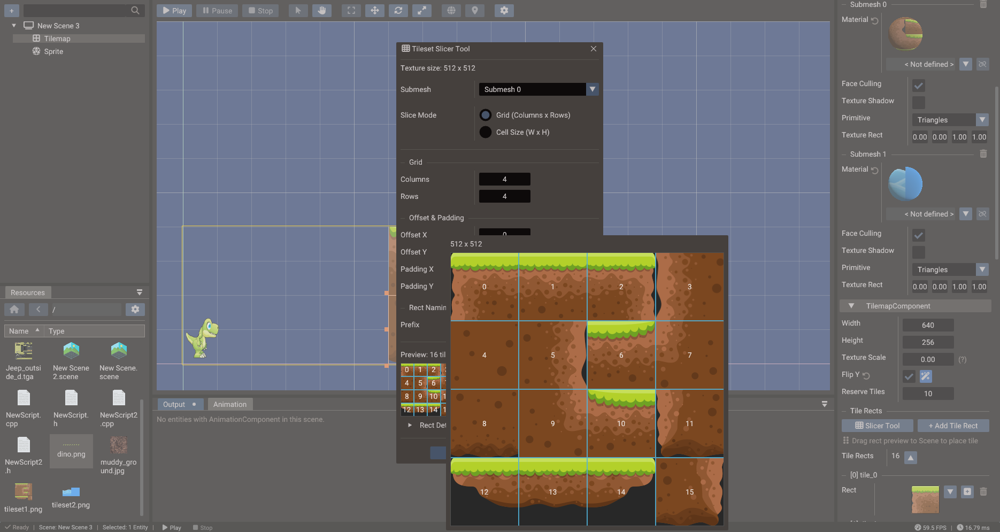

# Tileset Slicer

The **Tileset Slicer** tool divides a tileset texture into uniformly-sized tile regions
and assigns each region a numeric tile ID. Those IDs are the same values you store in
`TileData` cells and reference from `Tilemap` objects in script or the editor.



## Opening the Tileset Slicer

Select a texture in the **Resources Browser** and choose **Open in Tileset Slicer**
from the context menu. Alternatively, select a **Tilemap** entity in the scene, go to
its TilemapComponent in the **Properties window**, and open the tileset assignment from
there.

## Setting up the grid

| Field | Purpose |
| --- | --- |
| **Tile Width** | Pixel width of one tile |
| **Tile Height** | Pixel height of one tile |
| **Columns** | Number of tile columns (auto-calculated from image width / tile width) |
| **Rows** | Number of tile rows (auto-calculated from image height / tile height) |
| **Spacing X / Y** | Pixel gap between tiles (for tilesets with gutters) |
| **Offset X / Y** | Pixel inset of the first tile |

After entering the values, click **Slice** to populate the tile grid. Tile IDs are
assigned left-to-right, top-to-bottom starting from `0`.

## Tile IDs

Tile IDs are plain integers. The tile at column 0, row 0 is ID `0`; column 1, row 0 is
ID `1`; and so on. Use these IDs when filling `TileData` in script or when painting
tiles in the tilemap editor.

```lua
-- Create a tilemap, assign a tileset texture, and place tiles
tilemap = Tilemap(scene)
tilemap:setTexture("world/tileset.png")

-- Define texture regions (rects), then place tiles that reference them
tilemap:addRect(Rect( 0, 0, 32, 32))                 -- rect ID 0
tilemap:addRect(Rect(32, 0, 32, 32))                 -- rect ID 1

tilemap:addTile(0, Vector2( 0, 0), 32, 32)           -- rect ID, position, width, height
tilemap:addTile(1, Vector2(32, 0), 32, 32)
-- ... or paint with the rect IDs generated by the slicer directly
```

## Painting tiles in the editor

After slicing, the tilemap component in the scene editor lets you paint tile IDs
directly onto the canvas:

1. Select the **Tilemap** entity.
2. In the **Properties window**, open the tileset picker and confirm the sliced
   texture.
3. Pick a tile from the tile palette (the sliced grid preview).
4. Click or drag over the canvas to paint cells.

## Collision tiles

Mark individual tile IDs as **solid** or assign them a collision category in the slicer
panel. The physics system reads these flags when a `Body2D` is configured with tilemap
collision. This avoids having to manually define collision shapes for every tile.

## Tips

- Use power-of-two tile sizes (16×16, 32×32, 64×64) for consistent UV mapping.
- Keep the tileset image as one file even if the game uses multiple tile themes —
  tile ID ranges can be managed logically in data.
- For sprite animation and character frames, use the [Sprite Slicer](sprite-slicer.md)
  instead.
- Export-friendly naming: use lowercase filenames and avoid spaces so tile resource
  paths stay consistent across platforms.

## See also

- [Sprite Slicer](sprite-slicer.md)
- [Tilemap](../reference/classes/tilemap.md)
- [TileData](../reference/classes/tiledata.md)
- [TileRectData](../reference/classes/tilerectdata.md)
- [2D Graphics](../manual/2d-graphics.md)
