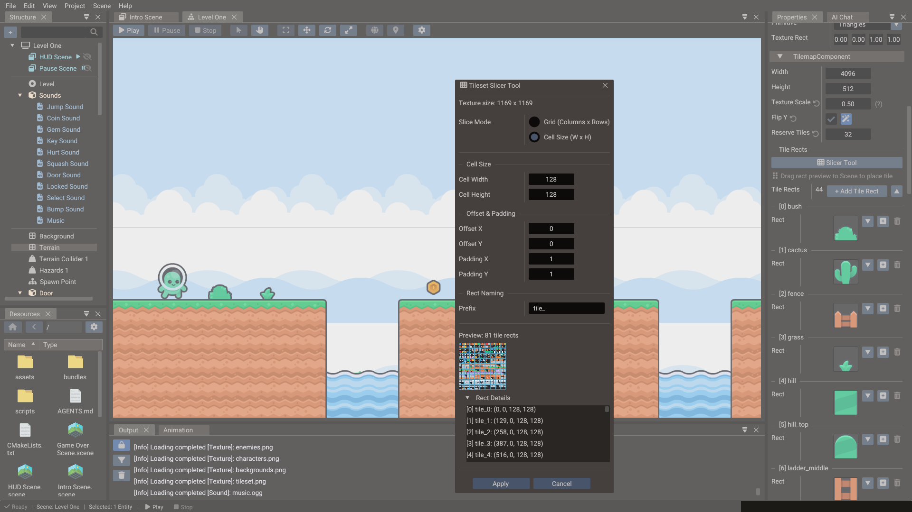
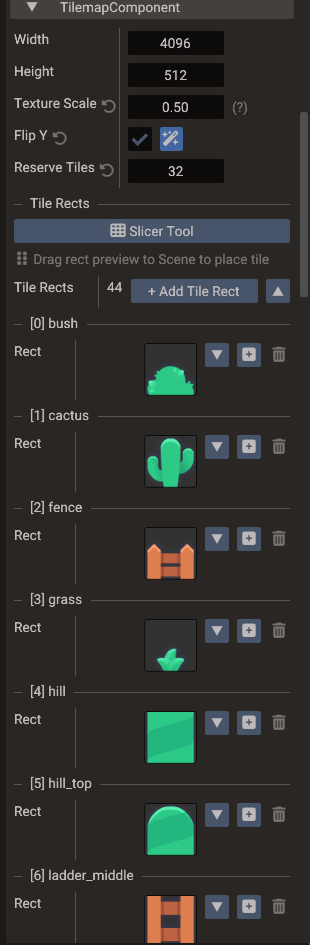

# Tileset Slicer

The **Tileset Slicer** tool divides a tilemap's texture into uniformly-sized tile rects.
Each rect gets a name and a numeric ID — its index in the tilemap's rect list. Those IDs
are the values you store in `TileData` cells and reference from `Tilemap` objects in
script.



## Opening the Tileset Slicer

Select an entity with a **Tilemap** component. In the [Properties window](properties.md),
click **Slicer Tool** in the component's **Tile Rects** section. The slicer cuts the
tilemap's texture; when the tilemap uses several textures, pick the one to slice at the
top of the dialog.

## Setting up the grid

| Field | Purpose |
| --- | --- |
| **Grid (Columns x Rows)** / **Cell Size (W x H)** | Slice by tile count or by tile size in pixels |
| **Columns** / **Rows** | Number of tiles across and down; the tile size is derived from the texture size |
| **Cell Width** / **Cell Height** | Pixel size of one tile; the number of columns and rows is derived |
| **Offset X / Y** | Pixel inset of the first tile |
| **Padding X / Y** | Pixel gap between tiles, for tilesets with gutters |
| **Prefix** | Rect name, followed by its number: `tile_0`, `tile_1`, … |

The **Preview** shows how many rects the grid produces, and **Rect Details** lists each
one in pixels. Click **Apply** to replace the rects of the sliced texture; rects that
belong to the tilemap's other textures are kept, and the new ones follow them, numbered
left to right, top to bottom. The change is one undoable step.

## Tile IDs

Tile IDs are plain integers. In a tilemap with a single texture, the tile at column 0,
row 0 is ID `0`; column 1, row 0 is ID `1`; and so on. Use these IDs when filling
`TileData` in script.

```lua
-- Create a tilemap, assign a tileset texture, and place tiles
tilemap = Tilemap(scene)
tilemap:setTexture("world/tileset.png")

-- Define texture regions (rects), then place tiles that reference them
tilemap:addRect(Rect( 0, 0, 32, 32))                 -- rect ID 0
tilemap:addRect(Rect(32, 0, 32, 32))                 -- rect ID 1

tilemap:addTile(0, Vector2( 0, 0), 32, 32)           -- rect ID, position, width, height
tilemap:addTile(1, Vector2(32, 0), 32, 32)
-- ... or paint with the rect IDs generated by the slicer directly
```

## Painting tiles in the editor

After slicing, the TilemapComponent's **Tile Rects** list shows a preview of each rect.
To place tiles:

1. Select the **Tilemap** entity.
2. In the **Properties window**, find the rect in the **Tile Rects** list.
3. Drag its preview into the viewport to place a tile there.



When arranging placed tiles in the [Scene View](scene-view.md), enable **Snap tile**
in the viewport gear menu so drops and gizmo moves snap to each tile's width and
height — useful for packing tiles flush without tuning the global grid.

## Collision tiles

Tiles carry no collision data. Give the level's solid areas their own entity with a
**2D Physics Body** — for example **Chain** or **Polygon** shapes that follow the
ground — and keep the tilemap purely visual. See [Physics](../manual/physics.md).

## Tips

- Use power-of-two tile sizes (16×16, 32×32, 64×64) for consistent UV mapping.
- Keep the tileset image as one file even if the game uses multiple tile themes —
  tile ID ranges can be managed logically in data.
- For sprite animation and character frames, use the [Sprite Slicer](sprite-slicer.md)
  instead.
- Export-friendly naming: use lowercase filenames and avoid spaces so tile resource
  paths stay consistent across platforms.

## See also

- [Sprite Slicer](sprite-slicer.md)
- [Scene View](scene-view.md#placing-and-grouping-tiles)
- [Tilemap](../reference/classes/tilemap.md)
- [TileData](../reference/classes/tiledata.md)
- [TileRectData](../reference/classes/tilerectdata.md)
- [2D Graphics](../manual/2d-graphics.md)
