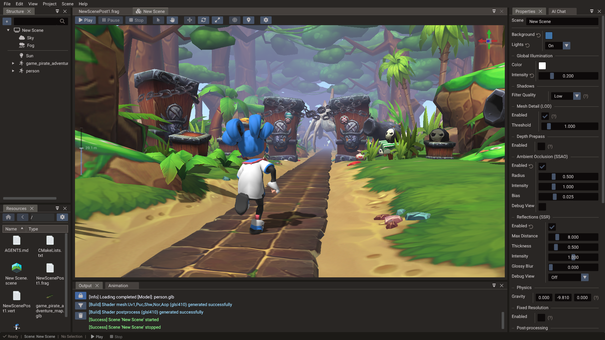
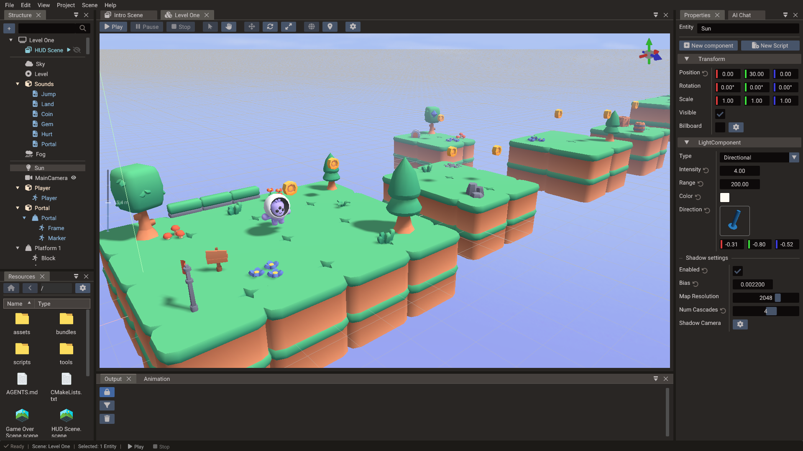
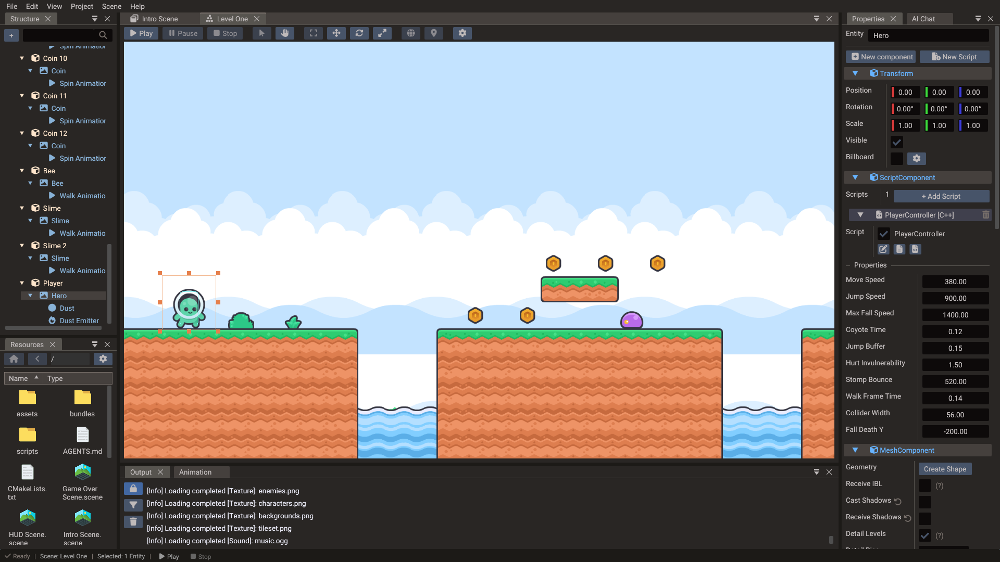
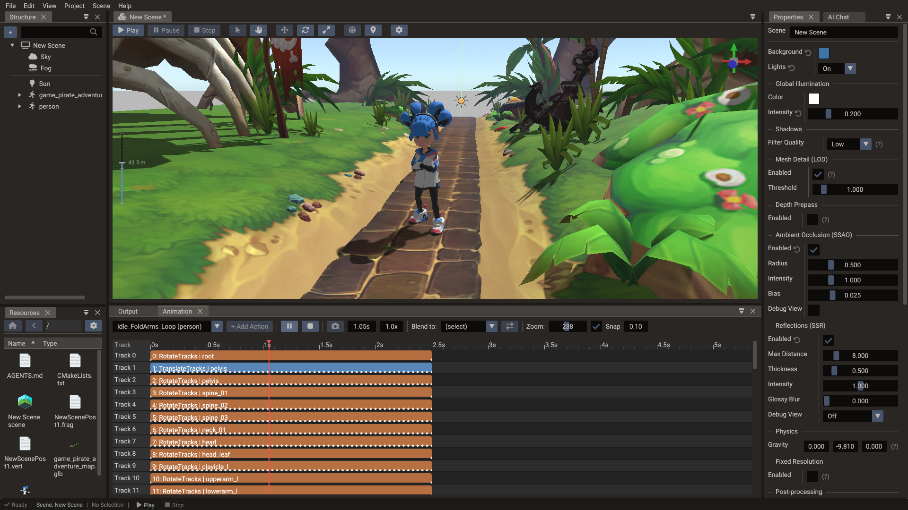
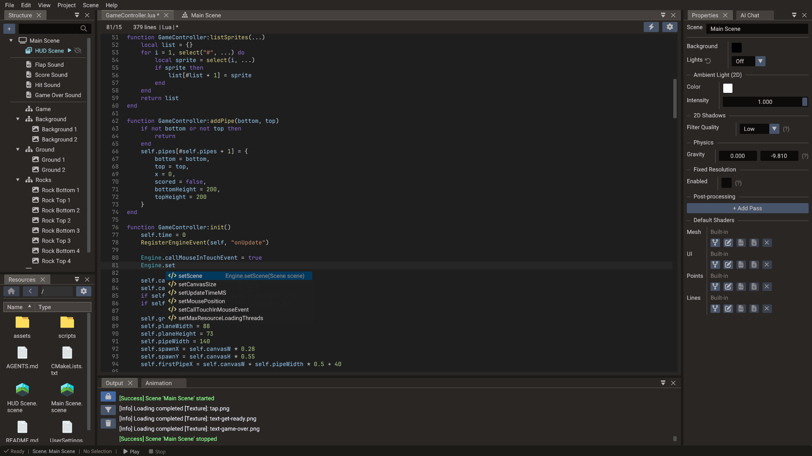
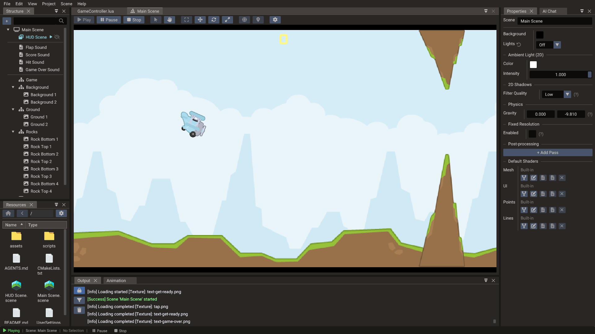
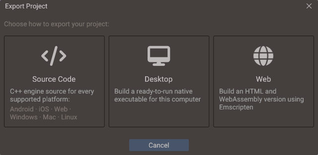

# The Editor

Doriax ships with a complete visual editor built for creators. Design scenes, write
code, animate characters, manage resources, and test your game from one unified
environment.

## Core panels

| Panel | Purpose |
| --- | --- |
| Scene view | Viewport for editing 2D and 3D scenes with gizmos and cameras |
| Structure | The tree of scenes and entities in the current scene |
| Properties | View and edit the components and properties of the selected entity |
| Resources | Manage textures, models, audio, and other project assets |
| Code editor | Integrated editor for Lua and C++ scripts |
| Animation | Timeline, keyframes, sprite animation, skeletal animation, and morph tracks |
| Output | Build logs, export messages, and diagnostics |

## 3D scenes

Edit 3D scenes with cameras, lighting, models, and play mode. Position entities with
gizmos, set up PBR materials, and preview shadows, fog, and the sky system directly in
the viewport.

## 2D &amp; tilemaps

Build 2D scenes with sprites and tilemaps. The **sprite slicer** and **tileset slicer**
tools let you cut sprite sheets and tilesets into usable frames and tiles.

## Animation

Animate characters and objects with the timeline editor, and work with skeletons using
the bone tools for skeletal animation.

## Code editor

Write Lua and C++ scripts in the integrated code editor without leaving the
environment. Lua iterates quickly at runtime, while C++ is compiled at build time for
native performance. Its [event menu](../editor/code-editor.md#add-events) adds engine,
input, component, and physics event handlers to a script for you.

## Play mode

Press **Play** to run your game inside the editor. Test gameplay, UI overlays, and
physics interactively, then return to editing.

## Export pipeline

The editor includes a shader-aware export pipeline that prepares scenes, assets,
scripts, engine files, and compiled shaders for your target platform — and can compile
ready-to-run desktop and web builds directly. See the [Export Window](../editor/export.md)
for the export modes and output options.

!!! note "Editor coverage"
    Terrain sculpting, painting, foliage and prop placement have a dedicated
    **Terrain Editor** window, particle entities can be created from the Structure
    panel, and built-in shaders can be forked and edited in place (see
    [Custom Shaders](../editor/custom-shaders.md)). Audio tooling is not fully integrated
    into the editor yet — it is available at the engine/runtime level.

## More editor documentation

The detailed editor manual is split into focused pages:

- [Project Workflow](../editor/project-workflow.md)
- [Project Settings](../editor/project-settings.md)
- [Editor Settings](../editor/editor-settings.md)
- [Scene View](../editor/scene-view.md)
- [Properties & Components](../editor/properties.md)
- [Resources Browser](../editor/resources.md)
- [Terrain Editor](../editor/terrain-editor.md)
- [Animation Timeline](../editor/animation.md)
- [Code Editor](../editor/code-editor.md)
- [Export Window](../editor/export.md)
