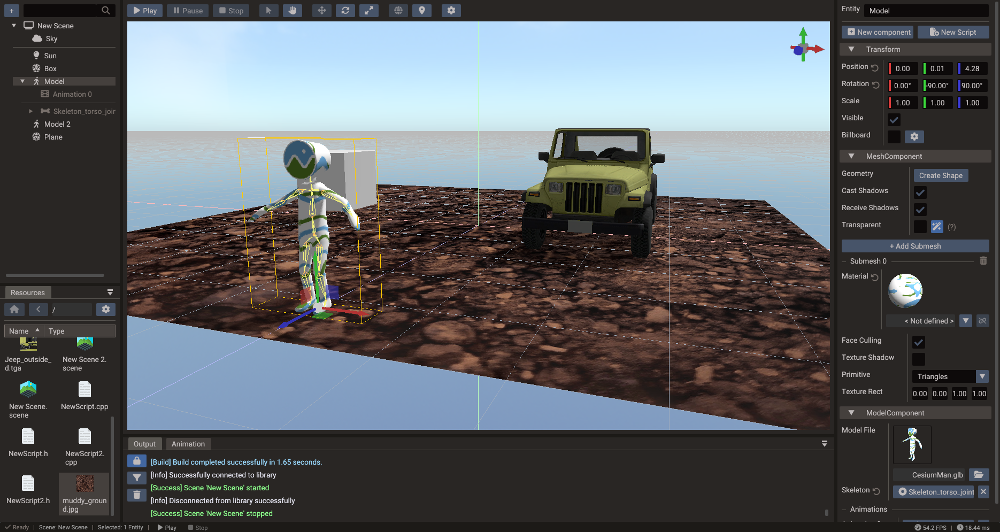
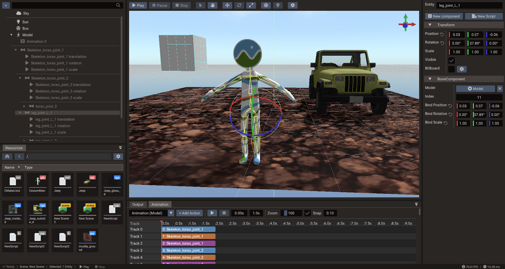
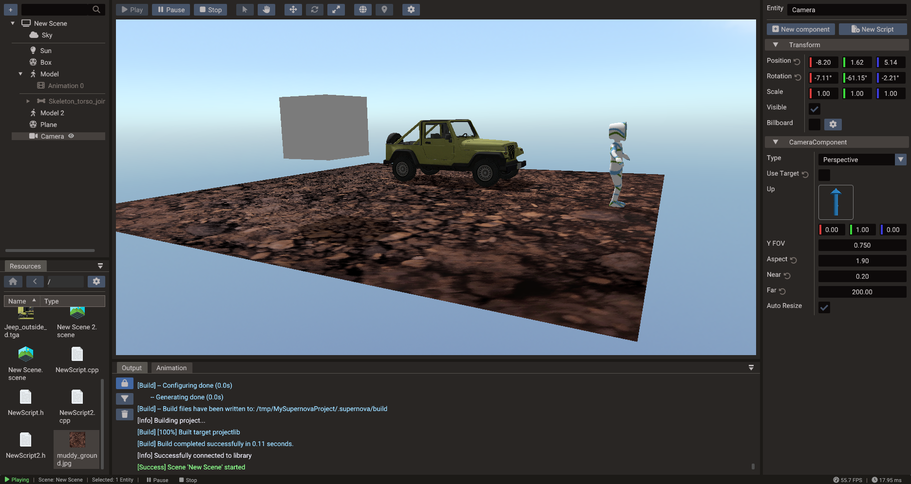

# 3D Graphics

Doriax provides a complete 3D pipeline with model loading, physically-based rendering,
dynamic lighting, and environment effects.

## Models

Doriax loads 3D models in **GLTF** and **OBJ** formats. Import a model as a resource and
add it to a scene as an entity, then position it with its transform.

Models support:

- **Skeletal animation** — animate rigged characters via bones
- **Node animation** — play transform clips on the imported glTF node tree
- **Morph targets** — blend between mesh shapes for facial animation and deformation

### GLTF compatibility and limits

Skinned GLTF models are not limited by a fixed-size shader uniform block. Bone matrices
are uploaded each frame through a **storage buffer** (Vulkan, Metal, Direct3D 11) or an
**unfilterable bone texture** (OpenGL / OpenGL ES), so large skeletons skin correctly on
every backend.

The CPU bone-matrix array still has a compile-time capacity, `MAX_BONES` (default
**128**). The editor grows that array for larger skins; export then raises `MAX_BONES` in
the generated CMake project to cover the largest skin in your scenes (never below 128).
A model loaded only at runtime that exceeds the exported capacity is rejected and the
loader writes an error to the log. Raise `MAX_BONES` yourself in a standalone engine
build if you spawn such models from code. See the
[Model reference](../reference/classes/model.md#gltf-import-support-and-limits) and
[Build Options — Engine capacity macros](../reference/build-options.md#engine-capacity-macros).

Morph-target capacity is per mesh primitive and depends on the data exported for each
target:

| Morph data | Maximum loaded targets |
| --- | --- |
| Position only | 8 |
| Position plus normal or tangent | 4 |
| Position, normal, and tangent | 2 |

The importer bases that capacity on the leading targets it actually loads and ignores
the unsupported tail. Sparse GLTF accessors are supported for morph-target attributes,
including sparse accessors without a dense base `bufferView`; Doriax expands them into
dense GPU vertex data during loading. See the [Model reference](../reference/classes/model.md#gltf-import-support-and-limits)
for the exact import behaviour.

### GLTF node hierarchy

How a GLTF becomes entities depends on what the file contains:

| File contents | Scene layout |
| --- | --- |
| Animation clips, or more than one skin | The **full node tree** is imported. Every glTF node becomes a child entity (transform-only helpers, joints, and mesh nodes), parented as in the file. |
| Several mesh nodes, no clips and a single skin (or none) | One **child mesh entity per mesh node**, parented under the model root. Joints still use the legacy skeleton path when the file has one skin and no clips. |
| A single static mesh | Geometry lives on the Model entity itself. |

On the full-tree path, bone and mesh mappings point into those node entities rather than
sitting in a separate skeleton. Animation channels target the node they were authored
against, so transform-only nodes (not just joints) play back. Models may use **more than
one skin**: each skinned mesh keeps its own joint order and inverse-bind matrices, and
the renderer builds that mesh's bone matrices from those joints.

Imported models with child nodes start collapsed in the
[Structure panel](../editor/structure.md#tree-marks-and-collapse). Expand the model when
you need to select a specific node, joint, or child mesh.

### Merging static model meshes

A GLTF with several mesh nodes normally keeps those meshes on child entities. That
hierarchy is useful for editing parts separately, but
[GPU instancing](rendering-pipeline.md#gpu-instancing) draws only the geometry on the
entity that owns `InstancedMeshComponent`.

For static props (no skinning, morph targets, or embedded animations), bake the children
into the root:

1. Select the Model in the [Structure panel](../editor/structure.md#merge-static-model).
2. Right-click and choose **Merge static model**.
3. Add **Instanced Mesh** (or set `ModelComponent::mergeStaticMeshes` before reload in
   C++ / exported project code).

**Restore model mesh children** reverses the flatten. Merge is refused for skinned,
animated, or morph-target models, and when the flattened result would exceed the root
submesh limit.

## PBR materials

Rendering is **physically based (PBR)**, producing realistic surfaces that respond
correctly to lighting. Materials drive how light interacts with each surface, supporting
photorealistic results.

Materials can use albedo, normal, roughness, metallic, and emission data. Imported
GLTF materials are converted into the engine material representation during loading;
editor-created materials are serialized with the project and baked into exported
output.

GLTF `OPAQUE`, `MASK`, and `BLEND` alpha modes are preserved. For masked materials,
the GLTF `alphaCutoff` value (default `0.5`) controls the combined base-colour factor
and texture alpha test in both the visible surface and its shadow/depth passes. Blended
submeshes keep depth testing but **disable depth writes** in the colour pass so overlapping
translucent surfaces composite instead of occluding each other. When auto-transparency
marks the mesh transparent, the SSAO depth pre-pass and SSR G-buffer skip it; shadow
maps still render it. In the editor, expand **Mesh → Submesh → Material** to change
**Alpha Mode** and **Alpha Cutoff**. See the
[Material reference](../reference/classes/material.md#alphamode-alphacutoff) for the mode
behaviours.

### Editing an imported model's submeshes

A model's geometry and materials are rebuilt from its source file every time the scene
loads, so the file — not the scene — is what the mesh normally follows. Editing a submesh
property of an imported model in the editor records an **override** on the model: the
edited field keeps your value across scene restarts, play/stop, and exported builds, while
every field you left alone still follows the source file.

That applies to the whole **Submesh** section — material values and textures, linked
`.material` files, **Face Culling**, **Texture Shadow**, and **Primitive Type** — on the
Model entity itself and on the child mesh entities a multi-node GLTF creates.

Because only the edited fields are pinned, re-exporting the model from your DCC still
propagates everything else. Change a texture in Blender and re-export: meshes where you
only tweaked base colour pick up the new texture and keep your colour.

Overrides are matched to the primitive they came from by its GLTF node and material name
(the material name alone for OBJ), not by position. Reordering nodes or primitives in the
source file therefore keeps each edit on the right geometry. When that identity no longer
resolves to exactly one primitive — the node or material was renamed or removed, or two of
them now share a name — the override is dropped instead of applied to whichever geometry
took the old slot. Re-apply the edit after that kind of re-export.

Assigning a **different** model file to the entity is a fresh import and clears the
overrides. Reloading the same file — **Merge static model** or **Restore model mesh
children** — keeps them.

Scenes authored before overrides existed are migrated the first time they load: the values
saved in the scene are compared against the source file, and only the fields that really
differ become overrides.

### Shared material files (`.material`)

Each mesh submesh can reference a standalone **`.material`** file in your project instead
of embedding values only inside the scene. Multiple meshes can link to the same file so
they always stay in sync — change the file once and every linked mesh updates.

**Create a material file from the editor:**

1. Select a mesh and open its **Material** row in the Properties window.
2. Tune base colour, textures, metallic, and roughness as needed.
3. **Drag the material preview** from Properties into the [Resources Browser](../editor/resources.md).
4. The editor creates `Material.material` (or `Material_1.material`, etc.) in the folder
   you drop on and **links** the submesh to that file.

**Apply an existing material file:**

- Drag a `.material` file from the Resources Browser onto a mesh in the [Scene view](../editor/scene-view.md), or
- Drop it onto the **Material** field in Properties (live preview while hovering).

Linked materials reload automatically when the file changes on disk. Use the **unlink**
button (chain icon) next to the material name in Properties to copy the values back into
the scene as a local, unlinked material.

See [Resources Browser — Material files](../editor/resources.md#material-files) and
[Properties — Mesh materials](../editor/properties.md#mesh-materials-and-ibl) for the
full workflow.

## Lighting and shadows

Doriax supports multiple light types with **dynamic shadows**, so moving objects cast
and receive shadows in real time.

| Light type | Best use |
| --- | --- |
| Directional | Sunlight or broad outdoor lighting |
| Point | Lamps, torches, explosions, and local lights |
| Spot | Flashlights, cones, and focused effects |

The runtime supports up to six active lights and cascaded shadow maps for directional
lighting. Tune edge smoothness with `Scene::setShadowQuality` (`NONE` / `LOW` / `MEDIUM` /
`HIGH` PCF filtering).

### Projected spot-light masks

A spot light uses a circular inner/outer cone by default. To project an arbitrary shape,
select the spot light and assign an image to **Light → Mask**. No separate shape mode is
needed: an assigned mask automatically becomes the complete light shape, and clearing it
restores the circular cone.

Mask alpha controls light intensity when the image contains transparency; otherwise the
engine uses luminance (black is unlit and white is fully lit). The **Angle Cone** property
sets the vertical projection angle, while the image aspect ratio sets its width. The scene
gizmo and spot shadow frustum use that same orientation and aspect ratio.

For C++ and Lua setup, in-memory masks, and clearing a mask at runtime, see
[Light.spotMask](../reference/classes/light.md#spotmask).

Enable **screen-space ambient occlusion** with `Scene::setSSAOEnabled(true)` to add soft
contact shading in creases and corners. It affects ambient/indirect light only — see
[Rendering Pipeline — Ambient occlusion (SSAO)](rendering-pipeline.md#ambient-occlusion-ssao).

## Environment

Add atmosphere to your scenes with:

- **Fog** — depth-based atmospheric fog
- **Sky system** — a configurable cubemap background that also drives **image-based
  lighting (IBL)** for reflective surfaces
- **Reflection probes** — local, box-shaped reflection environments for interiors and
  enclosed areas

### Sky and reflections

A **Sky** entity provides the scene background and the lighting environment for IBL.
Assign a cubemap texture (six faces or a single cross layout). Meshes that should pick up
sky reflections and indirect colour need **Receive IBL** enabled on their Mesh
component — see [Rendering Pipeline — IBL](rendering-pipeline.md#image-based-lighting-ibl).

Use **Visible** on the Sky component when you want IBL without drawing the sky dome
(for example, a studio HDR used only for reflections). The sky texture still generates
irradiance and prefiltered maps either way.

IBL gives soft, environment-wide reflections suited to curved and rough surfaces. For a
**local environment** (a room, garage, or cave) use a **Reflection Probe**; for a
**sharp, mirror-like reflection on a flat surface**, add a **Mirror** — see below.

### Reflection probes

Sky IBL reflects the same environment everywhere, which looks wrong indoors. A
**Reflection Probe** (Structure panel's create menu) captures the scene at its own
position and applies that environment to meshes inside a box-shaped influence volume,
with box-projected (parallax-corrected) reflections that stay anchored to the room.
Probes can be **static** — an authored cubemap or a one-time capture at load — or
**dynamic**, re-capturing at runtime on move, on an interval, or on demand. A mesh that
wraps around a probe would show up inside its own reflection, so turn off its **Render
in Probes** flag to keep it out of captures. See
[Rendering Pipeline — Reflection probes](rendering-pipeline.md#reflection-probes).

### Mirrors

For a true planar reflection on a flat surface — a mirror, still water, or a polished
floor — add a **Mirror** from the Structure panel's create menu. It produces an upright
reflective wall that reflects the scene from the viewer's mirrored viewpoint, with no
camera or texture setup required. See
[Rendering Pipeline — Mirrors and planar reflections](rendering-pipeline.md#mirrors-and-planar-reflections)
for how it works and its performance cost.

## Cameras

Cameras define the viewpoint into a 3D scene. Position and orient a camera entity, and
set it as the scene's active camera to control what the player sees.

Cameras can be perspective, orthographic, or UI cameras. A scene owns an active camera
entity; editor scene cameras are separate from game cameras so you can navigate while
preserving the player's view.

## Additional features

The runtime also supports [particle systems](particles.md), [terrain](terrain.md) with
level-of-detail (LOD), and [mesh instancing](rendering-pipeline.md#gpu-instancing) for
efficiently rendering many copies of the same geometry.

## Next steps

Add interactivity with [Physics](physics.md), or learn how to ship your game in
[Export Window](../editor/export.md).
