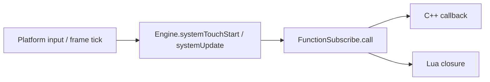

# Events

Doriax events use `FunctionSubscribe<Ret(Args...)>`, a multicast delegate that stores
callbacks with string tags. Adding a callback with an existing tag **replaces** the
previous one, which prevents duplicate subscriptions from the same source.

Events work identically in C++ and Lua. C++ uses macros from `FunctionSubscribe.h`.
Lua uses `RegisterEvent` and `RegisterEngineEvent` globals registered by `LuaBinding`.

## How dispatch works



1. The platform layer calls `Engine::systemUpdate()`, `systemTouchStart()`, etc.
2. Engine forwards to static `FunctionSubscribe` members (`onUpdate.call()`, etc.).
3. Subsystems and components fire their own events during simulation (physics contacts,
   UI pointer events, action start/stop).
4. Each subscriber runs in registration order unless disabled or removed.

## FunctionSubscribe API

Defined in `engine/core/util/FunctionSubscribe.h`.

| Method | Purpose |
| --- | --- |
| `add(tag, callback)` | Register a callback; replaces existing tag |
| `add(tag, lua_State*)` | Register a Lua function with tag |
| `remove(tag)` | Remove one callback by exact tag |
| `removeByTagSubstring(substr)` | Remove all callbacks whose tag contains substring |
| `clear()` | Remove all callbacks |
| `call(args...)` / `operator()` | Invoke all enabled callbacks |
| `setEnabled(bool)` | Enable or disable the entire event without removing subscribers |

With `DORIAX_CRASH_GUARD` enabled, failing subscribers are removed automatically and
optionally reported through a global crash handler.

## Engine events

`Engine` exposes frame, lifecycle, input, and pointer events.

| Event | Signature | Use |
| --- | --- | --- |
| `onInit` | `void()` | User init via `DORIAX_INIT` macro (access through `getOnInit()`) |
| `onViewLoaded` | `void()` | View/surface ready |
| `onViewChanged` | `void()` | Canvas/view changed; Lua name: `onCanvasChanged` |
| `onViewDestroyed` | `void()` | View destroyed |
| `onDraw` | `void()` | Draw callback (after scene draw) |
| `onUpdate` | `void()` | Variable-step gameplay update |
| `onFixedUpdate` | `void()` | Fixed-step simulation update |
| `onPostUpdate` | `void()` | Work after regular update |
| `onPause` / `onResume` | `void()` | App/game pause and resume |
| `onShutdown` | `void()` | Runtime shutdown |
| `onTouchStart/End/Move` | `void(int, float, float)` | Touch pointer index, x, y |
| `onTouchCancel` | `void()` | Touch sequence canceled |
| `onMouseDown/Up` | `void(int, float, float, int)` | Button, x, y, modifiers |
| `onMouseMove/Scroll` | `void(float, float, int)` | Position or scroll offsets plus modifiers |
| `onMouseEnter/Leave` | `void()` | Pointer enters/leaves view |
| `onKeyDown/Up` | `void(int, bool, int)` | Key, repeat flag, modifiers |
| `onCharInput` | `void(wchar_t)` | Text input codepoint |

### Input routing options

Configure how events reach gameplay vs. UI:

| Engine setting | Effect |
| --- | --- |
| `setIgnoreEventsHandledByUI(true)` | Gameplay handlers skip events already consumed by UI |
| `setAllowEventsOutCanvas(false)` | Clip events to the logical canvas |
| `pauseGameEvents(true)` | Pause game event delivery (editor pause, etc.) |
| `setCallMouseInTouchEvent` / `setCallTouchInMouseEvent` | Mirror mouse/touch for cross-platform testing |

## C++ registration macros

All macros live in `FunctionSubscribe.h` and generate a unique tag:
`typeid(ClassName)_objectAddress_methodName`.

### Engine events

```cpp
REGISTER_ENGINE_EVENT(onUpdate);
UNREGISTER_ENGINE_EVENT(onUpdate);
```

### Any FunctionSubscribe member

```cpp
auto* physics = scene->getPhysicsSystem();
REGISTER_EVENT(physics->beginContact2D, onBeginContact);
UNREGISTER_EVENT(physics->beginContact2D, onBeginContact);
```

### Component events on the same entity

```cpp
REGISTER_COMPONENT_EVENT(UIComponent, onClick, onClick);
REGISTER_UI_EVENT(onClick, onClick);           // shorthand for UIComponent
REGISTER_BUTTON_EVENT(onPress, onPress);       // ButtonComponent
REGISTER_SCROLLBAR_EVENT(onChange, onChange);  // ScrollbarComponent
REGISTER_PANEL_EVENT(onMove, onMove);          // PanelComponent
```

Matching `UNREGISTER_*` macros remove subscriptions in destructors.

### Example: full C++ script

```cpp
class DoorTrigger : public doriax::ScriptBase {
public:
    DoorTrigger(doriax::Scene* scene, doriax::Entity entity);
    ~DoorTrigger();

    void onUpdate();
    void onClick(float x, float y);
    void onBeginContact(doriax::Body2D bodyA, int shapeA, doriax::Body2D bodyB, int shapeB);

private:
    doriax::PhysicsSystem* physics = nullptr;
};

DoorTrigger::DoorTrigger(Scene* scene, Entity entity) : ScriptBase(scene, entity) {
    physics = scene->getPhysicsSystem();
    REGISTER_ENGINE_EVENT(onUpdate);
    REGISTER_UI_EVENT(onClick, onClick);
    if (physics) {
        REGISTER_EVENT(physics->beginContact2D, onBeginContact);
    }
}

DoorTrigger::~DoorTrigger() {
    UNREGISTER_ENGINE_EVENT(onUpdate);
    UNREGISTER_UI_EVENT(onClick, onClick);
    if (physics) {
        UNREGISTER_EVENT(physics->beginContact2D, onBeginContact);
    }
}
```

## Lua event registration

`LuaBinding::registerHelpersFunctions` exposes two globals:

| Function | Arguments | Behavior |
| --- | --- | --- |
| `RegisterEvent(self, event, methodName [, tag])` | Script table, event object, method name | Subscribes `self:methodName(...)` to any exposed `FunctionSubscribe` |
| `RegisterEngineEvent(self, methodName [, tag])` | Script table, engine event name | Looks up `Engine.<methodName>` and subscribes |

If `tag` is omitted, Doriax builds:
`ClassName_instancePointer_methodName`

### Engine event (Lua)

```lua
function Player:init()
    RegisterEngineEvent(self, "onUpdate")
end

function Player:onUpdate()
    -- called every frame
end
```

### Component event (Lua)

```lua
function Trigger:init()
    local ui = self.scene:findComponent(UIComponent, self.entity)
    RegisterEvent(self, ui.onClick, "onClick")
end

function Trigger:onClick(x, y)
    print("clicked", x, y)
end
```

### Physics event (Lua)

```lua
function Trap:init()
    local physics = self.scene:getPhysicsSystem()
    RegisterEvent(self, physics.beginContact2D, "onBeginContact")
end

function Trap:onBeginContact(bodyA, shapeA, bodyB, shapeB)
    print("2D contact")
end
```

### Custom tag

```lua
RegisterEngineEvent(self, "onUpdate", "player1_update")
```

Use custom tags when you need to replace or manually remove a specific subscription.

## Physics events

`PhysicsSystem` exposes 2D (Box2D) and 3D (Jolt) collision events.

### 2D events

| Event | Signature | Meaning |
| --- | --- | --- |
| `beginContact2D` | `void(Body2D, int, Body2D, int)` | Contact begins |
| `endContact2D` | `void(Body2D, int, Body2D, int)` | Contact ends |
| `hitContact2D` | `void(Body2D, int, Body2D, int, Vector2, Vector2, float)` | Impact with hit data |
| `beginSensorContact2D` | `void(Body2D, int, Body2D, int)` | Sensor overlap begins |
| `endSensorContact2D` | `void(Body2D, int, Body2D, int)` | Sensor overlap ends |
| `preSolve2D` | `bool(Body2D, int, Body2D, int)` | Return `false` to disable contact before solve |
| `shouldCollide2D` | `bool(Body2D, int, Body2D, int)` | Filter pairs before collision |

### 3D events

| Event | Meaning |
| --- | --- |
| `onBodyActivated3D` / `onBodyDeactivated3D` | Body activation state changed |
| `onContactAdded3D` / `onContactPersisted3D` / `onContactRemoved3D` | 3D contact lifecycle |
| `shouldCollide3D` | Filter whether two 3D bodies/shapes should collide |

## UI component events

`UIComponent` events (also available through `REGISTER_UI_EVENT`):

| Event | Signature | When |
| --- | --- | --- |
| `onGetFocus` / `onLostFocus` | `void()` | Focus changes |
| `onPointerEnter` / `onPointerLeave` | `void(float, float)` | Pointer enters/leaves widget bounds |
| `onPointerMove` | `void(float, float)` | Pointer moves over widget |
| `onPointerDown` / `onPointerUp` | `void(float, float)` | Pointer button down/up |
| `onClick` / `onDoubleClick` | `void(float, float)` | Click gestures |
| `onDragStart` / `onDrag` / `onDragEnd` | `void(float, float)` | Drag gestures |

### Widget-specific events

| Component | Events |
| --- | --- |
| `ButtonComponent` | `onPress`, `onRelease` |
| `ScrollbarComponent` | `onChange` |
| `PanelComponent` | `onMove`, `onResize` |
| `TextEditComponent` | `onChange`, `onSubmit` |

## Action and sound events

| Component | Events |
| --- | --- |
| `ActionComponent` | `onStart`, `onStop`, `onPause`, `onStep` |
| `SoundComponent` | `onStart`, `onStop`, `onPause` |

Use these to chain gameplay reactions to tweens, timelines, or audio playback.

## Easing as an event

`Ease` extends `FunctionSubscribe<float(float)>`. Timed actions can use custom easing
curves by subscribing to an `Ease` instance.

## Cleanup

| Context | Cleanup mechanism |
| --- | --- |
| C++ script destructor | Call matching `UNREGISTER_*` macros |
| Lua script unload | `cleanupLuaScripts` removes tags containing instance pointer |
| Scene unload | `Scene::removeSubscriptionsByTag` |
| Full reset | `Engine::clearAllSubscriptions()` |

Always unregister in C++ destructors when the object can outlive a scene reload.

## Best practices

- Register in a constructor or Lua `init()`. Never register in hot per-frame code.
- Unregister in destructors (C++) or rely on Lua cleanup for script components.
- Use `onFixedUpdate` for physics-sensitive simulation, not `onUpdate`.
- Enable `setIgnoreEventsHandledByUI(true)` when UI and gameplay share screen space.
- Return `false` from `preSolve2D` or `shouldCollide*` filters to implement one-way
  platforms, team filters, or trigger volumes.

## Reference

- [Engine](../reference/classes/engine.md) — engine events (`onUpdate`, input, lifecycle)
- [PhysicsSystem](../reference/classes/physicssystem.md) — collision and contact events
- Script workflow: [Creating Scripts](creating-scripts.md)
