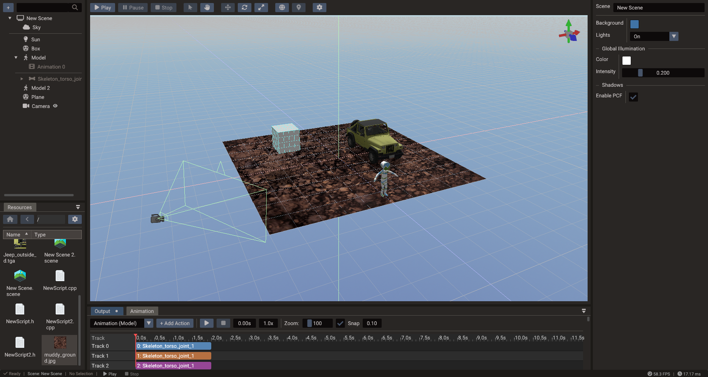

# Physics

Doriax includes integrated physics for both 2D and 3D games, so you can add realistic
movement, collisions, and interactions without external libraries.



## Physics backends

| Dimension | Backend |
| --- | --- |
| 2D | [Box2D](https://box2d.org/) |
| 3D | [Jolt Physics](https://github.com/jrouwe/JoltPhysics) |

Both backends are integrated into the engine and exposed through the same ECS-based
workflow.

## Core concepts

- **Rigid bodies** — give entities physical behavior so they respond to forces and
  gravity. Bodies can be static, kinematic, or dynamic.
- **Colliders / shapes** — define the volume used for collision detection (boxes,
  spheres, capsules, polygons, and more).
- **Joints** — constrain bodies together to model hinges, sliders, and other
  mechanical connections.
- **Collision detection** — the physics system detects overlaps and contacts between
  bodies each step.

## Typical workflow

1. Add a physics body component to an entity.
2. Attach one or more collision shapes that match its geometry.
3. Configure mass, friction, restitution, and body type.
4. Let the physics system step the simulation each frame, updating transforms.

You can react to collisions in your game logic to trigger gameplay events such as
damage, pickups, or sounds.

## 2D physics

2D physics uses Box2D. A body can contain up to `MAX_SHAPES` shapes and each shape can
have density, friction, restitution, sensor state, and collision filtering.

| Shape | Use it for |
| --- | --- |
| Box/polygon | Platforms, crates, walls, characters with simple silhouettes |
| Circle | Balls, radial triggers, wheels |
| Capsule | Characters, rounded obstacles |
| Segment/chain | Terrain edges, one-way boundaries, outlines |

```cpp
Body2D body = object.getBody2D();
body.createBoxShape(64, 32);
body.setType(BodyType::DYNAMIC);
body.setLinearVelocity(Vector2(4, 0));
```

## 3D physics

3D physics uses Jolt Physics. Bodies can use primitives, compound shapes, mesh shapes,
or height fields. Use simple primitives for dynamic bodies whenever possible, and
reserve mesh shapes for static world geometry.

| Shape | Use it for |
| --- | --- |
| Box/sphere/capsule/cylinder | Dynamic props and characters |
| Convex hull | Medium-complexity dynamic objects |
| Mesh | Static level collision |
| Height field | Terrain collision |

```cpp
Body3D body = object.getBody3D();
body.createCapsuleShape(0.8f, 0.25f);
body.setType(BodyType::DYNAMIC);
body.setAllowedDOFs2DPlane();
```

## Contacts and filtering

The physics system exposes contact subscriptions for begin, end, hit, sensor, and
pre-solve events. Use begin/end events for gameplay state, hit events for impacts, and
pre-solve callbacks when a contact should be conditionally disabled.

Collision filters use category and mask bits. Put broad gameplay groups into category
bits, such as player, enemy, world, projectile, and trigger. Use masks to decide which
groups interact.

## Joints

Doriax exposes 2D and 3D joint wrappers for constrained motion. 2D joint types include
revolute, prismatic, weld, distance, friction, and motor joints. In 3D, use constraints
and allowed degrees of freedom to lock or limit movement.

## Practical guidance

- Prefer primitive collision shapes for dynamic entities.
- Keep visual meshes and collision meshes separate.
- Use sensors for triggers, pickups, and detection volumes.
- Use fixed update logic for physics-driven gameplay.
- Tune gravity and meter scale before authoring a large scene.

## Next steps

Bring everything together and ship your game in [Export Window](../editor/export.md).
