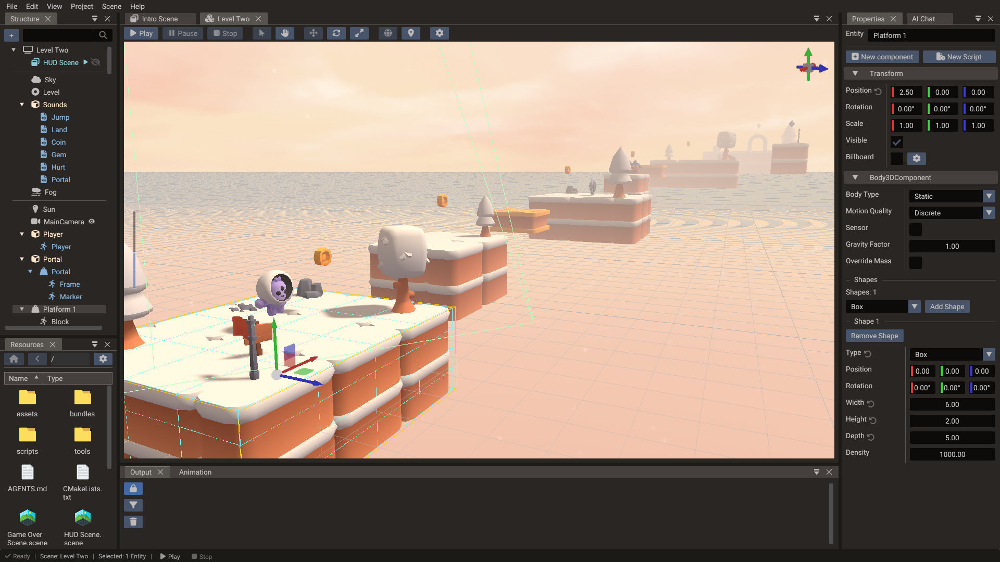
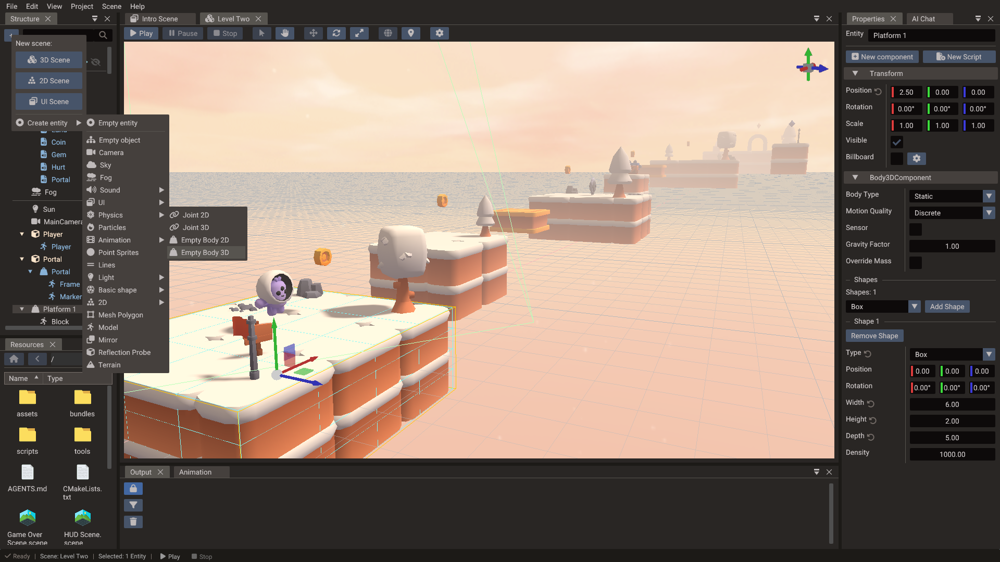

# Physics

Doriax includes integrated physics for both 2D and 3D games, so you can add realistic
movement, collisions, and interactions without external libraries.



## Physics backends

| Dimension | Backend |
| --- | --- |
| 2D | [Box2D](https://box2d.org/) |
| 3D | [Jolt Physics](https://github.com/jrouwe/JoltPhysics) |

Both backends are integrated into the engine and exposed through the same ECS-based
workflow. Each one can be left out of exported games that do not use it — see
[Project Settings → Physics backends](../editor/project-settings.md#physics-backends).
The editor and Play always have both.

## Core concepts

- **Rigid bodies** — give entities physical behavior so they respond to forces and
  gravity. Bodies can be static, kinematic, or dynamic.
- **Colliders / shapes** — define the volume used for collision detection (boxes,
  spheres, capsules, polygons, and more).
- **Joints** — constrain bodies together to model hinges, sliders, and other
  mechanical connections.
- **Collision detection** — the physics system detects overlaps and contacts between
  bodies each step.

## Typical workflow

1. Add a physics body component to an entity (**New component → 2D Physics Body** or
   **3D Physics Body**), or create an empty body or a joint from
   **Create entity → Physics** in the Structure panel.
2. Attach one or more collision shapes that match its geometry.
3. Configure mass, friction, restitution, and body type.
4. Let the physics system step the simulation each frame, updating transforms.



You can react to collisions in your game logic to trigger gameplay events such as
damage, pickups, or sounds.

## Gravity

Each scene has its own gravity, because each scene has its own physics worlds (see
[Physics across scenes](#physics-across-scenes)). The 2D and 3D worlds are independent:
`gravity2D` drives the Box2D world and `gravity3D` drives the Jolt world. Both default to
`(0, -9.81)` m/s².

In the editor, select the scene in the Properties window and set **Gravity** in the
**Physics** section — 2D scenes edit the 2D world, 3D scenes the 3D world. The value is
saved with the scene and applied in exported projects.

=== "C++"

    ```cpp
    scene.setGravity2D(Vector2(0, -20));       // snappier platformer fall
    scene.setGravity3D(Vector3(0, -3.7f, 0));  // Mars
    ```

=== "Lua"

    ```lua
    scene.gravity2D = Vector2(0, -20)
    scene.gravity3D = Vector3(0, -3.7, 0)
    ```

Scale the response per body with [Body2D — gravityScale](../reference/classes/body2d.md#gravityscale)
or [Body3D — gravityFactor](../reference/classes/body3d.md#gravityfactor). Changing
gravity at runtime does not wake sleeping bodies — they pick up the new value when
something wakes them.

## 2D physics

2D physics uses Box2D. A body can contain several shapes and each shape can have
density, friction, restitution, sensor state, and collision filtering. In exported games
a body holds at most `MAX_SHAPES_2D` shapes and a shape at most `MAX_SHAPE_POINTS_2D`
points. They default to 10 and 16, and the export raises them when your scenes use more.

| Shape | Use it for |
| --- | --- |
| Box/polygon | Platforms, crates, walls, characters with simple silhouettes |
| Circle | Balls, radial triggers, wheels |
| Capsule | Characters, rounded obstacles |
| Segment | Thin walls and edges that block from both sides |
| Chain | Terrain outlines and hollow containers; blocks from one side only |

```cpp
Body2D body = object.getBody2D();
body.createBoxShape(64, 32);
body.setType(BodyType::DYNAMIC);
body.setLinearVelocity(Vector2(200, 0)); // points per second
```

### Chain shapes

A chain is a line of connected edges for level outlines: bodies slide along it without
catching where edges meet. It collides on one side only, to the right of each edge going
from one vertex to the next. Counter-clockwise vertices make a closed chain solid from the
outside, like a platform. Clockwise vertices make it solid from the inside, like a ring
that keeps a ball in. Rotating or mirroring the body doesn't change the side.

When a body is selected, ticks on its chain edges point to the colliding side, and
**Collision Side → Reverse** in the shape's properties flips it. **Loop** closes the chain.
An open chain doesn't collide on its first and last edges, so add one extra vertex at each
end. Chains have no mass, so use them on static or kinematic bodies. See
[Body2D — createChainShape](../reference/classes/body2d.md#createchainshape) for code.

## 3D physics

3D physics uses Jolt Physics. Bodies can use primitives, compound shapes, mesh shapes,
or height fields. Use simple primitives for dynamic bodies whenever possible, and
reserve mesh shapes for static world geometry.

| Shape | Use it for |
| --- | --- |
| Box/sphere/capsule/cylinder | Dynamic props and characters |
| Convex hull | Medium-complexity dynamic objects |
| Mesh | Static level collision |
| Height field | Terrain collision |

```cpp
Body3D body = object.getBody3D();
body.createCapsuleShape(0.8f, 0.25f);
body.setType(BodyType::DYNAMIC);
body.setAllowedDOFs2DPlane();
```

### 2D sensors

In 2D the flag lives on each **shape**, so one body can mix solid and trigger shapes (a
character with a solid box and a foot sensor, a chest with a solid lid and a pickup zone).
Tick **Sensor** on the shape in the Body2D component of the Properties window — the editor
draws sensor shapes in orange — or set it from code with
[Body2D — setShapeSensor](../reference/classes/body2d.md#setshapesensor). A sensor never
pushes anything; its overlaps arrive through `beginSensorContact2D` / `endSensorContact2D`
on the [PhysicsSystem](../reference/classes/physicssystem.md), which name the sensor first
and the visitor second. A sensor always reports its overlaps (its **sensor events** are
implied), so give shapes a category bit so the callback can tell a coin from a spike:

=== "C++"

    ```cpp
    Body2D coin = coinSprite.getBody2D();
    coin.createCircleShape(Vector2(0, 0), 22.0f);
    coin.setShapeSensor(true);
    coin.setCategoryBitsFilter(0x0010);

    // on the hero
    REGISTER_EVENT(scene->getSystem<PhysicsSystem>()->beginSensorContact2D, onSensor);

    void Hero::onSensor(Body2D sensor, unsigned long shape, Body2D visitor, unsigned long) {
        if (visitor.getEntity() != getEntity()) return;
        if (sensor.getCategoryBitsFilter(shape) & 0x0010) collect(sensor.getEntity());
    }
    ```

=== "Lua"

    ```lua
    local coin = coinSprite:getBody2D()
    coin:createCircleShape(Vector2(0, 0), 22)
    coin.shapeSensor = true
    coin:setCategoryBitsFilter(0x0010)
    ```

Two sensors never report each other, and ray casts ignore sensor shapes.

### 3D sensors

A whole 3D body can be turned into a trigger volume with the **Sensor** flag: it still
reports contacts, but produces no collision response. Use it for checkpoints, pickup
volumes, damage zones, and detection areas.

In the editor, tick **Sensor** in the Body3D component of the Properties window. The flag
is stored on the component, so it is saved with the scene, applied in exported projects,
and kept when the body is rebuilt (for example after changing shapes). From code, set it
with [Body3D — sensor](../reference/classes/body3d.md#sensor) before or after `load()`:

=== "C++"

    ```cpp
    Body3D trigger = checkpoint.getBody3D();
    trigger.createBoxShape(2, 2, 2);
    trigger.setIsSensor(true);
    trigger.load();
    ```

=== "Lua"

    ```lua
    local trigger = checkpoint:getBody3D()
    trigger:createBoxShape(2, 2, 2)
    trigger.sensor = true
    trigger:load()
    ```

Sensor overlaps arrive through the regular 3D contact events below, and the
[Contact3D](../reference/classes/contact3d.md) passed to them carries a `sensor` flag so
trigger contacts can be told apart from solid ones. A static sensor only sees **awake**
dynamic and kinematic bodies; make the sensor itself dynamic or kinematic when it must
also detect sleeping bodies.

### Buoyancy

A dynamic 3D body floats in a [Water](../reference/classes/water.md) once its
**buoyancy** is above `0`. Every fixed step, while the body's centre of mass is inside the
water's area, the engine pushes it up by the part of its shape below the wave surface and
tilts it with the waves, then drags it with the water. No script is needed.

In the editor, the Body3D component of a dynamic body has a **Buoyancy** section:

| Field | Default | Purpose |
| --- | --- | --- |
| **Buoyancy** | `0` | `1` is neutral, more floats and less sinks. `0` ignores the water. |
| **Drag** | `0.5` | How much the water slows the body down. Shown when Buoyancy is above `0`. |
| **Angular Drag** | `0.01` | How much the water slows the body rotation. Shown when Buoyancy is above `0`. |

A box with a buoyancy of `2` floats about half under, `1.4` about 70% under, and `0.8`
sinks slowly. The values are saved with the scene and applied in exported projects; from
code they are [Body3D — buoyancy](../reference/classes/body3d.md#buoyancy),
`waterDrag`, and `waterAngularDrag`:

=== "C++"

    ```cpp
    Body3D body = barrel.getBody3D();
    body.createCylinderShape(0.5f, 0.4f);
    body.setType(BodyType::DYNAMIC);
    body.setBuoyancy(2.0f);
    body.load();
    ```

=== "Lua"

    ```lua
    local body = barrel:getBody3D()
    body:createCylinderShape(0.5, 0.4)
    body.type = BodyType.DYNAMIC
    body.buoyancy = 2
    body:load()
    ```

The water has no current: a floating body bobs and rocks with the waves but is not carried
along by them. Bodies outside every water's area, and static or kinematic bodies, are not
affected. Neither are bodies inside a
[Water Exclusion](../reference/classes/waterexclusion.md), so cargo rests on the floor of a
boat; the boat, which owns the volume, still floats. For an object without physics, read the surface with
[Water.getHeight](../reference/classes/water.md#getheight-getnormal) instead.

The Water component has a **Buoyancy** section too:

| Field | Default | Purpose |
| --- | --- | --- |
| **Buoyancy** | On | Floats the bodies whose Buoyancy is above `0`. Turn it off for water that is only for show. |
| **Depth** | `0` | How far below the surface bodies still float. `0` has no bottom. Shown when Buoyancy is on. |

Where waters overlap, a body floats in the one with the highest bottom that it is still
above, so a pool with a **Depth** over a lake floats only the bodies inside it and the lake
floats the rest. The bottom is not a floor: a body that plunges below it sinks through, so
give a pool a collider too. From code they are
[Water — buoyancy](../reference/classes/water.md#buoyancy-buoyancydepth) and
`buoyancyDepth`.

## Moving a body

A physics body owns its own pose. The engine syncs it with the entity's transform once
per fixed step: **transform → body** before the step, **body → transform** after it. Which
API you use depends on where your code runs.

| Where | Continuous movement | Teleport |
| --- | --- | --- |
| `onFixedUpdate` | `setLinearVelocity` / `applyForce` | `Body2D`/`Body3D` `setPosition` |
| `onUpdate` | not recommended for bodies | `Object::setPosition` also works |

!!! warning "Transform positions and rotations written in onFixedUpdate are discarded"

    `Engine::onFixedUpdate` runs **between** those two syncs. A position or rotation
    written to the transform there is read back over by the post-step sync before
    anything renders it, so the write silently does nothing — no error, no warning,
    unless you also call `Object::updateTransform()` to refresh the world transform the
    pre-step sync reads. Moving a **parent** of a body-carrying entity has the same
    effect on the body. The body pose API below avoids the whole ordering question.

    The exact scope is worth knowing:

    - **3D bodies** — always. The post-step sync writes back every body each step.
    - **2D bodies** — only when Box2D reports the body as moved. A sleeping or static
      `Body2D` produces no move event, so a transform write there survives and reaches
      the body on the next sync. Do not rely on it: whether a body sleeps is the
      simulation's decision, not yours.
    - **Scale** — not affected. Neither path writes scale back, so `Object::setScale`
      persists. Only its effect is delayed: the collider is resized once the world
      scale refreshes in the next variable-timestep pass.

Use the body's own pose API instead. It writes to the simulation directly and updates
the transform for you, so it works from any callback:

=== "C++"

    ```cpp
    void Player::onFixedUpdate() {
        // Continuous movement: let the solver do the work
        body.setLinearVelocity(Vector3(input.x * speed, body.getLinearVelocity().y, input.z * speed));

        // Teleport: write the body pose, never the transform
        if (fellOffTheMap) {
            body.setPosition(spawnPoint);
            body.setLinearVelocity(Vector3::ZERO);
        }
    }
    ```

=== "Lua"

    ```lua
    function Player:onFixedUpdate()
        body.linearVelocity = Vector3(input.x * speed, body.linearVelocity.y, input.z * speed)

        if fellOffTheMap then
            body.position = spawnPoint
            body.linearVelocity = Vector3(0, 0, 0)
        end
    end
    ```

Entities **without** a physics body have no such restriction — `Object::setPosition`
works from `onFixedUpdate` as usual.

Prefer velocities and forces over teleporting whenever the motion is continuous.
Teleporting skips collision detection between the old and new pose, so a body can pass
straight through walls. Do not scale forces or torques by `Engine::getDeltatime()`: the
solver already integrates them over the fixed step.

A **kinematic** body is the exception to teleporting: when its transform changes outside
the fixed step — an [animation](animation.md#keyframe-tracks-timeline-authored), a moving
parent, or `Object::setPosition` in `onUpdate` — the body moves there with a velocity over
the fixed steps of the frame. That velocity carries the bodies standing on a moving
platform and pushes the ones in its way. To jump a kinematic body somewhere instead, use
its `setPosition`.

## Contacts and filtering

The physics system exposes contact subscriptions so you can react to collisions in game
logic. **2D bodies** use `beginContact2D`, `endContact2D`, hit, sensor, and `preSolve2D`
events — use begin/end for gameplay state, hit for impacts, and pre-solve when a contact
should be conditionally disabled. Shapes opt in to these: a pair reports begin/end, hit or
pre-solve events only when one of its shapes has **Contact Events**, **Enable Hit Events**
or **PreSolve Events** on, and all are off by default (see
[Body2D events](../reference/classes/body2d.md#setshapeenablehitevents-setshapecontactevents-setshapepresolveevents-setshapesensorevents)).
A 2D event whose body was destroyed or recreated before it was dispatched is dropped, so
an end event does not come for a body that no longer exists.
**3D bodies** instead use `onContactAdded3D`,
`onContactPersisted3D`, and `onContactRemoved3D` (plus `onBodyActivated3D` /
`onBodyDeactivated3D`); each added/persisted callback receives a
[Contact3D](../reference/classes/contact3d.md) carrying the contact normal and points.

Collision filters use category and mask bits. Put broad gameplay groups into category
bits, such as player, enemy, world, projectile, and trigger. Use masks to decide which
groups interact.

### What a 3D callback may do

3D contact events run *while Jolt is stepping*, unlike the 2D begin/end/sensor/hit events,
which Box2D queues and the engine dispatches once the step is over (`preSolve2D` and
`shouldCollide2D` are the 2D exceptions: they are filter hooks called mid-step).
Reading and moving bodies is fine there — velocities, positions, ray casts
— but the broad phase is locked for the duration, so a body or joint cannot be **created**
from a callback: the call is refused and logged, and the next update retries it. Teardown
is queued instead of refused, so removing a `Body3DComponent` from a callback still
destroys its body, just after the step finishes.

Keep callbacks to recording what happened — a flag, a score, an entity to act on — and do
the work from `onUpdate` or `onFixedUpdate`. `PhysicsSystem::isSteppingWorld3D()`
(`physics.steppingWorld3D` in Lua) reports the window for helpers called from both.

## Raycasts and ground checks

A common need for character controllers is knowing whether a body is **standing on the
ground**. Doriax has no built-in `isGrounded()` flag, but you can build a reliable check
two ways.

### Downward raycast (recommended)

Cast a short [Ray](../reference/classes/ray.md) straight down from the body's feet and
test it against the 3D physics world with `RayFilter::BODY_3D`. Checking `normal.y` lets
you reject steep walls so only near-horizontal surfaces count as ground.

```cpp
bool isGrounded(Body3D& body, Scene* scene, float feetOffset, float probe = 0.15f) {
    // feetOffset = distance from the center of mass down to the soles
    // (for a capsule: halfHeight + radius)
    Vector3 com = body.getCenterOfMassPosition();
    Vector3 origin = com - Vector3(0, feetOffset - 0.05f, 0); // start just above the soles
    Ray ray(origin, Vector3(0, -(probe + 0.05f), 0));         // direction also sets the length

    // Pass the body so the ray continues through it instead of stopping at a self-hit
    RayReturn result = ray.intersects(scene, RayFilter::BODY_3D, body.getEntity());

    return result.hit
        && result.normal.y > 0.7f;           // ~45 degree slope limit
}
```

Pass `onlyStatic` or category/mask bits to restrict what counts as ground, for example
`ray.intersects(scene, RayFilter::BODY_3D, true, groundCategory, groundMask, body.getEntity())`.
The same `Ray` API is available in Lua (`RayFilter.BODY_2D` or `RayFilter.BODY_3D`). The
returned [RayReturn](../reference/classes/rayreturn.md) also carries the hit `distance`,
which is handy for step snapping or coyote-time.

A game without a physics backend can still cast against mesh bounds with
`RayFilter::BOUNDS`. It tests each mesh's axis-aligned box rather than a collider, so it
suits picking and line-of-sight more than ground checks — see
[RayFilter](../reference/classes/ray.md#rayfilter).

### Contact normal (event-driven)

If you already subscribe to contact events, inspect the contact normal instead of
raycasting. Read [Contact3D](../reference/classes/contact3d.md)`::getWorldSpaceNormal()`
inside `onContactAdded3D` / `onContactPersisted3D`. Jolt's normal points **from body 1
toward body 2**, and Jolt — not your code — decides which body is which, so flip the sign
when your character is body 1:

```cpp
Vector3 n = contact.getWorldSpaceNormal();
Vector3 up = (bodyA.getEntity() == characterEntity) ? n * -1.0f : n;
bool grounded = up.y > 0.7f;
```

Track grounded state with a contact counter (increment on `onContactAdded3D`, decrement
on `onContactRemoved3D`) rather than a single bool, so multiple simultaneous contacts are
handled correctly.

## Joints

Doriax exposes 2D and 3D joint wrappers for constrained motion. 2D joint types are
distance, revolute, prismatic, mouse, wheel, weld, and motor joints. With **Rope**
enabled, a distance joint lets the bodies move closer but never farther apart than when
it was created. In 3D, use constraints and allowed degrees of freedom to lock or limit
movement.

Both bodies of a joint must be in the joint's own scene.

## Physics across scenes

Every scene owns its own Box2D and Jolt worlds. Only the worker threads and temporary
memory are shared between them. When a [scene stack](scenes-and-entities.md#scene-stacks)
runs several scenes at once, for example a gameplay scene with a HUD or a world made of
chunk scenes, those worlds stay apart:

- A body in one scene never collides with a body in another scene, and never triggers
  its sensors.
- A ray cast against a `Scene*` tests only that scene's world. The returned
  `RayReturn::body` is an entity ID that only means something in that scene.
- Contact events report only the bodies of their own scene.
- A joint's `bodyA` and `bodyB` are looked up in the joint's scene. The editor accepts
  only same-scene entities in those fields.
- Only scenes on the engine are stepped. A scene removed with
  `SceneManager.removeChildScene` keeps its bodies, frozen, until it is added again.

There is no API that spans worlds. The approaches below go from simplest to most work.

### Keep interacting bodies in one scene

This is the recommended setup. Put everything that has to touch physically in one scene,
and use child scenes for the parts that don't take part in gameplay physics: HUD, menus,
lighting and sky. A gameplay scene with a UI overlay needs nothing more.

### Ray cast several scenes

Cast the same ray against each scene and keep the closest hit. Keep the scene next to
the hit, because the entity ID needs it. `distance` is a fraction of the ray's length,
so hits from different scenes compare directly.

=== "C++"

    ```cpp
    struct SceneHit {
        Scene* scene = nullptr;
        RayReturn hit = Ray::NO_HIT;
    };

    SceneHit raycastScenes(const Ray& ray, RayFilter filter) {
        SceneHit best;
        for (Scene* scene : Engine::getScenesSnapshot()) {
            RayReturn hit = ray.intersects(scene, filter);
            if (hit.hit && (!best.scene || hit.distance < best.hit.distance)) {
                best.scene = scene;
                best.hit = hit;
            }
        }
        return best;
    }
    ```

=== "Lua"

    ```lua
    -- Lua has no getScenesSnapshot: pass the IDs of the scenes to test
    local function raycastScenes(ray, filter, sceneIds)
        local bestScene, bestHit = nil, nil
        for _, id in ipairs(sceneIds) do
            local scene = SceneManager.getScenePtr(id)
            if scene then
                local hit = ray:intersects(scene, filter)
                if hit.hit and (bestHit == nil or hit.distance < bestHit.distance) then
                    bestScene, bestHit = scene, hit
                end
            end
        end
        return bestScene, bestHit
    end

    local ids = { SceneManager.getSceneId("Level"), SceneManager.getSceneId("Props") }
    local scene, hit = raycastScenes(ray, RayFilter.BODY_3D, ids)
    ```

This only works when the scenes share one coordinate space. An overlay drawn with its
own camera needs its own ray, built with that scene's `Camera::screenToRay`. To test a
single known body, `ray.intersects(body)` works for a body of any scene.

### Collide across scenes with a proxy body

To make a body in scene A push bodies in scene B, give scene B a **kinematic** stand-in
with the same shape, and move it to follow the real body.

Move the proxy from `onFixedUpdate`, which runs once per fixed step before any scene's
world steps. Set its velocity toward the target rather than its position. Setting the
position teleports it, so it won't push other bodies properly.

=== "C++"

    ```cpp
    // player: Body3D in scene A, proxy: kinematic Body3D in scene B
    Vector3 toTarget = player.getPosition() - proxy.getPosition();
    proxy.setLinearVelocity(toTarget * (1.0f / Engine::getUpdateTime()));
    ```

=== "Lua"

    ```lua
    local toTarget = self.player.position - self.proxy.position
    self.proxy.linearVelocity = toTarget * (1 / Engine.updateTime)
    ```

This works one way only: the proxy pushes bodies in B, but nothing in B pushes the real
body back. To get a response, handle the proxy's contacts in scene B
(`onContactAdded3D`) and apply impulses to the real body in scene A yourself. If you
need full two-way physics, put both bodies in the same scene.

### Move a body to another scene

Doriax has no transfer API. Recreate the entity in the target scene instead:

1. Read the position, rotation, `linearVelocity` and `angularVelocity` of the old body.
2. Create the entity in the target scene, or instance a bundle there, and set those
   values on its new body.
3. Destroy the old entity.

Don't do this inside a contact callback, while `isSteppingWorld3D()` is `true` (see
[What a 3D callback may do](#what-a-3d-callback-may-do)). Note what needs to move in the
callback, then move it in `onUpdate` or `onFixedUpdate`.

The new entity has a new ID, so update anything that refers to it. Contacts, sleep state
and joints don't carry over.

## Practical guidance

- Prefer primitive collision shapes for dynamic entities.
- Keep visual meshes and collision meshes separate.
- Use sensors for triggers, pickups, and detection volumes.
- Use fixed update logic for physics-driven gameplay.
- Tune gravity and meter scale before authoring a large scene.

## Next steps

Bring everything together and ship your game in [Export Window](../editor/export.md).
