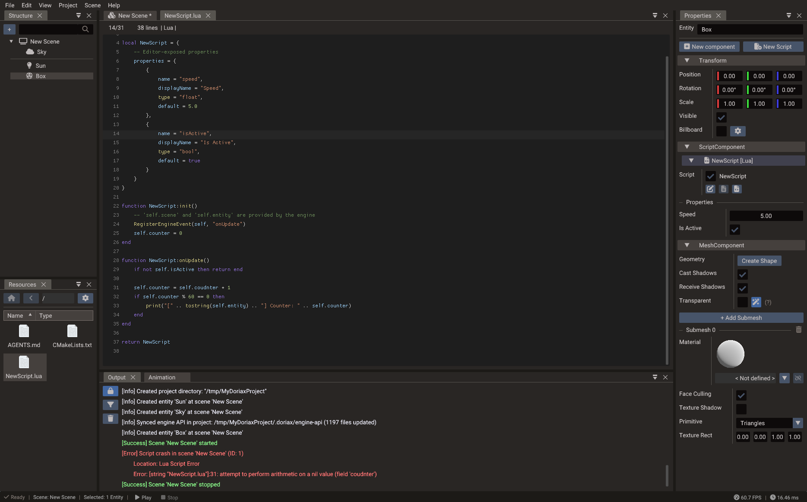

# Scripting

Doriax supports two scripting languages: **Lua** for fast iteration and flexible
scripting, and **C++** for full native performance. You can use either one or combine
both in the same project.

## Lua vs. C++

| | Lua | C++ |
| --- | --- | --- |
| Iteration speed | Very fast — no recompile needed | Requires a build step |
| Runtime performance | High | Maximum (native) |
| Compilation | Interpreted at runtime | Compiled at **build time** |
| Best for | Gameplay logic, prototyping, glue code | Performance-critical systems |

A common workflow is to prototype in Lua, then move hot paths to C++ when you need the
extra performance.

## Editor-era scripting model

Current Doriax projects usually attach behavior to entities with `ScriptComponent`.
Each `ScriptComponent` can contain multiple script entries. A script entry stores the
script type, paths, class/module name, enabled state, Properties window fields, and runtime
instance pointer.

| Script type | Use it for |
| --- | --- |
| `SUBCLASS` | C++ class derived from the entity's object wrapper (`Object`, `Mesh`, `Camera`, `Terrain`, …) |
| `SCRIPT_CLASS` | C++ class derived from `ScriptBase` |
| `SCRIPT_LUA` | Lua module returning a script table |

The difference between the two C++ types trips people up: a **Subclass** *is* the object
(it inherits `Camera`/`Mesh`/`Object`/… and you call wrapper methods on `this`), while a
**Script Class** only *references* the entity through `ScriptBase`. See
[C++ Subclass vs. C++ Script Class](creating-scripts.md#c-subclass-vs-c-script-class) for
the full breakdown and player-controller guidance.

See [Creating Scripts](creating-scripts.md), [Events](events.md), and
[Script Properties](script-properties.md) for the full workflow.

## Entry points

Each project has entry points for both languages:

- **C++** — the engine calls your `init()` function when the game starts.
- **Lua** — the main Lua script runs at startup and can require other Lua files.

=== "Lua"

    ```lua
    -- main.lua
    scene = Scene()
    -- build your scene here
    Engine.setScene(scene)
    ```

=== "C++"

    ```cpp
    // main.cpp
    #include "Doriax.h"
    using namespace doriax;

    Scene scene;

    DORIAX_INIT void init() {
        // build your scene here
        Engine::setScene(&scene);
    }
    ```

!!! warning "Choosing one entry point"
    If both Lua and C++ call `setScene()`, the C++ call runs last and overrides the Lua
    one. To disable an entry point, build with `NO_CPP_INIT` or `NO_LUA_INIT`:

    - **CMake:** add `-DNO_CPP_INIT=1` (or `-DNO_LUA_INIT=1`) to your configure step.

    See [Export Window](../editor/export.md) for full details.

For editor-authored projects, the start scene and exported scene factories are usually
more important than hand-written startup code. Use entry points for engine-level setup,
not for recreating an entire editor-authored scene by hand.

## The Engine API

The static `Engine` object is your main entry into the runtime. Common calls include:

```lua
Engine.setCanvasSize(1000, 480)   -- set the rendering canvas size
Engine.setScene(scene)            -- set the active scene
```

The same methods are available in C++ through `Engine::` static methods.

## Lua bindings

Doriax uses LuaBridge to expose the engine API to Lua. The binding layer registers:

| Binding group | Examples |
| --- | --- |
| Core | `Engine`, `Scene`, `SceneManager`, `BundleManager`, `Input`, `System` |
| ECS | Entities and built-in component types |
| Objects | `Object`, `Sprite`, `Mesh`, `Model`, `Camera`, `Light`, `Light2D`, `Occluder2D`, `Lines`, `Points`, `Sound` |
| Actions | `Action`, `Animation`, `SpriteAnimation`, `Particles`, `Ease` |
| Math | `Vector2`, `Vector3`, `Vector4`, `Matrix3`, `Matrix4`, `Quaternion`, `Ray`, `AABB`, `Rect`, `Plane` |
| I/O | `File`, `UserSettings`, memory data helpers |

Most C++ enums are mirrored into Lua namespaces, such as `Scaling.FITWIDTH`,
`BodyType.DYNAMIC`, and `GraphicBackend.METAL`.

## Script components

Attach `ScriptComponent` to an entity when behavior should live with that entity. The
component supports C++ subclasses, C++ `ScriptBase` instances, and Lua script modules.
Use script components for reusable entity behavior such as player controllers, enemy
AI, interactive doors, or UI widgets.

## Exposing values to the editor

C++ script properties are parsed by the editor and displayed in the Properties window when
they use the supported property annotations. This lets designers tune values without
editing source code. Keep exposed properties small and serializable: numbers, booleans,
strings, colors, vectors, resource paths, and entity references are the best fit.

## Logging



Use `Log` for runtime diagnostics in C++:

```cpp
Log::print("Player spawned");
Log::warn("Missing optional texture: %s", path.c_str());
Log::error("Failed to load level");
```

The same logging functions are exposed to Lua through the `Log` class. Regular Lua
`print()` also works for quick diagnostics:

```lua
Log.print("Player spawned")
Log.warn("Missing optional texture")
Log.error("Failed to load level")
```

## require() and module paths

Lua `require("foo")` searches the virtual filesystem:

1. `lua://lua/foo.lua`
2. `lua://foo.lua`

Dots in module names map to directory separators (`require("ui.menu")` → `lua/ui/menu.lua`).

Script component paths use the same `lua://` prefix with the stored relative path.

## Global helpers

| Function | Purpose |
| --- | --- |
| `RegisterEvent(self, event, methodName [, tag])` | Subscribe to any `FunctionSubscribe` event |
| `RegisterEngineEvent(self, methodName [, tag])` | Subscribe to `Engine.onUpdate`, etc. |

## Reference

- [Creating Scripts](creating-scripts.md) — editor workflow and lifecycle
- [C++ Build Setup](cpp-build-setup.md) — compilers, CMake, and build troubleshooting
- [Events](events.md) — all event types and registration macros
- [Script Properties](script-properties.md) — `DPROPERTY` and Lua properties
- [API Index](../reference/index.md) — complete class reference (C++ and Lua)
