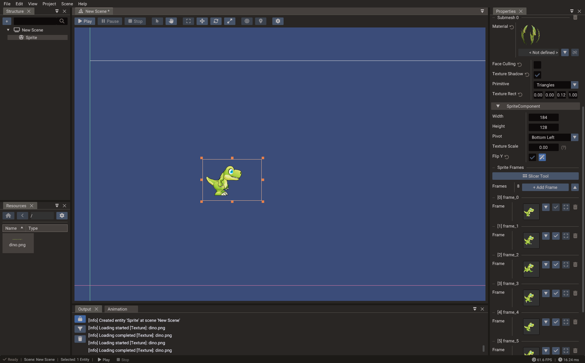

# First 2D Scene

This tutorial builds a complete small 2D scene from scratch and introduces the core
workflow you will reuse in larger projects: create a scene, add entities, attach
components, write a script, and test in play mode.



## What you will build

By the end of this tutorial you will have:

- A 2D scene with a visible sprite
- A correctly configured orthographic camera and canvas
- A Lua script that moves the sprite with keyboard input
- A `Body2D` physics body ready for collision

## 1. Create the project and scene

1. Open the editor and choose **File → New Project** to start with a fresh temporary
   project.
2. Choose **File → Save Project**, enter a project name, and select an empty directory.
3. Choose **File → New Scene → 2D Scene**.
4. Save the new scene immediately: press **Ctrl+S** and name it `main`.
5. If you do not need the initial 3D scene, select its tab and choose
   **Scene → Remove**.

## 2. Add a sprite entity

1. In the **Structure panel**, right-click and choose **Create → Empty Object**.
2. A new entity appears in the hierarchy. Rename it `Player` in the Properties window.
3. With the entity selected, click **Add Component** and choose **Sprite**.
4. In the Properties window, find the **Texture** field of the Sprite component and
   drag a PNG texture from the Resources Browser, or type its path directly.
5. The sprite should now be visible in the scene view centered at the origin.

## 3. Configure the camera

The default 2D scene already has a camera entity. Select it and verify:

- **Type** is set to `CAMERA_ORTHO` (orthographic).
- **Canvas size** matches your design resolution, for example `1280 × 720`.
- **Scaling mode** is set to `LETTERBOX` or `FITWIDTH`.

Move the camera so the sprite is visible in the camera preview.

## 4. Add a script

1. Open **File → New Script**, choose **Lua**, and name it `Player`.
2. The editor creates `scripts/Player.lua` with a boilerplate class.
3. Replace the body with the following movement code:

    ```lua
    local Player = {}
    Player.__index = Player

    function Player:init()
        RegisterEngineEvent(self, "onUpdate")
    end

    function Player:onUpdate()
        local obj = Object(self.scene, self.entity)
        local speed = 200  -- pixels per second

        local dt = Engine.deltatime
        local pos = obj.position

        if Input.isKeyPressed(Input.KEY_LEFT)  then pos.x = pos.x - speed * dt end
        if Input.isKeyPressed(Input.KEY_RIGHT) then pos.x = pos.x + speed * dt end
        if Input.isKeyPressed(Input.KEY_UP)    then pos.y = pos.y + speed * dt end
        if Input.isKeyPressed(Input.KEY_DOWN)  then pos.y = pos.y - speed * dt end

        obj.position = pos
    end

    return Player
    ```

4. Select the **Player** entity in the scene.
5. **Add Component → ScriptComponent**.
6. In the ScriptComponent, click **Add Entry**, assign `scripts/Player.lua`, and enable
   the entry.

## 5. Add physics (optional)

To make the sprite collide with walls:

1. Select the **Player** entity.
2. **Add Component → Body2D**.
3. In the Body2D component, click **Add Shape** and choose **Box**. Set the size to
   match the sprite dimensions.
4. Set the **Body Type** to `KINEMATIC` (for a player controlled by script) or
   `DYNAMIC` (for full physics simulation).

Create wall entities with static `Body2D` and box shapes to block the player's
movement.

## 6. Run and test

Press **Play** in the toolbar. The sprite should be visible and respond to arrow key
input.

If the sprite is not visible, check in order:

- [ ] The scene is set as active in project settings.
- [ ] The entity has a Sprite component with a valid texture path.
- [ ] The camera is a 2D orthographic camera and points at the origin.
- [ ] The canvas size and scaling mode are sensible for the editor window size.
- [ ] The script entry is enabled in the ScriptComponent.

Press **Stop** when done — the editor restores the scene to its pre-play state.

## 7. Next steps

- Add more sprites and create a tilemap background with the [Tileset Slicer](../editor/tileset-slicer.md).
- Animate the player with the [Sprite Slicer](../editor/sprite-slicer.md) and
  `SpriteAnimation`.
- Add a HUD overlay using a [UI scene](first-ui-scene.md).
- Continue with [2D Graphics](../manual/2d-graphics.md), [Input](../manual/input.md),
  and [Physics](../manual/physics.md).
