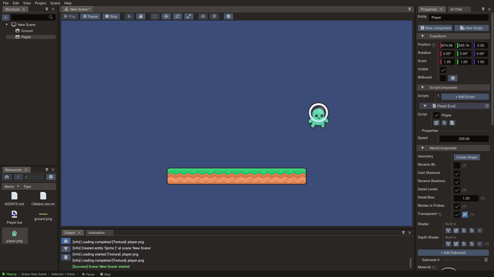
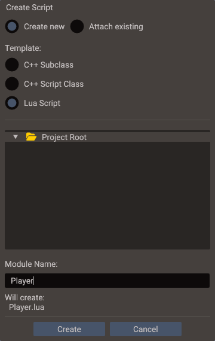
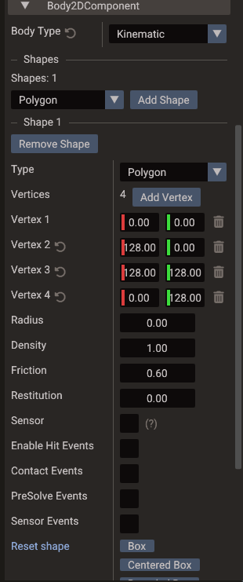

# First 2D Scene

This tutorial builds a complete small 2D scene from scratch and introduces the core
workflow you will reuse in larger projects: create a scene, add entities, attach
components, write a script, and test in play mode.



## What you will build

By the end of this tutorial you will have:

- A 2D scene with a visible sprite
- A canvas set up for your design resolution
- A Lua script that moves the sprite with keyboard input
- A `Body2D` physics body ready for collision

## 1. Create the project and scene

1. Open the editor and choose **File → New Project** to start with a fresh temporary
   project.
2. Choose **Scene → New Scene → 2D Scene**.
3. Choose **File → Save All**. The editor asks where each unsaved scene goes — name the
   2D one `main` — and then where the project itself lives: enter a project name and
   select an empty directory.
4. The initial 3D scene was never saved, so the new 2D scene replaces it — there is
   nothing to remove.

## 2. Add a sprite entity

1. Copy a PNG into the project folder, or drag one from your file manager into the
   **Resources Browser**.
2. Drag the PNG from the Resources Browser into the viewport. The editor creates a
   **Sprite** entity at the drop point, sized to the image.
3. Press **F2** and rename it `Player`.

You can also create the sprite first with **+ → Create entity → 2D → Sprite** and then
drop the PNG onto it in the viewport to give it a texture.

## 3. Configure the camera

A 2D scene does not need a camera entity: it draws through a built-in orthographic
camera that frames the canvas. The canvas belongs to the project — open
**Project → Project Settings → Canvas** and check that:

- **Canvas Width / Height** match your design resolution, for example `1280 × 720`.
- **Scaling Mode** is **Letterbox** or **Fit Width**.

Add a **Camera** entity (**+ → Create entity → Camera**) only when the view has to move,
for example to follow the player. The first camera you add becomes the scene's main
camera.

## 4. Add a script

1. Select **Player** and click **New Script** at the top of the Properties window.
2. Choose **Lua Script**, enter `Player` as the module name, and click **Create**. The
   editor writes `Player.lua` into the folder selected in the dialog, adds a
   `ScriptComponent` to the entity, and links the script to it.

    

3. Open the file with the source button on the script entry, or double-click it in the
   Resources Browser, and replace its contents with the following movement code:

    ```lua
    local Player = {
        properties = {
            { name = "speed", displayName = "Speed", type = "float", default = 200.0 }
        }
    }

    function Player:init()
        RegisterEngineEvent(self, "onUpdate")
    end

    function Player:onUpdate()
        local obj = Object(self.scene, self.entity)
        local dt = Engine.deltatime
        local dx, dy = 0, 0

        if Input.isKeyPressed(Input.KEY_LEFT)  then dx = dx - self.speed * dt end
        if Input.isKeyPressed(Input.KEY_RIGHT) then dx = dx + self.speed * dt end
        if Input.isKeyPressed(Input.KEY_UP)    then dy = dy + self.speed * dt end
        if Input.isKeyPressed(Input.KEY_DOWN)  then dy = dy - self.speed * dt end

        -- Object.position is returned by value; assign the updated vector back.
        obj.position = obj.position + Vector3(dx, dy, 0)
    end

    return Player
    ```

4. Save the file (**Ctrl+S**). The **Speed** property appears on the script entry in
   the Properties window.

## 5. Add physics (optional)

To make the sprite collide with walls:

1. Select the **Player** entity.
2. Click **New component** and choose **2D Physics Body** (type `body` in the search
   field to find it).
3. Set the **Body Type** to **Kinematic** (for a player controlled by script) or
   **Dynamic** (for full physics simulation).
4. Leave the shape type on **Polygon** and click **Add Shape**. The polygon starts as a
   box the size of the sprite; edit its vertices if the sprite needs a tighter outline.



Give walls a 2D Physics Body with **Body Type** set to **Static** and a polygon shape to
block the player's movement.

## 6. Run and test

Press **Play** in the toolbar. The sprite should be visible and respond to arrow key
input.

If the sprite is not visible, check in order:

- [ ] The scene is set as active in project settings.
- [ ] The entity has a Sprite component with a valid texture path.
- [ ] If you added a Camera entity, it is orthographic and frames the sprite.
- [ ] The canvas size and scaling mode are sensible for the editor window size.
- [ ] The script entry is enabled in the ScriptComponent.

Press **Stop** when done — the editor restores the scene to its pre-play state.

## 7. Next steps

- Add more sprites and create a tilemap background with the [Tileset Slicer](../editor/tileset-slicer.md).
- Animate the player with the [Sprite Slicer](../editor/sprite-slicer.md) and
  `SpriteAnimation`.
- Add a HUD overlay using a [UI scene](first-ui-scene.md).
- Continue with [2D Graphics](../manual/2d-graphics.md), [Input](../manual/input.md),
  and [Physics](../manual/physics.md).
