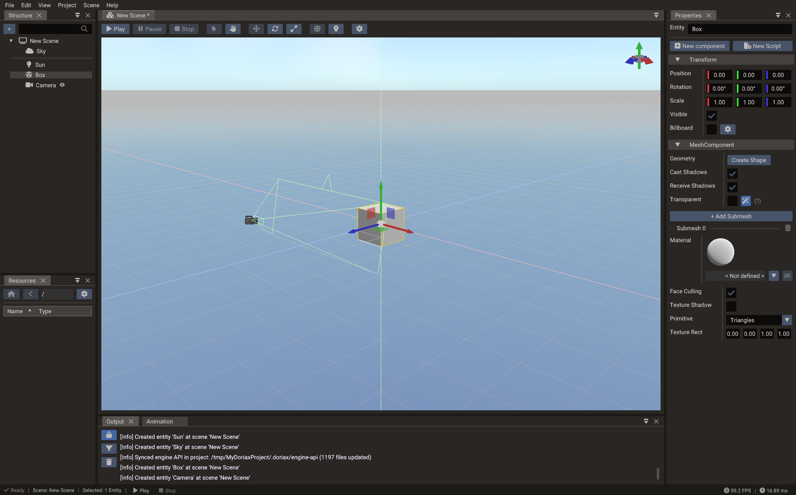
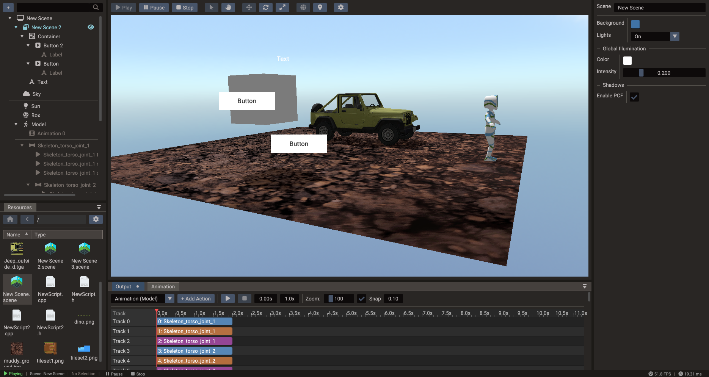

# First 3D Scene

This tutorial creates a complete small 3D scene and introduces the essential pieces of
a Doriax 3D level: scene setup, camera, directional light, a 3D model, PBR materials,
and optional collision.



## What you will build

By the end of this tutorial you will have:

- A 3D scene with a model visible in the game camera
- Directional lighting with optional shadows
- A physics floor and optional collision on the model
- A script that rotates the object each frame

## 1. Create the project and scene

1. Open the editor and choose **New Project**.
2. Select the **3D** template and pick an empty folder.
3. Save the default scene immediately (**Ctrl+S**) and name it `main`.

## 2. Set up the camera

The template creates a default camera entity. Select it and:

1. Set **Type** to `PERSPECTIVE`.
2. Position it at approximately `(0, 3, 8)` facing the origin using the Properties
   window or by dragging in the viewport.
3. Set a **Near plane** of `0.1` and a **Far plane** of `200` for a typical scene
   scale.

Use the viewport navigation to verify the camera preview. Press **F** with the camera
selected to frame it in the editor view.

## 3. Add a directional light

1. In the **Structure panel**, right-click and choose **Create → Light**.
2. Set **Light Type** to `DIRECTIONAL`.
3. Rotate it to approximately `(-45°, -60°, 0°)` so shadows fall at a diagonal.
4. Set **Intensity** to `2.0` and choose a warm white color (`1.0, 0.95, 0.8`).
5. Enable **Shadows** if you want the model to cast a shadow onto the floor.

Set the scene's **Global Illumination** to a low value (`0.2, 0.2, 0.25`) to prevent
completely black shadow areas.

## 4. Import and place a model

1. Copy a GLTF file into your project's `assets/` folder (or drag one from your OS
   file manager into the Resources Browser).
2. In the **Resources Browser**, drag the GLTF file into the scene view — a Model
   entity is created automatically.
3. Use the **Translate gizmo** (W) to move the model to the origin.
4. If the model appears very large or very small, adjust its **Scale** in the
   Properties window. GLTF files exported from Blender with default settings use
   meters — scale down if your scene uses smaller units.

## 5. Tune the materials

If the model carries its own GLTF materials, they appear automatically. To adjust them:

1. Select the Model entity.
2. In the Properties window, find the **Materials** section.
3. Adjust **Roughness** (lower = shinier), **Metallic** (0 = plastic, 1 = metal), and
   check that the **Albedo** texture path is correct.

Tips:

- Roughness controls how wide the specular highlight is — 0.1 looks mirror-smooth,
  0.9 looks matte.
- Metallic should only be 1.0 for actual metals; leave it at 0.0 for wood, stone,
  fabric, and plastic.
- Preview under both bright and dim lighting to catch texture issues early.

## 6. Add a script — rotating object

1. Open **File → New Script**, choose **Lua**, and name it `Rotator`.
2. Replace the body with:

    ```lua
    local Rotator = {}
    Rotator.__index = Rotator

    function Rotator:init()
        RegisterEngineEvent(self, "onUpdate")
        self.speed = 45  -- degrees per second
    end

    function Rotator:onUpdate()
        local obj   = Object(self.scene, self.entity)
        local dt    = Engine.getDeltaTime()
        local euler = obj.rotation:toEulerAngles()
        euler.y     = euler.y + self.speed * dt
        obj.rotation = Quaternion.fromEulerAngles(euler.x, euler.y, euler.z)
    end

    return Rotator
    ```

3. Select the Model entity, **Add Component → ScriptComponent**, add an entry for
   `scripts/Rotator.lua`, and enable it.

## 7. Add a floor with collision

1. Create a thin **Mesh** entity (or a Plane primitive) as the floor.
2. Position it at `(0, -0.5, 0)` and scale it wide.
3. **Add Component → Body3D** to the floor entity.
4. Add a **Box Shape** that matches the floor's visual dimensions.
5. Set **Body Type** to `STATIC`.

Optionally add a `Body3D` with a convex or box shape to the model entity and set it to
`DYNAMIC` to see it react to gravity.

## 8. Run the scene

Press **Play**. The model should rotate and be illuminated by the directional light.



If the scene appears completely black:

- [ ] The light is enabled and has positive intensity.
- [ ] The scene's Light State is `ON` or `AUTO`.
- [ ] The model has materials with valid albedo textures or colors.
- [ ] The camera's Far plane is greater than the distance to the model.
- [ ] The camera is the active camera in the scene's Camera field.

Press **Stop** when done.

## 9. Next steps

- Add skeletal animation using the [Animation Timeline](../editor/animation.md).
- Add fog and a skybox for atmosphere: see [Rendering Pipeline](../manual/rendering-pipeline.md).
- Add a UI overlay HUD: see [First UI Scene](first-ui-scene.md).
- Continue with [3D Graphics](../manual/3d-graphics.md) and [Physics](../manual/physics.md).
