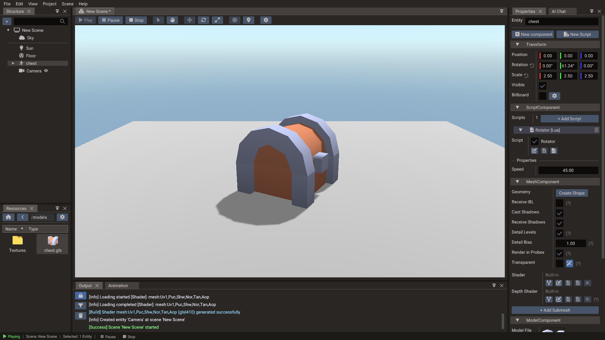
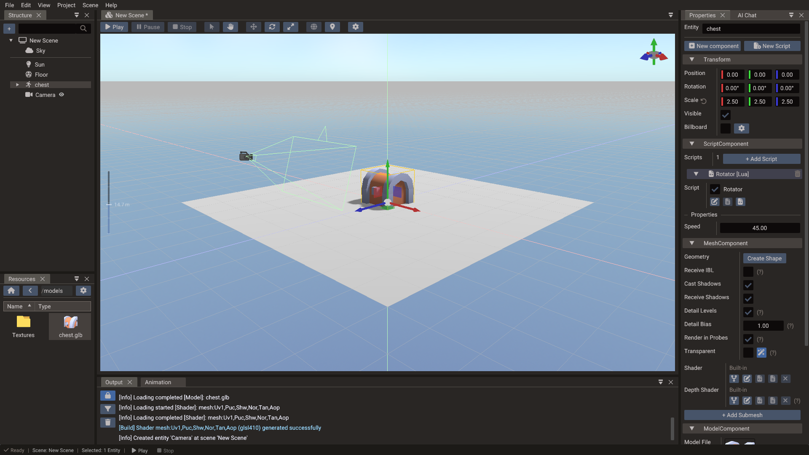

# First 3D Scene

This tutorial creates a complete small 3D scene and introduces the essential pieces of
a Doriax 3D level: scene setup, camera, directional light, a 3D model, PBR materials,
and optional collision.



## What you will build

By the end of this tutorial you will have:

- A 3D scene with a model visible in the game camera
- Directional lighting with optional shadows
- A physics floor and optional collision on the model
- A script that rotates the object each frame

## 1. Create the project and scene

1. Open the editor and choose **File → New Project** to start with a fresh temporary
   project and its initial 3D scene.
2. Choose **File → Save All**. The editor asks where the new scene goes — name it
   `main` — and then where the project itself lives: enter a project name and select an
   empty directory.

## 2. Set up the camera

A new 3D scene has no camera entity; it renders through a built-in camera until you add
one. In the **Structure panel**, choose **+ → Create entity → Camera**. The first camera
you add becomes the scene's main camera. Then:

1. Keep **Type** on **Perspective**.
2. Position it at approximately `(0, 3, 8)`. To keep it facing the origin, enable
   **Use Target** and set **Target** to `(0, 0, 0)`.
3. Set **Near** to `0.1` and **Far** to `200` for a typical scene scale.

Click **View** on the **Preview** row of the CameraComponent to look through the camera,
and **Exit** to return to the editor view. Press **F** with the camera selected to frame
it in the editor view.

## 3. Adjust the directional light

A new 3D scene already has a **Sun**: a directional light with shadows enabled. Other
lights come from **+ → Create entity → Light → Directional**, **Point**, or **Spot**.

1. Select **Sun**.
2. Change its **Direction** so shadows fall at a diagonal; it starts at
   `(-0.2, -0.5, 0.3)`.
3. Set **Intensity** to `2.0` and choose a warm white **Color** (`1.0, 0.95, 0.8`).
4. Keep **Shadows → Enabled** on so the model casts a shadow onto the floor.

The scene's **Global Illumination** (select nothing to see the scene settings) starts
at an intensity of `0.2`, which keeps shadowed areas from going completely black.

## 4. Import and place a model

1. Copy a GLTF file into your project's `assets/` folder (or drag one from your OS
   file manager into the Resources Browser).
2. In the **Resources Browser**, drag the GLTF file into the scene view — a Model
   entity is created automatically.
3. Use the **Translate gizmo** (W) to move the model to the origin.
4. If the model appears very large or very small, adjust its **Scale** in the
   Properties window. GLTF files exported from Blender with default settings use
   meters — scale down if your scene uses smaller units.

## 5. Tune the materials

If the model carries its own GLTF materials, they appear automatically. To adjust them:

1. Select the model — or, for a model with several meshes, one of its child mesh
   entities in the Structure panel.
2. In the Properties window, expand the **Submesh** material section.
3. Adjust **Roughness** (lower = shinier), **Metallic** (0 = plastic, 1 = metal), and
   check that the **Base Texture** path is correct.

To reuse the same material on several objects later, drag the **material preview** from
Properties into the Resources Browser to create a `.material` file, then drag that file
onto other meshes. See [Material files](../editor/resources.md#material-files).

Tips:

- Roughness controls how wide the specular highlight is — 0.1 looks mirror-smooth,
  0.9 looks matte.
- Metallic should only be 1.0 for actual metals; leave it at 0.0 for wood, stone,
  fabric, and plastic.
- Preview under both bright and dim lighting to catch texture issues early.

## 6. Add a script — rotating object

1. Select the model and click **New Script** at the top of the Properties window.
2. Choose **Lua Script**, enter `Rotator` as the module name, and click **Create**. The
   editor adds a `ScriptComponent` to the model and links the new script to it.
3. Open the file with the source button on the script entry and replace its contents
   with:

    ```lua
    local Rotator = {
        properties = {
            { name = "speed", displayName = "Speed", type = "float", default = 45.0 }
        }
    }

    function Rotator:init()
        RegisterEngineEvent(self, "onUpdate")
        self.angle = 0
    end

    function Rotator:onUpdate()
        local obj = Object(self.scene, self.entity)
        self.angle = self.angle + self.speed * Engine.deltatime
        -- Quaternion(x, y, z) builds a rotation from Euler angles in ZYX order
        -- (in degrees, since Engine.useDegrees is true by default).
        obj.rotation = Quaternion(0, self.angle, 0)
    end

    return Rotator
    ```

4. Save the file (**Ctrl+S**). The **Speed** property appears on the script entry.



## 7. Add a floor with collision

1. Choose **+ → Create entity → Basic shape → Plane** for the floor.
2. Position it at `(0, -0.5, 0)` and scale it wide.
3. Click **New component** and choose **3D Physics Body**.
4. Choose **Box** in the shape list and click **Add Shape**, then set the shape's
   **Width**, **Height**, and **Depth** to match the floor.
5. Keep **Body Type** on **Static**.

Optionally give the model a 3D Physics Body with a **Convex Hull** or **Box** shape and
set it to **Dynamic** to see it react to gravity.

## 8. Run the scene

Press **Play**. The model should rotate and be illuminated by the directional light.

If the scene appears completely black:

- [ ] The light is enabled and has positive intensity.
- [ ] The scene's Light State is `ON` or `AUTO`.
- [ ] The model has materials with valid albedo textures or colors.
- [ ] The camera's Far plane is greater than the distance to the model.
- [ ] The camera is the active camera in the scene's Camera field.

Press **Stop** when done.

## 9. Next steps

- Add skeletal animation using the [Animation Timeline](../editor/animation.md).
- Add a **Sky** entity, enable **Receive IBL** on reflective meshes, and optionally hide
  the sky with **Visible** while keeping reflections: see
  [Rendering Pipeline — IBL](../manual/rendering-pipeline.md#image-based-lighting-ibl).
- Add fog for depth: see [Rendering Pipeline](../manual/rendering-pipeline.md).
- Add a UI overlay HUD: see [First UI Scene](first-ui-scene.md).
- Continue with [3D Graphics](../manual/3d-graphics.md) and [Physics](../manual/physics.md).
