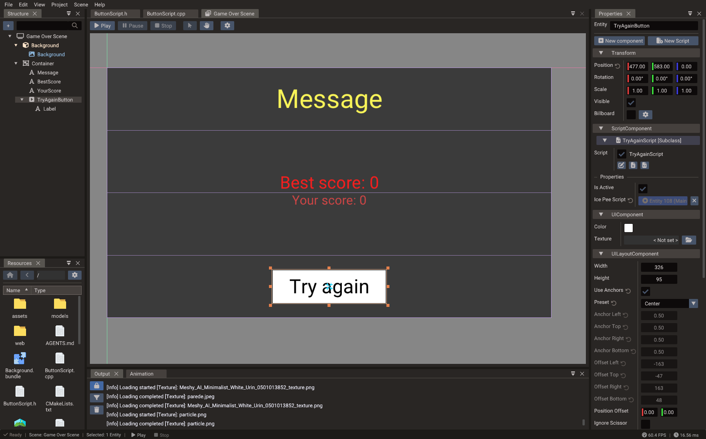

# First UI Scene

This tutorial builds a **UI scene** — a separate scene dedicated to screen-space
widgets — and shows how to layer it on top of a gameplay scene. UI scenes are the
recommended approach for HUDs, menus, and overlays in Doriax.



## What you will build

By the end of this tutorial you will have:

- A UI scene with a centered panel, a text label, and a Button
- A `Progressbar` acting as a health bar in the top-left corner
- The UI scene loaded on top of a gameplay scene
- A script that updates the health bar value from gameplay logic

## 1. Create a UI scene

1. Open the editor and open or create a project that already has a gameplay scene
   (`main` or `level_01`).
2. Choose **File → New Scene** and select the **UI** template.
3. Save it as `scenes/hud.scene`.

The UI template sets up an orthographic camera and a canvas root entity.

## 2. Set the canvas size

Select the scene root and set the **Canvas Size** to your design resolution —
for example `1920 × 1080`. Set **Scaling Mode** to `LETTERBOX` to maintain aspect ratio
across different screen sizes.

## 3. Add a health bar

1. In the **Structure panel**, right-click the canvas root and choose
   **Create → Progressbar**.
2. In the **Properties window**:
   - Set **Anchor Preset** to `TOP_LEFT`.
   - Set **Width** to `300` and **Height** to `24`.
   - Set the **Margin Left** and **Margin Top** to `20` each (inset from the edge).
   - Set **Min Value** to `0` and **Max Value** to `100`.
   - Set the initial **Value** to `80`.
   - Assign a fill texture or set a fill **Color** (e.g. green for health).
3. The health bar appears in the top-left corner of the canvas.

## 4. Add a center panel with a button

For a "Game Over" overlay:

1. Right-click the canvas root → **Create → Panel**.
2. Set **Anchor Preset** to `CENTER` and **Size** to `400 × 250`.
3. Assign a background texture to the panel, or leave it as a solid color.

Add a label inside the panel:

1. Right-click the panel → **Create → Text**.
2. Set **Anchor Preset** to `TOP_WIDE`.
3. Set the **Text** to `"Game Over"` and **Font Size** to `40`.

Add a restart button:

1. Right-click the panel → **Create → Button**.
2. Set **Anchor Preset** to `BOTTOM_CENTER`.
3. Set the **Label** text to `"Restart"`.
4. In the Properties window, set the **On Press** callback to a Lua script function
   (see the next step).

## 5. Write a HUD script

Create a Lua script `scripts/HUD.lua`:

```lua
local HUD = {}
HUD.__index = HUD

DPROPERTY("Health Bar Entity")
HUD.healthBarEntity = nil

function HUD:init()
    RegisterEngineEvent(self, "onUpdate")
end

function HUD:onUpdate()
    -- Read health from a shared value or an event
    -- For demonstration, use a global updated by gameplay code
    if GameState and GameState.health and HUD.healthBarEntity then
        local bar = Progressbar(self.scene, self.healthBarEntity)
        bar.value = GameState.health
    end
end

return HUD
```

Attach the script to the canvas root entity via **ScriptComponent**, and use the
`DPROPERTY` entity reference field to link the health bar entity.

## 6. Load the UI scene as a layer

In the project's startup file or `main` scene script, add the HUD scene as a layer:

=== "Lua"

    ```lua
    -- Register both scenes
    SceneManager.registerScene(1, "Main", function()
        Engine.setScene(gameplayScene)
    end)

    SceneManager.registerScene(2, "HUD", function()
        Engine.addSceneLayer(hudScene)
    end)

    -- Load them at startup
    SceneManager.loadScene("Main")
    SceneManager.loadScene("HUD")
    ```

=== "C++"

    ```cpp
    SceneManager::registerScene(1, "Main", []() {
        Engine::setScene(&gameplayScene);
    });
    SceneManager::registerScene(2, "HUD", []() {
        Engine::addSceneLayer(&hudScene);
    });

    SceneManager::loadScene("Main");
    SceneManager::loadScene("HUD");
    ```

The UI scene renders on top of the gameplay scene automatically.

## 7. Run and test

Press **Play**. You should see:

- The gameplay scene rendering as normal.
- The health bar in the top-left corner.
- The "Game Over" panel centered on screen.
- The "Restart" button responding to clicks.

If the UI is not visible:

- [ ] The HUD scene is registered and loaded as an **additive** layer with
  `addSceneLayer`, not `setScene`.
- [ ] The canvas size and scaling mode are set correctly.
- [ ] The UI scene camera is orthographic.
- [ ] UI events are enabled on the scene (`scene.uiEventsEnabled = true`).

## 8. Next steps

- Add a pause menu to a separate UI scene and toggle it with **Escape**.
- Use `Container` with `VERTICAL` layout for a dynamic item list.
- Use `TextEdit` for a name-entry field in a high-score screen.
- Continue with [User Interface](../manual/user-interface.md) for the full UI system
  reference.
