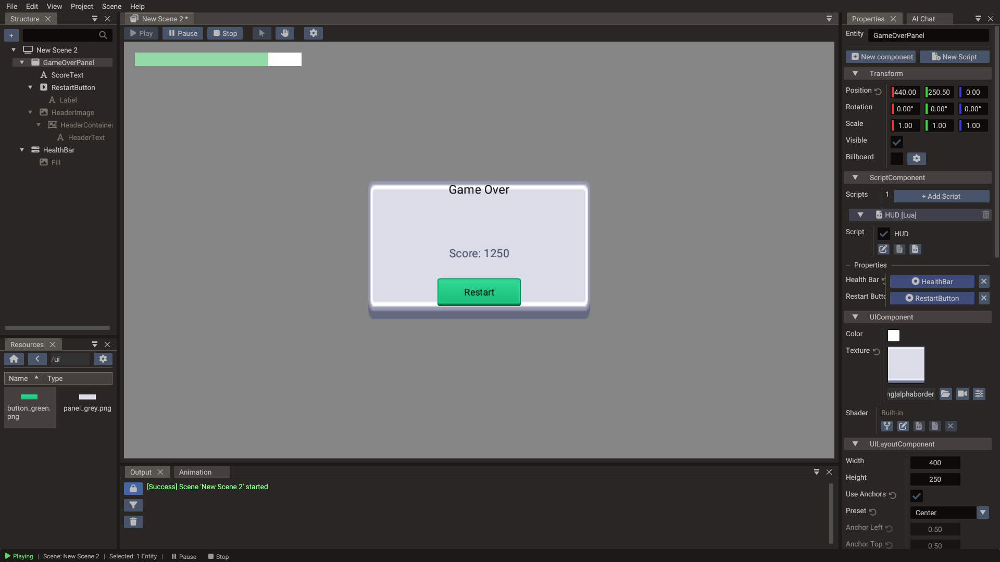
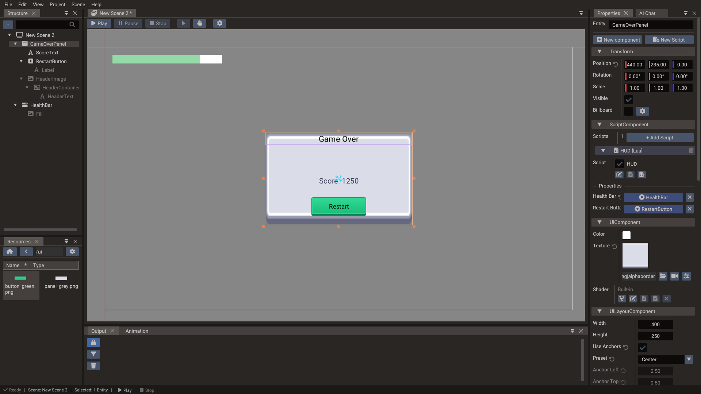
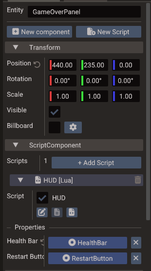

# First UI Scene

This tutorial builds a **UI scene** — a separate scene dedicated to screen-space
widgets — and shows how to layer it on top of a gameplay scene. UI scenes are the
recommended approach for HUDs, menus, and overlays in Doriax.



## What you will build

By the end of this tutorial you will have:

- A UI scene with a centered panel, a text label, and a Button
- A `Progressbar` acting as a health bar in the top-left corner
- The UI scene loaded on top of a gameplay scene
- A script that updates the health bar value from gameplay logic

## 1. Create a UI scene

1. Open the editor and open or create a project that already has a gameplay scene
   (`main` or `level_01`).
2. Choose **Scene → New Scene → UI Scene**.
3. Save it as `scenes/hud.scene`.

A new UI scene starts empty and draws through a built-in UI camera that frames the
project's canvas.

## 2. Set the canvas size

The canvas is shared by every scene in the project. Open
**Project → Project Settings → Canvas**, set **Canvas Width / Height** to your design
resolution — for example `1920 × 1080` — and set **Scaling Mode** to **Letterbox** to
keep the aspect ratio across different screen sizes.

## 3. Add a health bar

1. In the **Structure panel**, choose **+ → Create entity → UI → Progressbar**. It comes
   with a **Fill** child that draws the filled part of the bar.
2. In the **Properties window**:
   - Set **Width** to `300` and **Height** to `24`.
   - Enable **Use Anchors** and set **Preset** to **Top Left**.
   - Set **Position Offset** to `20, 20` to inset the bar from the corner.
   - Set the initial **Value** to `0.8`. Progressbar values are normalized from
     `0.0` (empty) to `1.0` (full).
   - Select the **Fill** child to give the bar a texture or a **Color** (e.g. green for
     health).
3. The health bar appears in the top-left corner of the canvas.

## 4. Add a center panel with a button

For a "Game Over" overlay:

1. Choose **+ → Create entity → UI → Panel**.
2. Set **Width** to `400` and **Height** to `250`, enable **Use Anchors**, and set
   **Preset** to **Center**.
3. Drop an image from the Resources Browser onto the panel in the viewport to give it a
   background texture, or leave it as a solid color.

The panel comes with a title bar. Set its text:

1. Expand the panel in the Structure panel and select **HeaderText** (under
   **HeaderImage → HeaderContainer**).
2. Set **Text** to `Game Over` and **FontSize** to `26`.

Add a label inside the panel:

1. Right-click the panel and choose **Create child → UI → Text**.
2. Enable **Use Anchors** and set **Preset** to **Center**.
3. Set **Text** to `Score: 1250`.

Add a restart button:

1. Right-click the panel in the Structure panel and choose
   **Create child → UI → Button**.
2. Enable **Use Anchors**, set **Preset** to **Center Bottom**, and set
   **Position Offset** to `0, -24` to lift it off the edge.
3. Select the button's **Label** child and set its **Text** to `Restart`.
4. The HUD script in the next step exposes a `restartButton` property for this button.



## 5. Write a HUD script

Create a Lua script `scripts/HUD.lua`:

```lua
-- In Lua, editor-exposed fields are declared in a `properties` table
-- (DPROPERTY is a C++-only macro).
local HUD = {
    properties = {
        { name = "healthBar", displayName = "Health Bar", type = "Progressbar" },
        { name = "restartButton", displayName = "Restart Button", type = "Button" }
    }
}

function HUD:init()
    RegisterEngineEvent(self, "onUpdate")
    if self.restartButton then
        local button = self.restartButton:getButtonComponent()
        RegisterEvent(self, button.onPress, "onRestart")
    end
end

function HUD:onUpdate()
    -- Read health from a shared value or an event
    -- For demonstration, GameState.health is a percentage from 0 to 100
    if GameState and GameState.health and self.healthBar then
        self.healthBar.value = GameState.health / 100
    end
end

function HUD:onRestart()
    SceneManager.loadScene("Main")
end

return HUD
```

Select the panel, click **New Script**, and create a Lua script named `HUD` — or, if
you wrote the file already, choose **Attach existing** in the same dialog. Then drag the
health bar and the button from the Structure panel onto the **Health Bar** and
**Restart Button** fields of the script entry.



## 6. Load the UI scene as a layer

In the editor, the simplest way is to make the HUD a **child scene** of the gameplay
scene: select the gameplay scene in the [Structure panel](../editor/structure.md),
right-click the scene root, and choose **Add child scene → HUD**. Leave **Start active**
on so the HUD loads with the level. The exporter then loads both together when you call
`SceneManager.loadScene("Main")`.

If you are wiring scenes up by hand instead, register the gameplay scene and its HUD as a
**single stack** — one factory that sets the main scene *and* adds the HUD layer — so a
single `loadScene` brings up both:

=== "Lua"

    ```lua
    SceneManager.registerScene(1, "Main", function()
        Engine.setScene(gameplayScene)
        Engine.addSceneLayer(hudScene)   -- HUD layer on top
    end)

    SceneManager.loadScene("Main")
    ```

=== "C++"

    ```cpp
    SceneManager::registerScene(1, "Main", []() {
        Engine::setScene(&gameplayScene);
        Engine::addSceneLayer(&hudScene);   // HUD layer on top
    });

    SceneManager::loadScene("Main");
    ```

!!! note
    Don't call `loadScene` once per layer — each call to `loadScene` clears every scene
    first. Add the HUD inside the same stack (as above, or as a start-active child scene)
    so it survives the load. The UI scene then renders on top of the gameplay scene
    automatically.

## 7. Run and test

Press **Play**. You should see:

- The gameplay scene rendering as normal.
- The health bar in the top-left corner.
- The "Game Over" panel centered on screen.
- The "Restart" button responding to clicks.

If the UI is not visible:

- [ ] The HUD scene is registered and loaded as an **additive** layer with
  `addSceneLayer`, not `setScene`.
- [ ] The canvas size and scaling mode are set correctly.
- [ ] The UI scene camera is orthographic.
- [ ] UI events are enabled on the scene (the scene's `enableUIEvents` setting).

## 8. Next steps

- Add a pause menu to a separate UI scene and toggle it with **Escape**.
- Use `Container` with `VERTICAL` layout for a dynamic item list.
- Use `TextEdit` for a name-entry field in a high-score screen.
- Continue with [User Interface](../manual/user-interface.md) for the full UI system
  reference.
